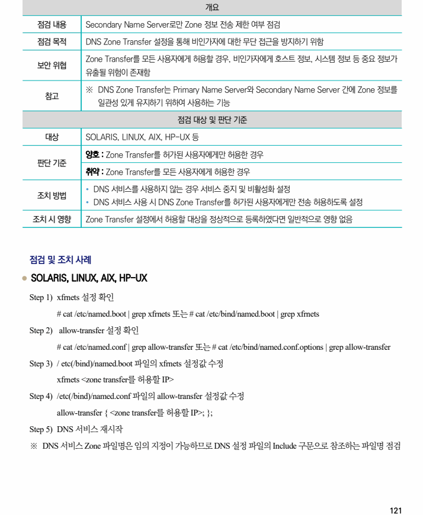

## 원문 전사

### PDF 페이지 121

~~~text transcription
개요
점검 내용 Secondary Name Server로만 Zone 정보 전송 제한 여부 점검
점검 목적 DNS Zone Transfer 설정을 통해 비인가자에 대한 무단 접근을 방지하기 위함
Zone Transfer를 모든 사용자에게 허용할 경우, 비인가자에게 호스트 정보, 시스템 정보 등 중요 정보가
보안 위협
유출될 위험이 존재함
※ DNS Zone Transfer는 Primary Name Server와 Secondary Name Server 간에 Zone 정보를
참고
일관성 있게 유지하기 위하여 사용하는 기능
점검 대상 및 판단 기준
대상 SOLARIS, LINUX, AIX, HP-UX 등
양호 : Zone Transfer를 허가된 사용자에게만 허용한 경우
판단 기준
취약 : Zone Transfer를 모든 사용자에게 허용한 경우
Ÿ DNS 서비스를 사용하지 않는 경우 서비스 중지 및 비활성화 설정
조치 방법
Ÿ DNS 서비스 사용 시 DNS Zone Transfer를 허가된 사용자에게만 전송 허용하도록 설정
조치 시 영향 Zone Transfer 설정에서 허용할 대상을 정상적으로 등록하였다면 일반적으로 영향 없음
점검 및 조치 사례
l SOLARIS, LINUX, AIX, HP-UX
Step 1) xfrnets 설정 확인
# cat /etc/named.boot | grep xfrnets 또는 # cat /etc/bind/named.boot | grep xfrnets
Step 2) allow-transfer 설정 확인
# cat /etc/named.conf | grep allow-transfer 또는 # cat /etc/bind/named.conf.options | grep allow-transfer
Step 3) / etc(/bind)/named.boot 파일의 xfrnets 설정값 수정
xfrnets <zone transfer를 허용할 IP>
Step 4) /etc(/bind)/named.conf 파일의 allow-transfer 설정값 수정
allow-transfer { <zone transfer를 허용할 IP>; };
Step 5) DNS 서비스 재시작
※ DNS 서비스 Zone 파일명은 임의 지정이 가능하므로 DNS 설정 파일의 Include 구문으로 참조하는 파일명 점검
~~~

