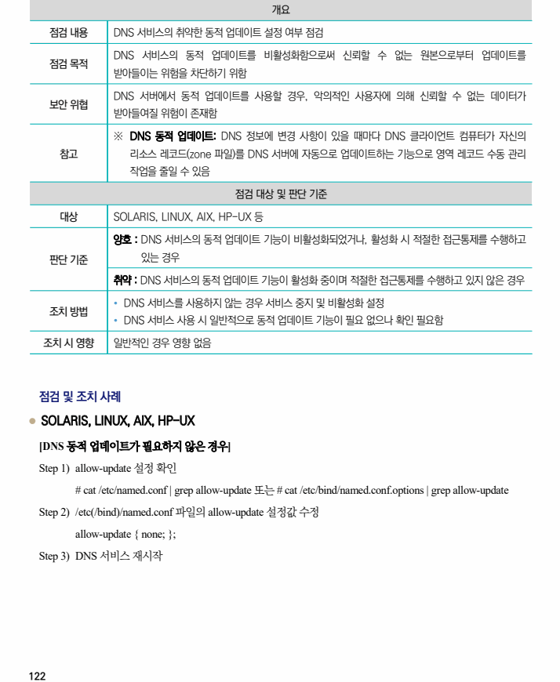
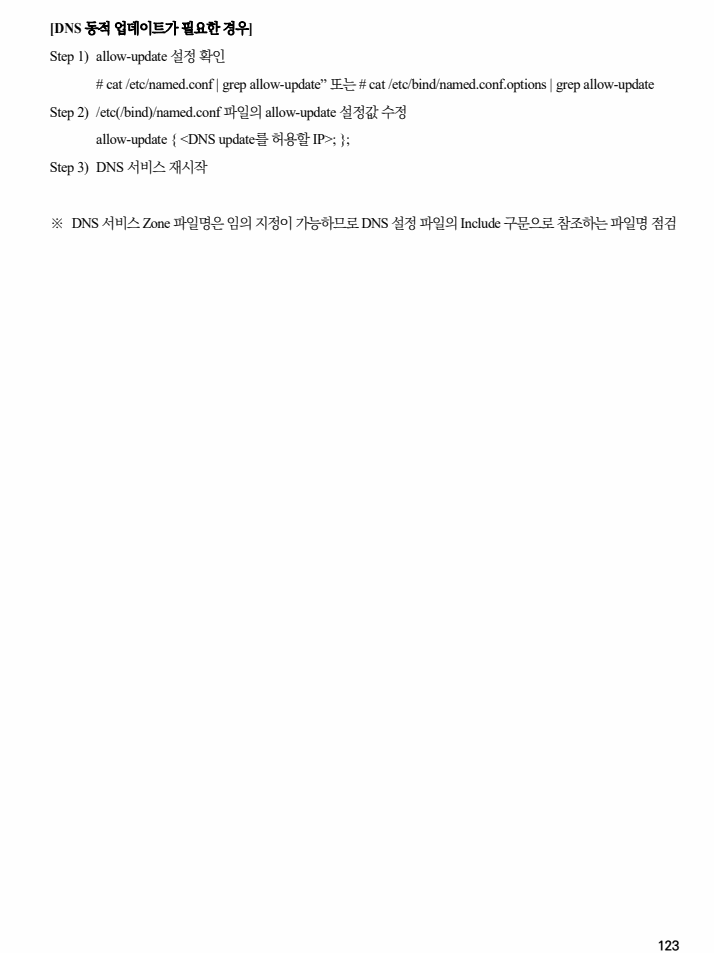

## 원문 전사

### PDF 페이지 122

~~~text transcription
개요
점검 내용 DNS 서비스의 취약한 동적 업데이트 설정 여부 점검
DNS 서비스의 동적 업데이트를 비활성화함으로써 신뢰할 수 없는 원본으로부터 업데이트를
점검 목적
받아들이는 위험을 차단하기 위함
DNS 서버에서 동적 업데이트를 사용할 경우, 악의적인 사용자에 의해 신뢰할 수 없는 데이터가
보안 위협
받아들여질 위험이 존재함
※ DNS 동적 업데이트: DNS 정보에 변경 사항이 있을 때마다 DNS 클라이언트 컴퓨터가 자신의
참고 리소스 레코드(zone 파일)를 DNS 서버에 자동으로 업데이트하는 기능으로 영역 레코드 수동 관리
작업을 줄일 수 있음
점검 대상 및 판단 기준
대상 SOLARIS, LINUX, AIX, HP-UX 등
양호 : DNS 서비스의 동적 업데이트 기능이 비활성화되었거나, 활성화 시 적절한 접근통제를 수행하고
판단 기준 있는 경우
취약 : DNS 서비스의 동적 업데이트 기능이 활성화 중이며 적절한 접근통제를 수행하고 있지 않은 경우
Ÿ DNS 서비스를 사용하지 않는 경우 서비스 중지 및 비활성화 설정
조치 방법
Ÿ DNS 서비스 사용 시 일반적으로 동적 업데이트 기능이 필요 없으나 확인 필요함
조치 시 영향 일반적인 경우 영향 없음
점검 및 조치 사례
l SOLARIS, LINUX, AIX, HP-UX
[DNS 동적 업데이트가 필요하지 않은 경우]
Step 1) allow-update 설정 확인
# cat /etc/named.conf | grep allow-update 또는 # cat /etc/bind/named.conf.options | grep allow-update
Step 2) /etc(/bind)/named.conf 파일의 allow-update 설정값 수정
allow-update { none; };
Step 3) DNS 서비스 재시작
~~~

### PDF 페이지 123

~~~text transcription
[DNS 동적 업데이트가 필요한 경우]
Step 1) allow-update 설정 확인
# cat /etc/named.conf | grep allow-update” 또는 # cat /etc/bind/named.conf.options | grep allow-update
Step 2) /etc(/bind)/named.conf 파일의 allow-update 설정값 수정
allow-update { <DNS update를 허용할 IP>; };
Step 3) DNS 서비스 재시작
※ DNS 서비스 Zone 파일명은 임의 지정이 가능하므로 DNS 설정 파일의 Include 구문으로 참조하는 파일명 점검
~~~

