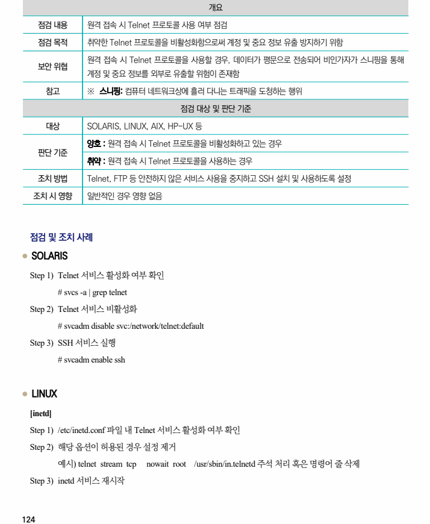
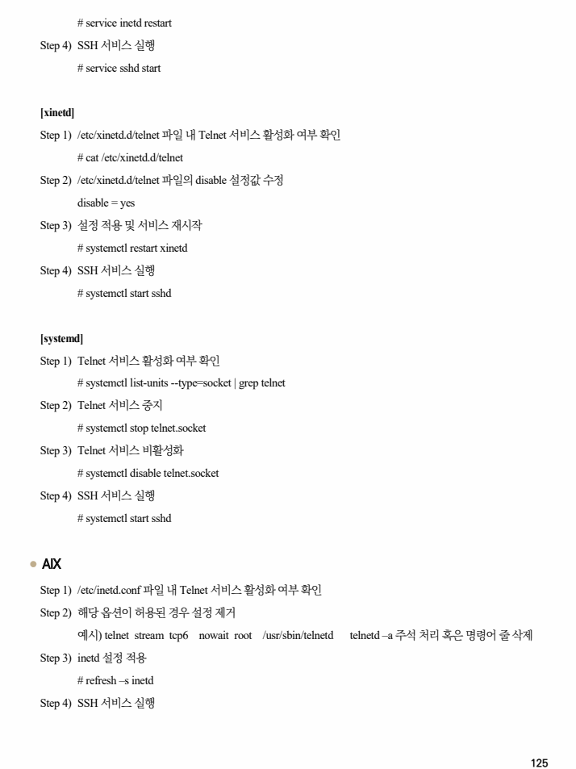
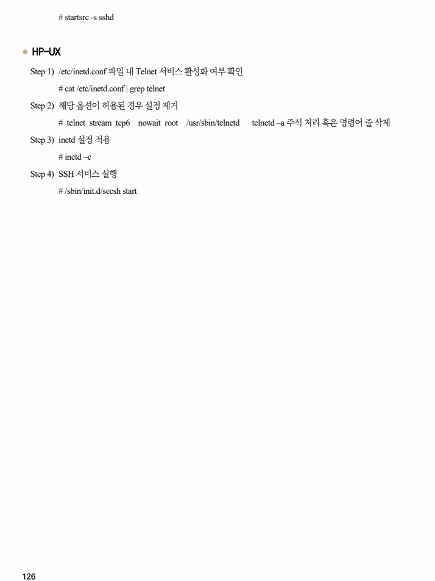

## 원문 전사

### PDF 페이지 124

~~~text transcription
개요
점검 내용 원격 접속 시 Telnet 프로토콜 사용 여부 점검
점검 목적 취약한 Telnet 프로토콜을 비활성화함으로써 계정 및 중요 정보 유출 방지하기 위함
원격 접속 시 Telnet 프로토콜을 사용할 경우, 데이터가 평문으로 전송되어 비인가자가 스니핑을 통해
보안 위협
계정 및 중요 정보를 외부로 유출할 위험이 존재함
참고 ※ 스니핑: 컴퓨터 네트워크상에 흘러 다니는 트래픽을 도청하는 행위
점검 대상 및 판단 기준
대상 SOLARIS, LINUX, AIX, HP-UX 등
양호 : 원격 접속 시 Telnet 프로토콜을 비활성화하고 있는 경우
판단 기준
취약 : 원격 접속 시 Telnet 프로토콜을 사용하는 경우
조치 방법 Telnet, FTP 등 안전하지 않은 서비스 사용을 중지하고 SSH 설치 및 사용하도록 설정
조치 시 영향 일반적인 경우 영향 없음
점검 및 조치 사례
l SOLARIS
Step 1) Telnet 서비스 활성화 여부 확인
# svcs -a | grep telnet
Step 2) Telnet 서비스 비활성화
# svcadm disable svc:/network/telnet:default
Step 3) SSH 서비스 실행
# svcadm enable ssh
l LINUX
[inetd]
Step 1) /etc/inetd.conf 파일 내 Telnet 서비스 활성화 여부 확인
Step 2) 해당 옵션이 허용된 경우 설정 제거
예시) telnet stream tcp nowait root /usr/sbin/in.telnetd 주석 처리 혹은 명령어 줄 삭제
Step 3) inetd 서비스 재시작
~~~

### PDF 페이지 125

~~~text transcription
# service inetd restart
Step 4) SSH 서비스 실행
# service sshd start
[xinetd]
Step 1) /etc/xinetd.d/telnet 파일 내 Telnet 서비스 활성화 여부 확인
# cat /etc/xinetd.d/telnet
Step 2) /etc/xinetd.d/telnet 파일의 disable 설정값 수정
disable = yes
Step 3) 설정 적용 및 서비스 재시작
# systemctl restart xinetd
Step 4) SSH 서비스 실행
# systemctl start sshd
[systemd]
Step 1) Telnet 서비스 활성화 여부 확인
# systemctl list-units --type=socket | grep telnet
Step 2) Telnet 서비스 중지
# systemctl stop telnet.socket
Step 3) Telnet 서비스 비활성화
# systemctl disable telnet.socket
Step 4) SSH 서비스 실행
# systemctl start sshd
l AIX
Step 1) /etc/inetd.conf 파일 내 Telnet 서비스 활성화 여부 확인
Step 2) 해당 옵션이 허용된 경우 설정 제거
예시) telnet stream tcp6 nowait root /usr/sbin/telnetd telnetd –a 주석 처리 혹은 명령어 줄 삭제
Step 3) inetd 설정 적용
# refresh –s inetd
Step 4) SSH 서비스 실행
~~~

### PDF 페이지 126

~~~text transcription
# startsrc -s sshd
l HP-UX
Step 1) /etc/inetd.conf 파일 내 Telnet 서비스 활성화 여부 확인
# cat /etc/inetd.conf | grep telnet
Step 2) 해당 옵션이 허용된 경우 설정 제거
# telnet stream tcp6 nowait root /usr/sbin/telnetd telnetd –a 주석 처리 혹은 명령어 줄 삭제
Step 3) inetd 설정 적용
# inetd –c
Step 4) SSH 서비스 실행
# /sbin/init.d/secsh start
~~~

