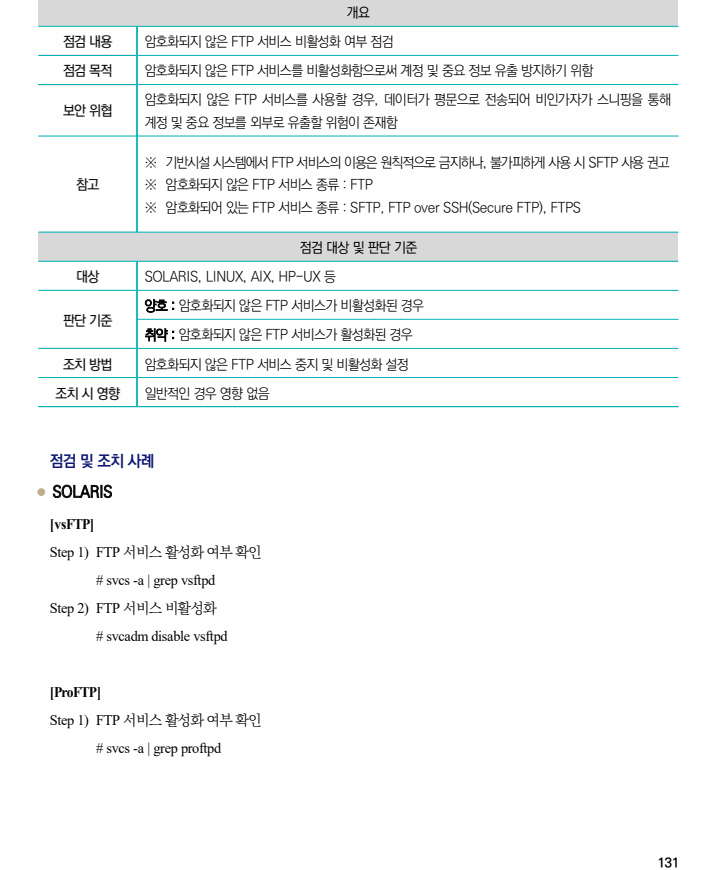
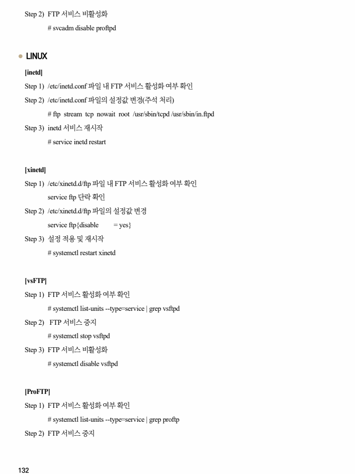
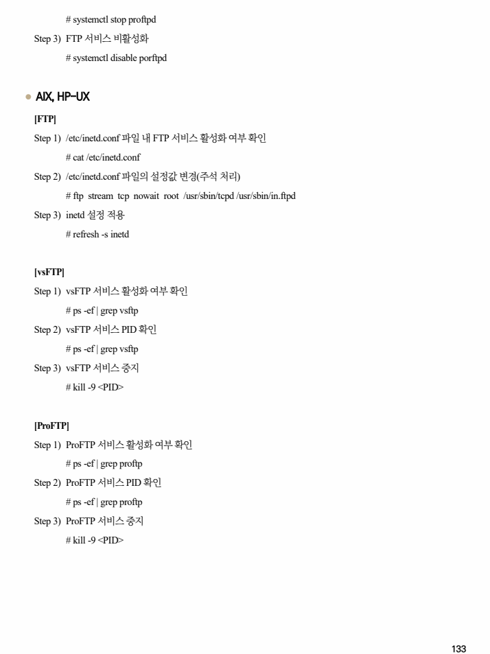

## 원문 전사

### PDF 페이지 131

~~~text transcription
개요
점검 내용 암호화되지 않은 FTP 서비스 비활성화 여부 점검
점검 목적 암호화되지 않은 FTP 서비스를 비활성화함으로써 계정 및 중요 정보 유출 방지하기 위함
암호화되지 않은 FTP 서비스를 사용할 경우, 데이터가 평문으로 전송되어 비인가자가 스니핑을 통해
보안 위협
계정 및 중요 정보를 외부로 유출할 위험이 존재함
※ 기반시설 시스템에서 FTP 서비스의 이용은 원칙적으로 금지하나, 불가피하게 사용 시 SFTP 사용 권고
참고 ※ 암호화되지 않은 FTP 서비스 종류 : FTP
※ 암호화되어 있는 FTP 서비스 종류 : SFTP, FTP over SSH(Secure FTP), FTPS
점검 대상 및 판단 기준
대상 SOLARIS, LINUX, AIX, HP-UX 등
양호 : 암호화되지 않은 FTP 서비스가 비활성화된 경우
판단 기준
취약 : 암호화되지 않은 FTP 서비스가 활성화된 경우
조치 방법 암호화되지 않은 FTP 서비스 중지 및 비활성화 설정
조치 시 영향 일반적인 경우 영향 없음
점검 및 조치 사례
l SOLARIS
[vsFTP]
Step 1) FTP 서비스 활성화 여부 확인
# svcs -a | grep vsftpd
Step 2) FTP 서비스 비활성화
# svcadm disable vsftpd
[ProFTP]
Step 1) FTP 서비스 활성화 여부 확인
# svcs -a | grep proftpd
~~~

### PDF 페이지 132

~~~text transcription
Step 2) FTP 서비스 비활성화
# svcadm disable proftpd
l LINUX
[inetd]
Step 1) /etc/inetd.conf 파일 내 FTP 서비스 활성화 여부 확인
Step 2) /etc/inetd.conf 파일의 설정값 변경(주석 처리)
# ftp stream tcp nowait root /usr/sbin/tcpd /usr/sbin/in.ftpd
Step 3) inetd 서비스 재시작
# service inetd restart
[xinetd]
Step 1) /etc/xinetd.d/ftp 파일 내 FTP 서비스 활성화 여부 확인
service ftp 단락 확인
Step 2) /etc/xinetd.d/ftp 파일의 설정값 변경
service ftp{disable = yes}
Step 3) 설정 적용 및 재시작
# systemctl restart xinetd
[vsFTP]
Step 1) FTP 서비스 활성화 여부 확인
# systemctl list-units --type=service | grep vsftpd
Step 2) FTP 서비스 중지
# systemctl stop vsftpd
Step 3) FTP 서비스 비활성화
# systemctl disable vsftpd
[ProFTP]
Step 1) FTP 서비스 활성화 여부 확인
# systemctl list-units --type=service | grep proftp
Step 2) FTP 서비스 중지
~~~

### PDF 페이지 133

~~~text transcription
# systemctl stop proftpd
Step 3) FTP 서비스 비활성화
# systemctl disable porftpd
l AIX, HP-UX
[FTP]
Step 1) /etc/inetd.conf 파일 내 FTP 서비스 활성화 여부 확인
# cat /etc/inetd.conf
Step 2) /etc/inetd.conf 파일의 설정값 변경(주석 처리)
# ftp stream tcp nowait root /usr/sbin/tcpd /usr/sbin/in.ftpd
Step 3) inetd 설정 적용
# refresh -s inetd
[vsFTP]
Step 1) vsFTP 서비스 활성화 여부 확인
# ps -ef | grep vsftp
Step 2) vsFTP 서비스 PID 확인
# ps -ef | grep vsftp
Step 3) vsFTP 서비스 중지
# kill -9 <PID>
[ProFTP]
Step 1) ProFTP 서비스 활성화 여부 확인
# ps -ef | grep proftp
Step 2) ProFTP 서비스 PID 확인
# ps -ef | grep proftp
Step 3) ProFTP 서비스 중지
# kill -9 <PID>
~~~

