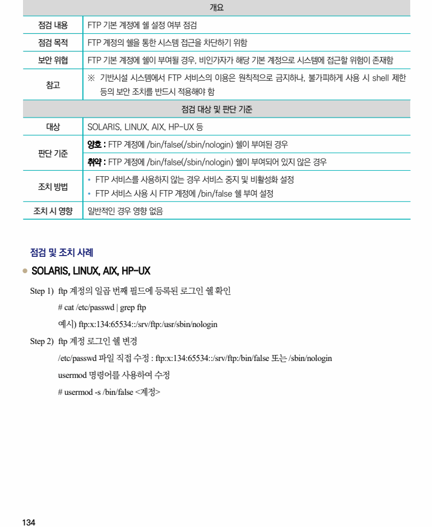

## 원문 전사

### PDF 페이지 134

~~~text transcription
개요
점검 내용 FTP 기본 계정에 쉘 설정 여부 점검
점검 목적 FTP 계정의 쉘을 통한 시스템 접근을 차단하기 위함
보안 위협 FTP 기본 계정에 쉘이 부여될 경우, 비인가자가 해당 기본 계정으로 시스템에 접근할 위험이 존재함
※ 기반시설 시스템에서 FTP 서비스의 이용은 원칙적으로 금지하나, 불가피하게 사용 시 shell 제한
참고
등의 보안 조치를 반드시 적용해야 함
점검 대상 및 판단 기준
대상 SOLARIS, LINUX, AIX, HP-UX 등
양호 : FTP 계정에 /bin/false(/sbin/nologin) 쉘이 부여된 경우
판단 기준
취약 : FTP 계정에 /bin/false(/sbin/nologin) 쉘이 부여되어 있지 않은 경우
Ÿ FTP 서비스를 사용하지 않는 경우 서비스 중지 및 비활성화 설정
조치 방법
Ÿ FTP 서비스 사용 시 FTP 계정에 /bin/false 쉘 부여 설정
조치 시 영향 일반적인 경우 영향 없음
점검 및 조치 사례
l SOLARIS, LINUX, AIX, HP-UX
Step 1) ftp 계정의 일곱 번째 필드에 등록된 로그인 쉘 확인
# cat /etc/passwd | grep ftp
예시) ftp:x:134:65534::/srv/ftp:/usr/sbin/nologin
Step 2) ftp 계정 로그인 쉘 변경
/etc/passwd 파일 직접 수정 : ftp:x:134:65534::/srv/ftp:/bin/false 또는 /sbin/nologin
usermod 명령어를 사용하여 수정
# usermod -s /bin/false <계정>
~~~

