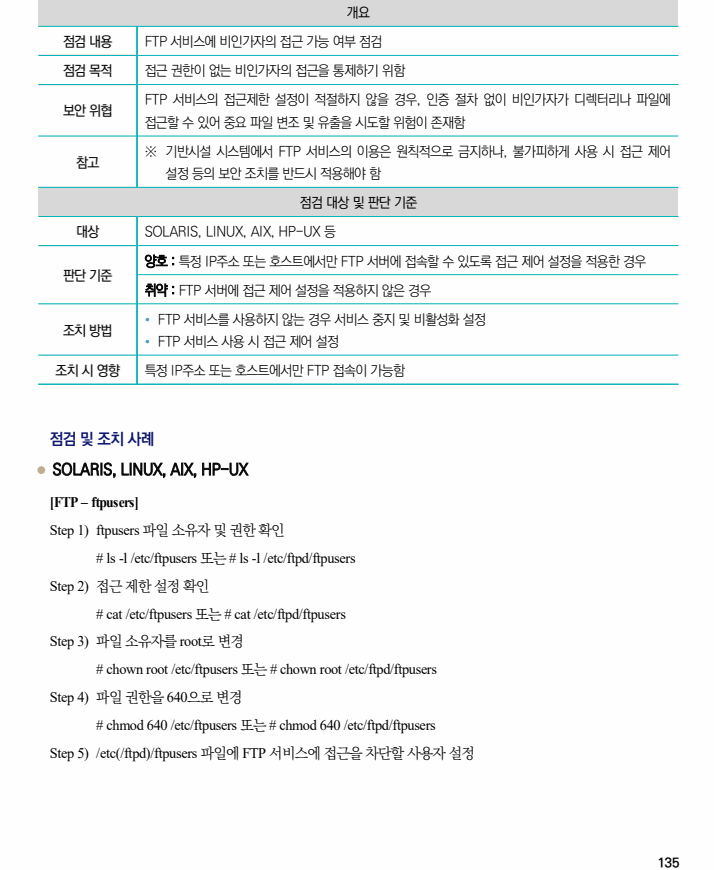
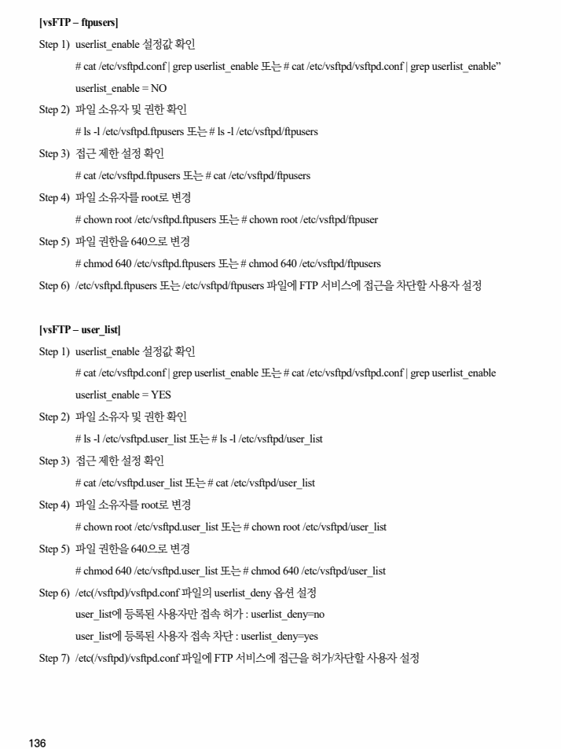
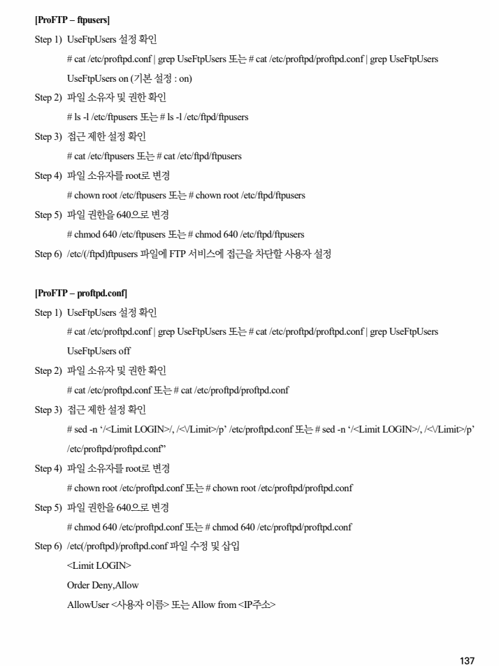
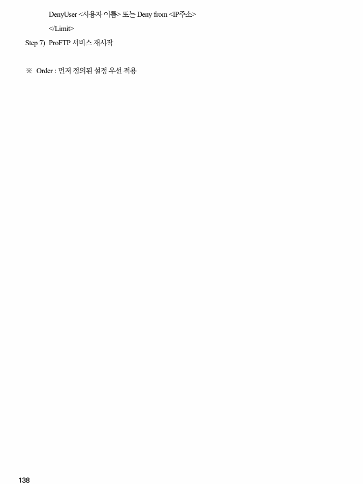

## 원문 전사

### PDF 페이지 135

~~~text transcription
개요
점검 내용 FTP 서비스에 비인가자의 접근 가능 여부 점검
점검 목적 접근 권한이 없는 비인가자의 접근을 통제하기 위함
FTP 서비스의 접근제한 설정이 적절하지 않을 경우, 인증 절차 없이 비인가자가 디렉터리나 파일에
보안 위협
접근할 수 있어 중요 파일 변조 및 유출을 시도할 위험이 존재함
※ 기반시설 시스템에서 FTP 서비스의 이용은 원칙적으로 금지하나, 불가피하게 사용 시 접근 제어
참고
설정 등의 보안 조치를 반드시 적용해야 함
점검 대상 및 판단 기준
대상 SOLARIS, LINUX, AIX, HP-UX 등
양호 : 특정 IP주소 또는 호스트에서만 FTP 서버에 접속할 수 있도록 접근 제어 설정을 적용한 경우
판단 기준
취약 : FTP 서버에 접근 제어 설정을 적용하지 않은 경우
Ÿ FTP 서비스를 사용하지 않는 경우 서비스 중지 및 비활성화 설정
조치 방법
Ÿ FTP 서비스 사용 시 접근 제어 설정
조치 시 영향 특정 IP주소 또는 호스트에서만 FTP 접속이 가능함
점검 및 조치 사례
l SOLARIS, LINUX, AIX, HP-UX
[FTP – ftpusers]
Step 1) ftpusers 파일 소유자 및 권한 확인
# ls -l /etc/ftpusers 또는 # ls -l /etc/ftpd/ftpusers
Step 2) 접근 제한 설정 확인
# cat /etc/ftpusers 또는 # cat /etc/ftpd/ftpusers
Step 3) 파일 소유자를 root로 변경
# chown root /etc/ftpusers 또는 # chown root /etc/ftpd/ftpusers
Step 4) 파일 권한을 640으로 변경
# chmod 640 /etc/ftpusers 또는 # chmod 640 /etc/ftpd/ftpusers
Step 5) /etc(/ftpd)/ftpusers 파일에 FTP 서비스에 접근을 차단할 사용자 설정
~~~

### PDF 페이지 136

~~~text transcription
[vsFTP – ftpusers]
Step 1) userlist_enable 설정값 확인
# cat /etc/vsftpd.conf | grep userlist_enable 또는 # cat /etc/vsftpd/vsftpd.conf | grep userlist_enable”
userlist_enable = NO
Step 2) 파일 소유자 및 권한 확인
# ls -l /etc/vsftpd.ftpusers 또는 # ls -l /etc/vsftpd/ftpusers
Step 3) 접근 제한 설정 확인
# cat /etc/vsftpd.ftpusers 또는 # cat /etc/vsftpd/ftpusers
Step 4) 파일 소유자를 root로 변경
# chown root /etc/vsftpd.ftpusers 또는 # chown root /etc/vsftpd/ftpuser
Step 5) 파일 권한을 640으로 변경
# chmod 640 /etc/vsftpd.ftpusers 또는 # chmod 640 /etc/vsftpd/ftpusers
Step 6) /etc/vsftpd.ftpusers 또는 /etc/vsftpd/ftpusers 파일에 FTP 서비스에 접근을 차단할 사용자 설정
[vsFTP – user_list]
Step 1) userlist_enable 설정값 확인
# cat /etc/vsftpd.conf | grep userlist_enable 또는 # cat /etc/vsftpd/vsftpd.conf | grep userlist_enable
userlist_enable = YES
Step 2) 파일 소유자 및 권한 확인
# ls -l /etc/vsftpd.user_list 또는 # ls -l /etc/vsftpd/user_list
Step 3) 접근 제한 설정 확인
# cat /etc/vsftpd.user_list 또는 # cat /etc/vsftpd/user_list
Step 4) 파일 소유자를 root로 변경
# chown root /etc/vsftpd.user_list 또는 # chown root /etc/vsftpd/user_list
Step 5) 파일 권한을 640으로 변경
# chmod 640 /etc/vsftpd.user_list 또는 # chmod 640 /etc/vsftpd/user_list
Step 6) /etc(/vsftpd)/vsftpd.conf 파일의 userlist_deny 옵션 설정
user_list에 등록된 사용자만 접속 허가 : userlist_deny=no
user_list에 등록된 사용자 접속 차단 : userlist_deny=yes
Step 7) /etc(/vsftpd)/vsftpd.conf 파일에 FTP 서비스에 접근을 허가/차단할 사용자 설정
~~~

### PDF 페이지 137

~~~text transcription
[ProFTP – ftpusers]
Step 1) UseFtpUsers 설정 확인
# cat /etc/proftpd.conf | grep UseFtpUsers 또는 # cat /etc/proftpd/proftpd.conf | grep UseFtpUsers
UseFtpUsers on (기본 설정 : on)
Step 2) 파일 소유자 및 권한 확인
# ls -l /etc/ftpusers 또는 # ls -l /etc/ftpd/ftpusers
Step 3) 접근 제한 설정 확인
# cat /etc/ftpusers 또는 # cat /etc/ftpd/ftpusers
Step 4) 파일 소유자를 root로 변경
# chown root /etc/ftpusers 또는 # chown root /etc/ftpd/ftpusers
Step 5) 파일 권한을 640으로 변경
# chmod 640 /etc/ftpusers 또는 # chmod 640 /etc/ftpd/ftpusers
Step 6) /etc/(/ftpd)ftpusers 파일에 FTP 서비스에 접근을 차단할 사용자 설정
[ProFTP – proftpd.conf]
Step 1) UseFtpUsers 설정 확인
# cat /etc/proftpd.conf | grep UseFtpUsers 또는 # cat /etc/proftpd/proftpd.conf | grep UseFtpUsers
UseFtpUsers off
Step 2) 파일 소유자 및 권한 확인
# cat /etc/proftpd.conf 또는 # cat /etc/proftpd/proftpd.conf
Step 3) 접근 제한 설정 확인
# sed -n ‘/<Limit LOGIN>/, /<\/Limit>/p’ /etc/proftpd.conf 또는 # sed -n ‘/<Limit LOGIN>/, /<\/Limit>/p’
/etc/proftpd/proftpd.conf”
Step 4) 파일 소유자를 root로 변경
# chown root /etc/proftpd.conf 또는 # chown root /etc/proftpd/proftpd.conf
Step 5) 파일 권한을 640으로 변경
# chmod 640 /etc/proftpd.conf 또는 # chmod 640 /etc/proftpd/proftpd.conf
Step 6) /etc(/proftpd)/proftpd.conf 파일 수정 및 삽입
<Limit LOGIN>
Order Deny,Allow
AllowUser <사용자 이름> 또는 Allow from <IP주소>
~~~

### PDF 페이지 138

~~~text transcription
DenyUser <사용자 이름> 또는 Deny from <IP주소>
</Limit>
Step 7) ProFTP 서비스 재시작
※ Order : 먼저 정의된 설정 우선 적용
~~~

