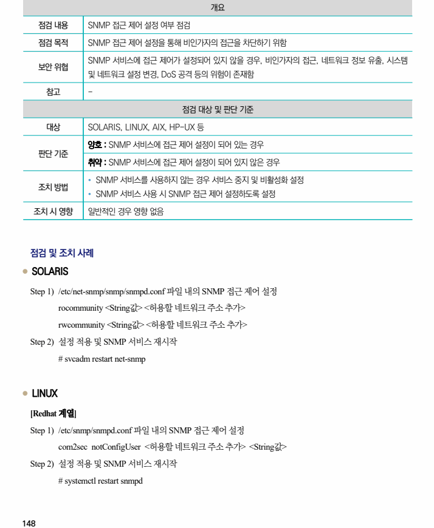
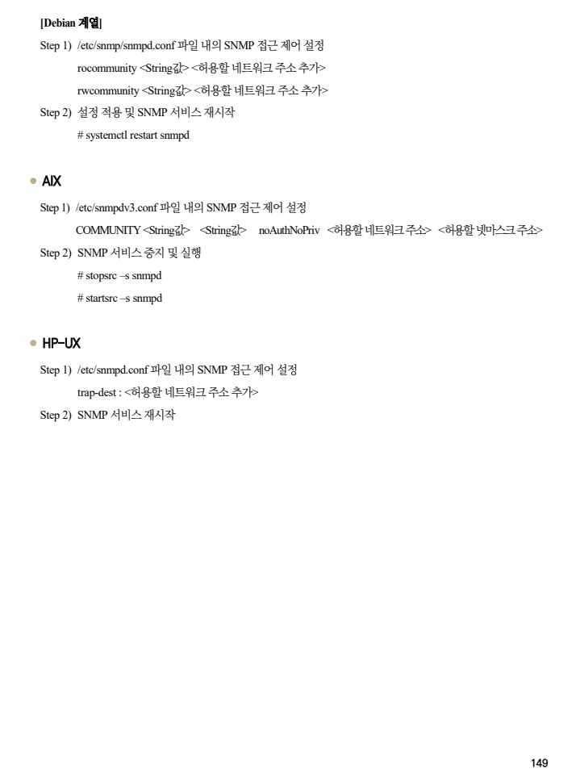

## 원문 전사

### PDF 페이지 148

~~~text transcription
개요
점검 내용 SNMP 접근 제어 설정 여부 점검
점검 목적 SNMP 접근 제어 설정을 통해 비인가자의 접근을 차단하기 위함
SNMP 서비스에 접근 제어가 설정되어 있지 않을 경우, 비인가자의 접근, 네트워크 정보 유출, 시스템
보안 위협
및 네트워크 설정 변경, DoS 공격 등의 위험이 존재함
참고 -
점검 대상 및 판단 기준
대상 SOLARIS, LINUX, AIX, HP-UX 등
양호 : SNMP 서비스에 접근 제어 설정이 되어 있는 경우
판단 기준
취약 : SNMP 서비스에 접근 제어 설정이 되어 있지 않은 경우
Ÿ SNMP 서비스를 사용하지 않는 경우 서비스 중지 및 비활성화 설정
조치 방법
Ÿ SNMP 서비스 사용 시 SNMP 접근 제어 설정하도록 설정
조치 시 영향 일반적인 경우 영향 없음
점검 및 조치 사례
l SOLARIS
Step 1) /etc/net-snmp/snmp/snmpd.conf 파일 내의 SNMP 접근 제어 설정
rocommunity <String값> <허용할 네트워크 주소 추가>
rwcommunity <String값> <허용할 네트워크 주소 추가>
Step 2) 설정 적용 및 SNMP 서비스 재시작
# svcadm restart net-snmp
l LINUX
[Redhat 계열]
Step 1) /etc/snmp/snmpd.conf 파일 내의 SNMP 접근 제어 설정
com2sec notConfigUser <허용할 네트워크 주소 추가> <String값>
Step 2) 설정 적용 및 SNMP 서비스 재시작
# systemctl restart snmpd
~~~

### PDF 페이지 149

~~~text transcription
[Debian 계열]
Step 1) /etc/snmp/snmpd.conf 파일 내의 SNMP 접근 제어 설정
rocommunity <String값> <허용할 네트워크 주소 추가>
rwcommunity <String값> <허용할 네트워크 주소 추가>
Step 2) 설정 적용 및 SNMP 서비스 재시작
# systemctl restart snmpd
l AIX
Step 1) /etc/snmpdv3.conf 파일 내의 SNMP 접근 제어 설정
COMMUNITY <String값> <String값> noAuthNoPriv <허용할 네트워크 주소> <허용할 넷마스크 주소>
Step 2) SNMP 서비스 중지 및 실행
# stopsrc –s snmpd
# startsrc –s snmpd
l HP-UX
Step 1) /etc/snmpd.conf 파일 내의 SNMP 접근 제어 설정
trap-dest : <허용할 네트워크 주소 추가>
Step 2) SNMP 서비스 재시작
~~~

