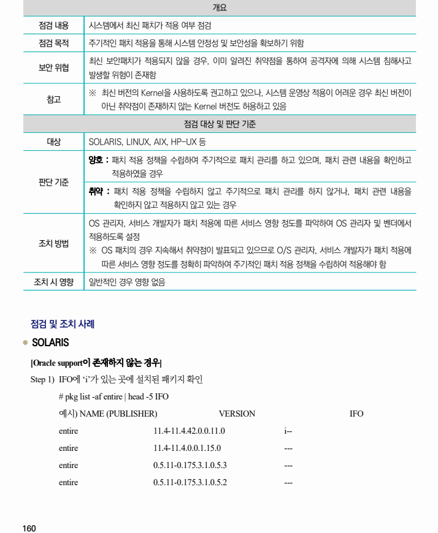
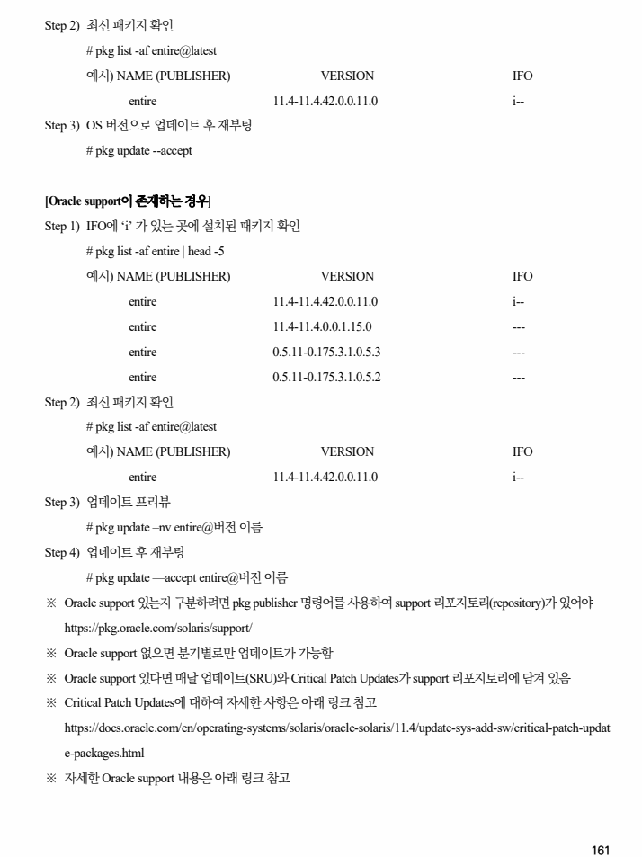
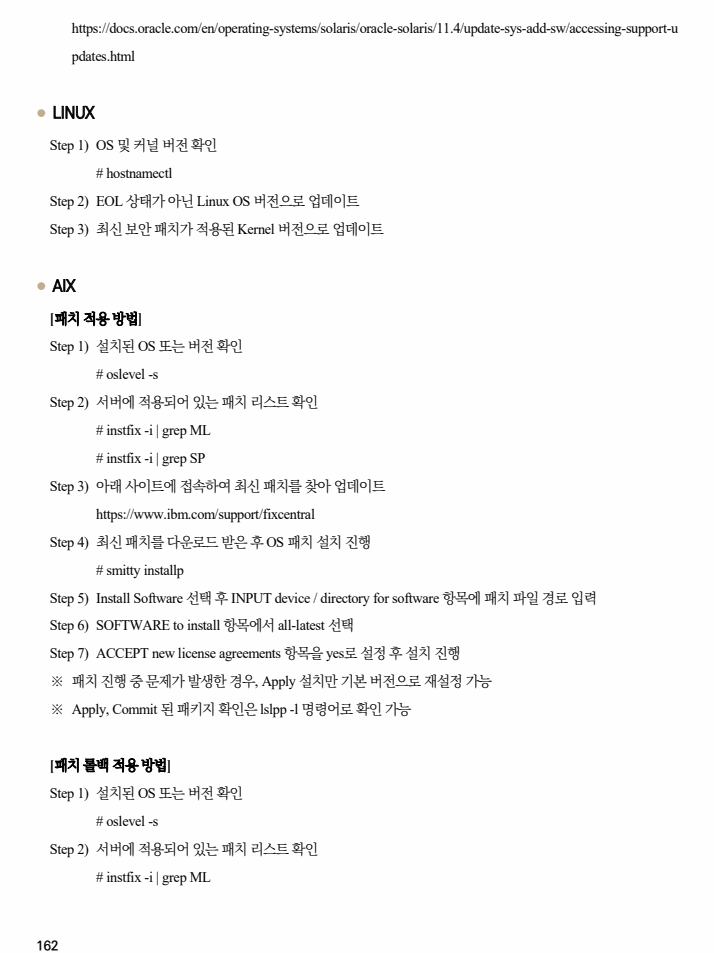
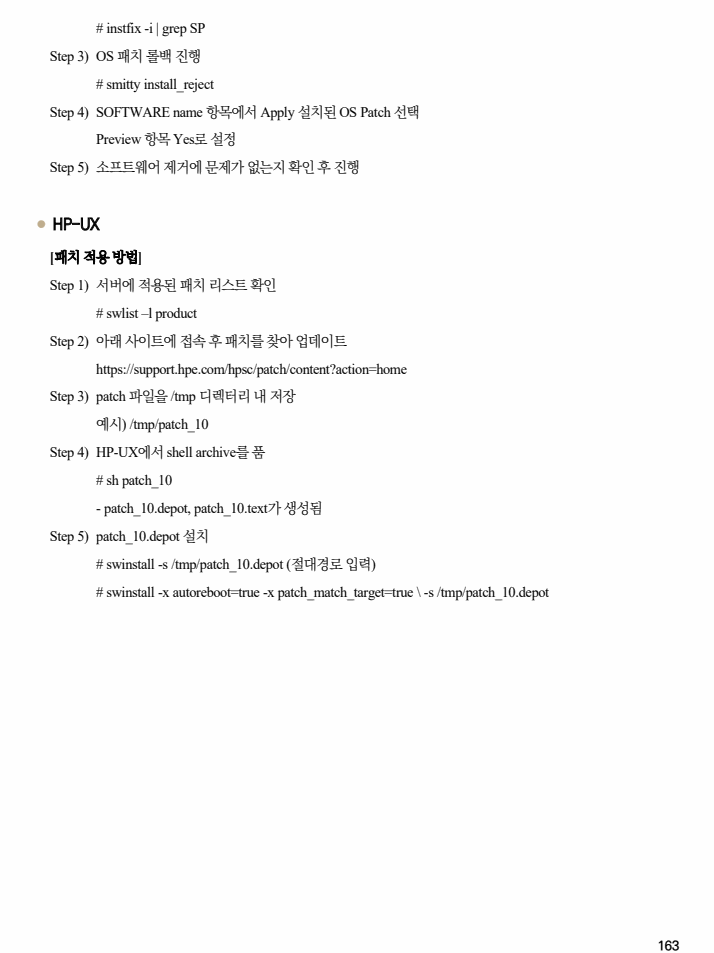

## 원문 전사

### PDF 페이지 160

~~~text transcription
개요
점검 내용 시스템에서 최신 패치가 적용 여부 점검
점검 목적 주기적인 패치 적용을 통해 시스템 안정성 및 보안성을 확보하기 위함
최신 보안패치가 적용되지 않을 경우, 이미 알려진 취약점을 통하여 공격자에 의해 시스템 침해사고
보안 위협
발생할 위험이 존재함
※ 최신 버전의 Kernel을 사용하도록 권고하고 있으나, 시스템 운영상 적용이 어려운 경우 최신 버전이
참고
아닌 취약점이 존재하지 않는 Kernel 버전도 허용하고 있음
점검 대상 및 판단 기준
대상 SOLARIS, LINUX, AIX, HP-UX 등
양호 : 패치 적용 정책을 수립하여 주기적으로 패치 관리를 하고 있으며, 패치 관련 내용을 확인하고
적용하였을 경우
판단 기준
취약 : 패치 적용 정책을 수립하지 않고 주기적으로 패치 관리를 하지 않거나, 패치 관련 내용을
확인하지 않고 적용하지 않고 있는 경우
OS 관리자, 서비스 개발자가 패치 적용에 따른 서비스 영향 정도를 파악하여 OS 관리자 및 벤더에서
적용하도록 설정
조치 방법
※ OS 패치의 경우 지속해서 취약점이 발표되고 있으므로 O/S 관리자, 서비스 개발자가 패치 적용에
따른 서비스 영향 정도를 정확히 파악하여 주기적인 패치 적용 정책을 수립하여 적용해야 함
조치 시 영향 일반적인 경우 영향 없음
점검 및 조치 사례
l SOLARIS
[Oracle support이 존재하지 않는 경우]
Step 1) IFO에 ‘i’가 있는 곳에 설치된 패키지 확인
# pkg list -af entire | head -5 IFO
예시) NAME (PUBLISHER) VERSION IFO
entire 11.4-11.4.42.0.0.11.0 i--
entire 11.4-11.4.0.0.1.15.0 ---
entire 0.5.11-0.175.3.1.0.5.3 ---
entire 0.5.11-0.175.3.1.0.5.2 ---
~~~

### PDF 페이지 161

~~~text transcription
Step 2) 최신 패키지 확인
# pkg list -af entire@latest
예시) NAME (PUBLISHER) VERSION IFO
entire 11.4-11.4.42.0.0.11.0 i--
Step 3) OS 버전으로 업데이트 후 재부팅
# pkg update --accept
[Oracle support이 존재하는 경우]
Step 1) IFO에 ‘i’ 가 있는 곳에 설치된 패키지 확인
# pkg list -af entire | head -5
예시) NAME (PUBLISHER) VERSION IFO
entire 11.4-11.4.42.0.0.11.0 i--
entire 11.4-11.4.0.0.1.15.0 ---
entire 0.5.11-0.175.3.1.0.5.3 ---
entire 0.5.11-0.175.3.1.0.5.2 ---
Step 2) 최신 패키지 확인
# pkg list -af entire@latest
예시) NAME (PUBLISHER) VERSION IFO
entire 11.4-11.4.42.0.0.11.0 i--
Step 3) 업데이트 프리뷰
# pkg update –nv entire@버전 이름
Step 4) 업데이트 후 재부팅
# pkg update —accept entire@버전 이름
※ Oracle support 있는지 구분하려면 pkg publisher 명령어를 사용하여 support 리포지토리(repository)가 있어야
https://pkg.oracle.com/solaris/support/
※ Oracle support 없으면 분기별로만 업데이트가 가능함
※ Oracle support 있다면 매달 업데이트(SRU)와 Critical Patch Updates가 support 리포지토리에 담겨 있음
※ Critical Patch Updates에 대하여 자세한 사항은 아래 링크 참고
https://docs.oracle.com/en/operating-systems/solaris/oracle-solaris/11.4/update-sys-add-sw/critical-patch-updat
e-packages.html
※ 자세한 Oracle support 내용은 아래 링크 참고
~~~

### PDF 페이지 162

~~~text transcription
https://docs.oracle.com/en/operating-systems/solaris/oracle-solaris/11.4/update-sys-add-sw/accessing-support-u
pdates.html
l LINUX
Step 1) OS 및 커널 버전 확인
# hostnamectl
Step 2) EOL 상태가 아닌 Linux OS 버전으로 업데이트
Step 3) 최신 보안 패치가 적용된 Kernel 버전으로 업데이트
l AIX
[패치 적용 방법]
Step 1) 설치된 OS 또는 버전 확인
# oslevel -s
Step 2) 서버에 적용되어 있는 패치 리스트 확인
# instfix -i | grep ML
# instfix -i | grep SP
Step 3) 아래 사이트에 접속하여 최신 패치를 찾아 업데이트
https://www.ibm.com/support/fixcentral
Step 4) 최신 패치를 다운로드 받은 후 OS 패치 설치 진행
# smitty installp
Step 5) Install Software 선택 후 INPUT device / directory for software 항목에 패치 파일 경로 입력
Step 6) SOFTWARE to install 항목에서 all-latest 선택
Step 7) ACCEPT new license agreements 항목을 yes로 설정 후 설치 진행
※ 패치 진행 중 문제가 발생한 경우, Apply 설치만 기본 버전으로 재설정 가능
※ Apply, Commit 된 패키지 확인은 lslpp -l 명령어로 확인 가능
[패치 롤백 적용 방법]
Step 1) 설치된 OS 또는 버전 확인
# oslevel -s
Step 2) 서버에 적용되어 있는 패치 리스트 확인
# instfix -i | grep ML
~~~

### PDF 페이지 163

~~~text transcription
# instfix -i | grep SP
Step 3) OS 패치 롤백 진행
# smitty install_reject
Step 4) SOFTWARE name 항목에서 Apply 설치된 OS Patch 선택
Preview 항목 Yes로 설정
Step 5) 소프트웨어 제거에 문제가 없는지 확인 후 진행
l HP-UX
[패치 적용 방법]
Step 1) 서버에 적용된 패치 리스트 확인
# swlist –l product
Step 2) 아래 사이트에 접속 후 패치를 찾아 업데이트
https://support.hpe.com/hpsc/patch/content?action=home
Step 3) patch 파일을 /tmp 디렉터리 내 저장
예시) /tmp/patch_10
Step 4) HP-UX에서 shell archive를 품
# sh patch_10
- patch_10.depot, patch_10.text가 생성됨
Step 5) patch_10.depot 설치
# swinstall -s /tmp/patch_10.depot (절대경로 입력)
# swinstall -x autoreboot=true -x patch_match_target=true \ -s /tmp/patch_10.depot
~~~

