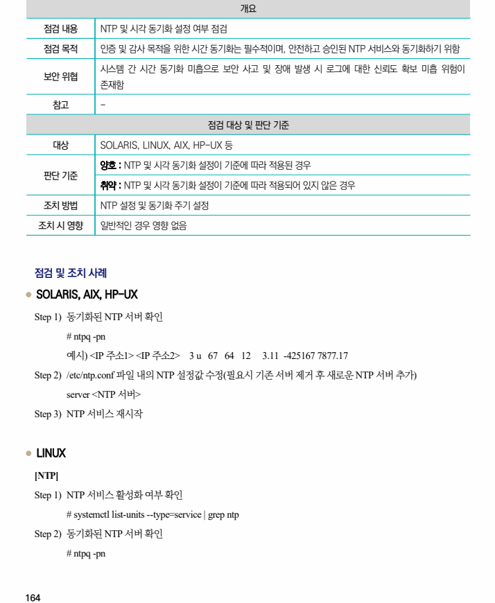
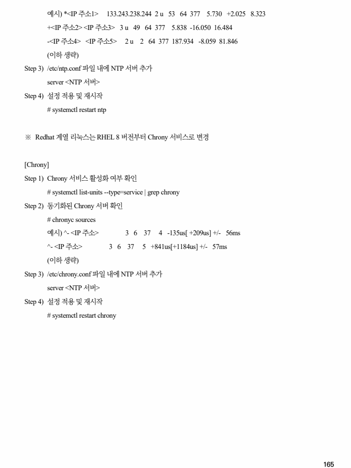

## 원문 전사

### PDF 페이지 164

~~~text transcription
개요
점검 내용 NTP 및 시각 동기화 설정 여부 점검
점검 목적 인증 및 감사 목적을 위한 시간 동기화는 필수적이며, 안전하고 승인된 NTP 서비스와 동기화하기 위함
시스템 간 시간 동기화 미흡으로 보안 사고 및 장애 발생 시 로그에 대한 신뢰도 확보 미흡 위험이
보안 위협
존재함
참고 -
점검 대상 및 판단 기준
대상 SOLARIS, LINUX, AIX, HP-UX 등
양호 : NTP 및 시각 동기화 설정이 기준에 따라 적용된 경우
판단 기준
취약 : NTP 및 시각 동기화 설정이 기준에 따라 적용되어 있지 않은 경우
조치 방법 NTP 설정 및 동기화 주기 설정
조치 시 영향 일반적인 경우 영향 없음
점검 및 조치 사례
l SOLARIS, AIX, HP-UX
Step 1) 동기화된 NTP 서버 확인
# ntpq -pn
예시) <IP 주소1> <IP 주소2> 3 u 67 64 12 3.11 -425167 7877.17
Step 2) /etc/ntp.conf 파일 내의 NTP 설정값 수정(필요시 기존 서버 제거 후 새로운 NTP 서버 추가)
server <NTP 서버>
Step 3) NTP 서비스 재시작
l LINUX
[NTP]
Step 1) NTP 서비스 활성화 여부 확인
# systemctl list-units --type=service | grep ntp
Step 2) 동기화된 NTP 서버 확인
# ntpq -pn
~~~

### PDF 페이지 165

~~~text transcription
예시) *<IP 주소1> 133.243.238.244 2 u 53 64 377 5.730 +2.025 8.323
+<IP 주소2> <IP 주소3> 3 u 49 64 377 5.838 -16.050 16.484
-<IP 주소4> <IP 주소5> 2 u 2 64 377 187.934 -8.059 81.846
(이하 생략)
Step 3) /etc/ntp.conf 파일 내에 NTP 서버 추가
server <NTP 서버>
Step 4) 설정 적용 및 재시작
# systemctl restart ntp
※ Redhat 계열 리눅스는 RHEL 8 버전부터 Chrony 서비스로 변경
[Chrony]
Step 1) Chrony 서비스 활성화 여부 확인
# systemctl list-units --type=service | grep chrony
Step 2) 동기화된 Chrony 서버 확인
# chronyc sources
예시) ^- <IP 주소> 3 6 37 4 -135us[ +209us] +/- 56ms
^- <IP 주소> 3 6 37 5 +841us[+1184us] +/- 57ms
(이하 생략)
Step 3) /etc/chrony.conf 파일 내에 NTP 서버 추가
server <NTP 서버>
Step 4) 설정 적용 및 재시작
# systemctl restart chrony
~~~

