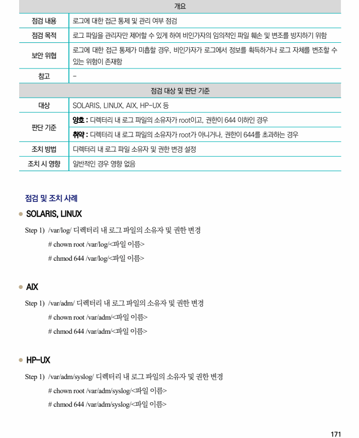

## 원문 전사

### PDF 페이지 171

~~~text transcription
개요
점검 내용 로그에 대한 접근 통제 및 관리 여부 점검
점검 목적 로그 파일을 관리자만 제어할 수 있게 하여 비인가자의 임의적인 파일 훼손 및 변조를 방지하기 위함
로그에 대한 접근 통제가 미흡할 경우, 비인가자가 로그에서 정보를 획득하거나 로그 자체를 변조할 수
보안 위협
있는 위험이 존재함
참고 -
점검 대상 및 판단 기준
대상 SOLARIS, LINUX, AIX, HP-UX 등
양호 : 디렉터리 내 로그 파일의 소유자가 root이고, 권한이 644 이하인 경우
판단 기준
취약 : 디렉터리 내 로그 파일의 소유자가 root가 아니거나, 권한이 644를 초과하는 경우
조치 방법 디렉터리 내 로그 파일 소유자 및 권한 변경 설정
조치 시 영향 일반적인 경우 영향 없음
점검 및 조치 사례
l SOLARIS, LINUX
Step 1) /var/log/ 디렉터리 내 로그 파일의 소유자 및 권한 변경
# chown root /var/log/<파일 이름>
# chmod 644 /var/log/<파일 이름>
l AIX
Step 1) /var/adm/ 디렉터리 내 로그 파일의 소유자 및 권한 변경
# chown root /var/adm/<파일 이름>
# chmod 644 /var/adm/<파일 이름>
l HP-UX
Step 1) /var/adm/syslog/ 디렉터리 내 로그 파일의 소유자 및 권한 변경
# chown root /var/adm/syslog/<파일 이름>
# chmod 644 /var/adm/syslog/<파일 이름>
~~~

