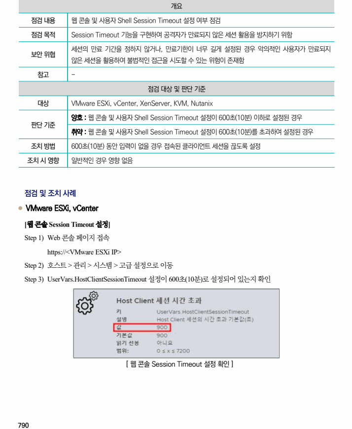
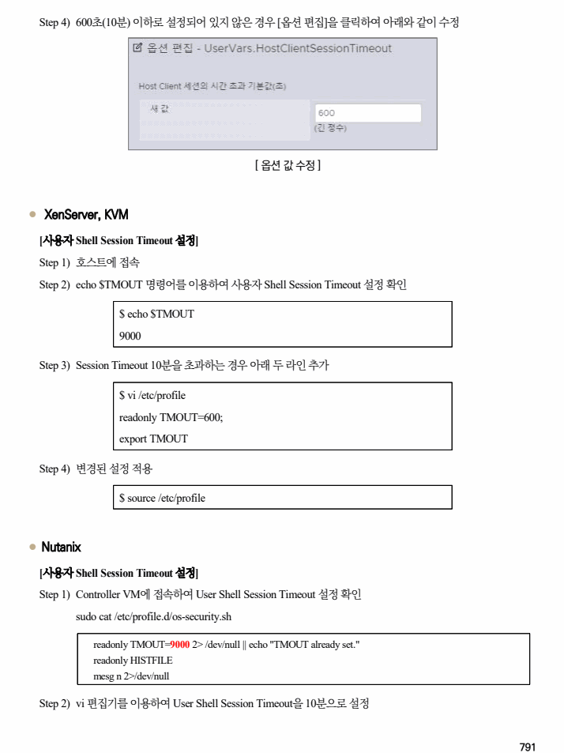
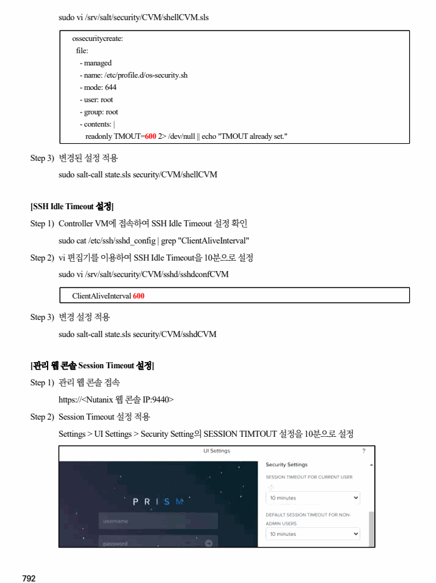

## 원문 전사

### PDF 페이지 790

~~~text transcription
개요
점검 내용 웹 콘솔 및 사용자 Shell Session Timeout 설정 여부 점검
점검 목적 Session Timeout 기능을 구현하여 공격자가 만료되지 않은 세션 활용을 방지하기 위함
세션의 만료 기간을 정하지 않거나, 만료기한이 너무 길게 설정된 경우 악의적인 사용자가 만료되지
보안 위협
않은 세션을 활용하여 불법적인 접근을 시도할 수 있는 위험이 존재함
참고 -
점검 대상 및 판단 기준
대상 VMware ESXi, vCenter, XenServer, KVM, Nutanix
양호 : 웹 콘솔 및 사용자 Shell Session Timeout 설정이 600초(10분) 이하로 설정된 경우
판단 기준
취약 : 웹 콘솔 및 사용자 Shell Session Timeout 설정이 600초(10분)를 초과하여 설정된 경우
조치 방법 600초(10분) 동안 입력이 없을 경우 접속된 클라이언트 세션을 끊도록 설정
조치 시 영향 일반적인 경우 영향 없음
점검 및 조치 사례
l VMware ESXi, vCenter
[웹 콘솔 Session Timeout 설정]
Step 1) Web 콘솔 페이지 접속
https://<VMware ESXi IP>
Step 2) 호스트 > 관리 > 시스템 > 고급 설정으로 이동
Step 3) UserVars.HostClientSessionTimeout 설정이 600초(10분)로 설정되어 있는지 확인
[ 웹 콘솔 Session Timeout 설정 확인 ]
~~~

### PDF 페이지 791

~~~text transcription
Step 4) 600초(10분) 이하로 설정되어 있지 않은 경우 [옵션 편집]을 클릭하여 아래와 같이 수정
[ 옵션 값 수정 ]
l XenServer, KVM
[사용자 Shell Session Timeout 설정]
Step 1) 호스트에 접속
Step 2) echo $TMOUT 명령어를 이용하여 사용자 Shell Session Timeout 설정 확인
$ echo $TMOUT
9000
Step 3) Session Timeout 10분을 초과하는 경우 아래 두 라인 추가
$ vi /etc/profile
readonly TMOUT=600;
export TMOUT
Step 4) 변경된 설정 적용
$ source /etc/profile
l Nutanix
[사용자 Shell Session Timeout 설정]
Step 1) Controller VM에 접속하여 User Shell Session Timeout 설정 확인
sudo cat /etc/profile.d/os-security.sh
readonly TMOUT=9000 2> /dev/null || echo "TMOUT already set."
readonly HISTFILE
mesg n 2>/dev/null
Step 2) vi 편집기를 이용하여 User Shell Session Timeout을 10분으로 설정
~~~

### PDF 페이지 792

~~~text transcription
sudo vi /srv/salt/security/CVM/shellCVM.sls
ossecuritycreate:
file:
- managed
- name: /etc/profile.d/os-security.sh
- mode: 644
- user: root
- group: root
- contents: |
readonly TMOUT=600 2> /dev/null || echo "TMOUT already set."
Step 3) 변경된 설정 적용
sudo salt-call state.sls security/CVM/shellCVM
[SSH Idle Timeout 설정]
Step 1) Controller VM에 접속하여 SSH Idle Timeout 설정 확인
sudo cat /etc/ssh/sshd_config | grep "ClientAliveInterval"
Step 2) vi 편집기를 이용하여 SSH Idle Timeout을 10분으로 설정
sudo vi /srv/salt/security/CVM/sshd/sshdconfCVM
ClientAliveInterval 600
Step 3) 변경 설정 적용
sudo salt-call state.sls security/CVM/sshdCVM
[관리 웹 콘솔 Session Timeout 설정]
Step 1) 관리 웹 콘솔 접속
https://<Nutanix 웹 콘솔 IP:9440>
Step 2) Session Timeout 설정 적용
Settings > UI Settings > Security Setting의 SESSION TIMTOUT 설정을 10분으로 설정
~~~

