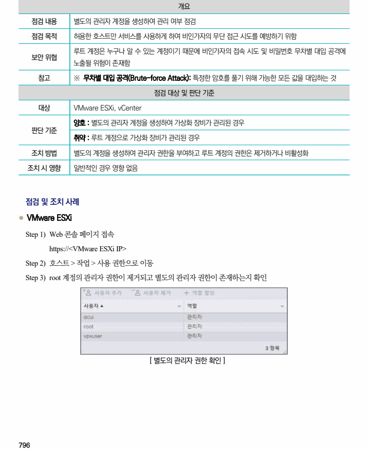
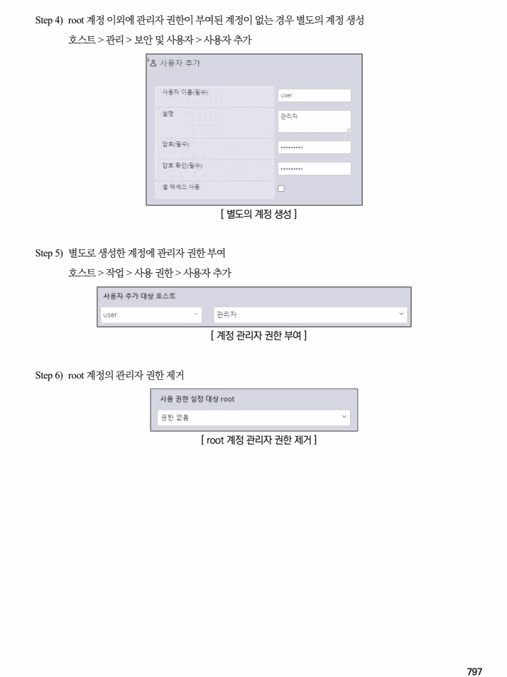

## 원문 전사

### PDF 페이지 796

~~~text transcription
개요
점검 내용 별도의 관리자 계정을 생성하여 관리 여부 점검
점검 목적 허용한 호스트만 서비스를 사용하게 하여 비인가자의 무단 접근 시도를 예방하기 위함
루트 계정은 누구나 알 수 있는 계정이기 때문에 비인가자의 접속 시도 및 비밀번호 무차별 대입 공격에
보안 위협
노출될 위험이 존재함
참고 ※ 무차별 대입 공격(Brute-force Attack): 특정한 암호를 풀기 위해 가능한 모든 값을 대입하는 것
점검 대상 및 판단 기준
대상 VMware ESXi, vCenter
양호 : 별도의 관리자 계정을 생성하여 가상화 장비가 관리된 경우
판단 기준
취약 : 루트 계정으로 가상화 장비가 관리된 경우
조치 방법 별도의 계정을 생성하여 관리자 권한을 부여하고 루트 계정의 권한은 제거하거나 비활성화
조치 시 영향 일반적인 경우 영향 없음
점검 및 조치 사례
l VMware ESXi
Step 1) Web 콘솔 페이지 접속
https://<VMware ESXi IP>
Step 2) 호스트 > 작업 > 사용 권한으로 이동
Step 3) root 계정의 관리자 권한이 제거되고 별도의 관리자 권한이 존재하는지 확인
[ 별도의 관리자 권한 확인 ]
~~~

### PDF 페이지 797

~~~text transcription
Step 4) root 계정 이외에 관리자 권한이 부여된 계정이 없는 경우 별도의 계정 생성
호스트 > 관리 > 보안 및 사용자 > 사용자 추가
[ 별도의 계정 생성 ]
Step 5) 별도로 생성한 계정에 관리자 권한 부여
호스트 > 작업 > 사용 권한 > 사용자 추가
[ 계정 관리자 권한 부여 ]
Step 6) root 계정의 관리자 권한 제거
[ root 계정 관리자 권한 제거 ]
~~~

