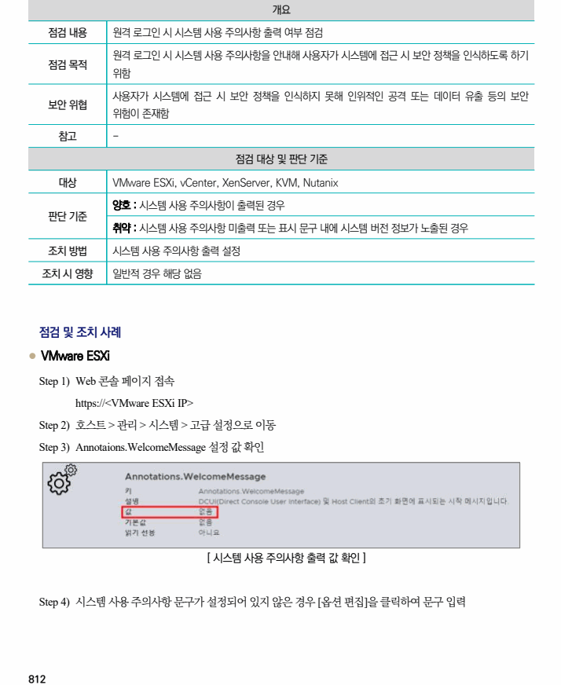
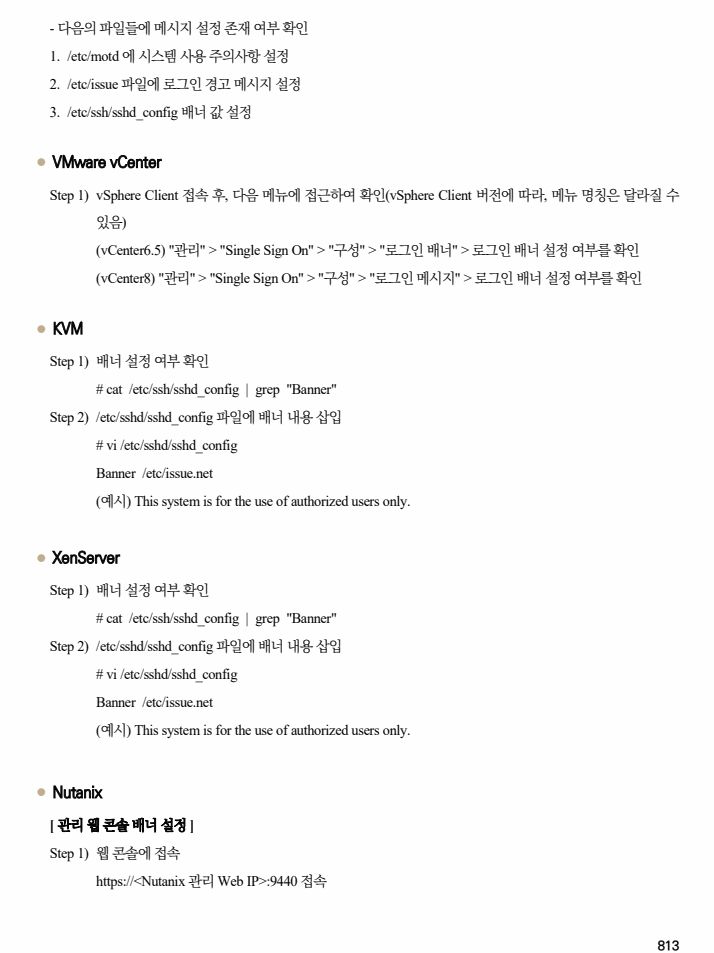
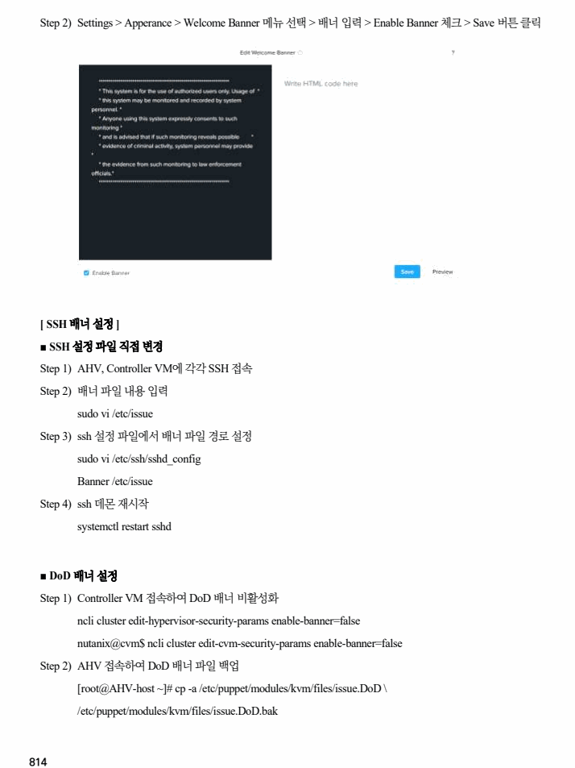
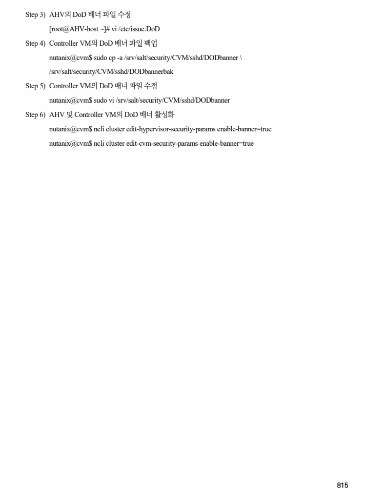

## 원문 전사

### PDF 페이지 812

~~~text transcription
개요
점검 내용 원격 로그인 시 시스템 사용 주의사항 출력 여부 점검
원격 로그인 시 시스템 사용 주의사항을 안내해 사용자가 시스템에 접근 시 보안 정책을 인식하도록 하기
점검 목적
위함
사용자가 시스템에 접근 시 보안 정책을 인식하지 못해 인위적인 공격 또는 데이터 유출 등의 보안
보안 위협
위험이 존재함
참고 -
점검 대상 및 판단 기준
대상 VMware ESXi, vCenter, XenServer, KVM, Nutanix
양호 : 시스템 사용 주의사항이 출력된 경우
판단 기준
취약 : 시스템 사용 주의사항 미출력 또는 표시 문구 내에 시스템 버전 정보가 노출된 경우
조치 방법 시스템 사용 주의사항 출력 설정
조치 시 영향 일반적 경우 해당 없음
점검 및 조치 사례
l VMware ESXi
Step 1) Web 콘솔 페이지 접속
https://<VMware ESXi IP>
Step 2) 호스트 > 관리 > 시스템 > 고급 설정으로 이동
Step 3) Annotaions.WelcomeMessage 설정 값 확인
[ 시스템 사용 주의사항 출력 값 확인 ]
Step 4) 시스템 사용 주의사항 문구가 설정되어 있지 않은 경우 [옵션 편집]을 클릭하여 문구 입력
~~~

### PDF 페이지 813

~~~text transcription
- 다음의 파일들에 메시지 설정 존재 여부 확인
1. /etc/motd 에 시스템 사용 주의사항 설정
2. /etc/issue 파일에 로그인 경고 메시지 설정
3. /etc/ssh/sshd_config 배너 값 설정
l VMware vCenter
Step 1) vSphere Client 접속 후, 다음 메뉴에 접근하여 확인(vSphere Client 버전에 따라, 메뉴 명칭은 달라질 수
있음)
(vCenter6.5) "관리" > "Single Sign On" > "구성" > "로그인 배너" > 로그인 배너 설정 여부를 확인
(vCenter8) "관리" > "Single Sign On" > "구성" > "로그인 메시지" > 로그인 배너 설정 여부를 확인
l KVM
Step 1) 배너 설정 여부 확인
# cat /etc/ssh/sshd_config | grep "Banner"
Step 2) /etc/sshd/sshd_config 파일에 배너 내용 삽입
# vi /etc/sshd/sshd_config
Banner /etc/issue.net
(예시) This system is for the use of authorized users only.
l XenServer
Step 1) 배너 설정 여부 확인
# cat /etc/ssh/sshd_config | grep "Banner"
Step 2) /etc/sshd/sshd_config 파일에 배너 내용 삽입
# vi /etc/sshd/sshd_config
Banner /etc/issue.net
(예시) This system is for the use of authorized users only.
l Nutanix
[ 관리 웹 콘솔 배너 설정 ]
Step 1) 웹 콘솔에 접속
https://<Nutanix 관리 Web IP>:9440 접속
~~~

### PDF 페이지 814

~~~text transcription
Step 2) Settings > Apperance > Welcome Banner 메뉴 선택 > 배너 입력 > Enable Banner 체크 > Save 버튼 클릭
[ SSH 배너 설정 ]
■ SSH 설정 파일 직접 변경
Step 1) AHV, Controller VM에 각각 SSH 접속
Step 2) 배너 파일 내용 입력
sudo vi /etc/issue
Step 3) ssh 설정 파일에서 배너 파일 경로 설정
sudo vi /etc/ssh/sshd_config
Banner /etc/issue
Step 4) ssh 데몬 재시작
systemctl restart sshd
■ DoD 배너 설정
Step 1) Controller VM 접속하여 DoD 배너 비활성화
ncli cluster edit-hypervisor-security-params enable-banner=false
nutanix@cvm$ ncli cluster edit-cvm-security-params enable-banner=false
Step 2) AHV 접속하여 DoD 배너 파일 백업
[root@AHV-host ~]# cp -a /etc/puppet/modules/kvm/files/issue.DoD \
/etc/puppet/modules/kvm/files/issue.DoD.bak
~~~

### PDF 페이지 815

~~~text transcription
Step 3) AHV의 DoD 배너 파일 수정
[root@AHV-host ~]# vi /etc/issue.DoD
Step 4) Controller VM의 DoD 배너 파일 백업
nutanix@cvm$ sudo cp -a /srv/salt/security/CVM/sshd/DODbanner \
/srv/salt/security/CVM/sshd/DODbannerbak
Step 5) Controller VM의 DoD 배너 파일 수정
nutanix@cvm$ sudo vi /srv/salt/security/CVM/sshd/DODbanner
Step 6) AHV 및 Controller VM의 DoD 배너 활성화
nutanix@cvm$ ncli cluster edit-hypervisor-security-params enable-banner=true
nutanix@cvm$ ncli cluster edit-cvm-security-params enable-banner=true
~~~

