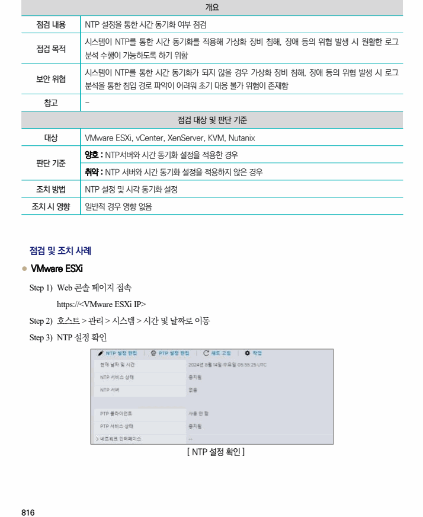
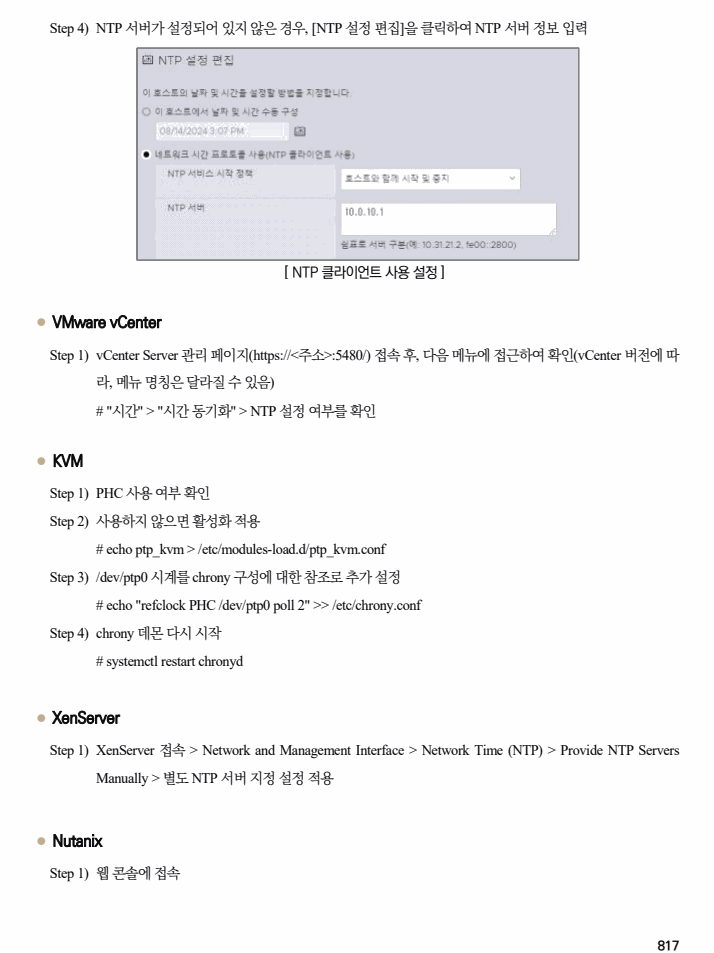
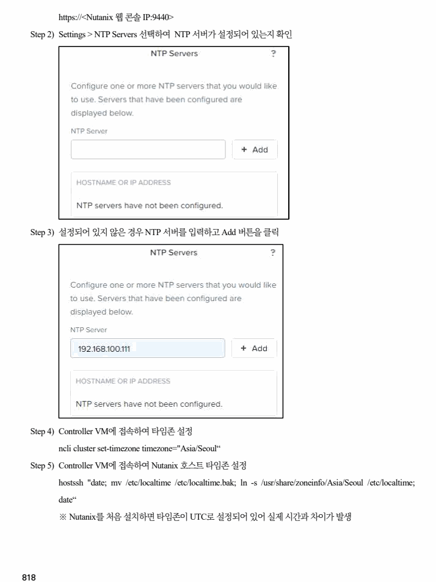

## 원문 전사

### PDF 페이지 816

~~~text transcription
개요
점검 내용 NTP 설정을 통한 시간 동기화 여부 점검
시스템이 NTP를 통한 시간 동기화를 적용해 가상화 장비 침해, 장애 등의 위협 발생 시 원활한 로그
점검 목적
분석 수행이 가능하도록 하기 위함
시스템이 NTP를 통한 시간 동기화가 되지 않을 경우 가상화 장비 침해, 장애 등의 위협 발생 시 로그
보안 위협
분석을 통한 침입 경로 파악이 어려워 초기 대응 불가 위험이 존재함
참고 -
점검 대상 및 판단 기준
대상 VMware ESXi, vCenter, XenServer, KVM, Nutanix
양호 : NTP서버와 시간 동기화 설정을 적용한 경우
판단 기준
취약 : NTP 서버와 시간 동기화 설정을 적용하지 않은 경우
조치 방법 NTP 설정 및 시각 동기화 설정
조치 시 영향 일반적 경우 영향 없음
점검 및 조치 사례
l VMware ESXi
Step 1) Web 콘솔 페이지 접속
https://<VMware ESXi IP>
Step 2) 호스트 > 관리 > 시스템 > 시간 및 날짜로 이동
Step 3) NTP 설정 확인
[ NTP 설정 확인 ]
~~~

### PDF 페이지 817

~~~text transcription
Step 4) NTP 서버가 설정되어 있지 않은 경우, [NTP 설정 편집]을 클릭하여 NTP 서버 정보 입력
[ NTP 클라이언트 사용 설정 ]
l VMware vCenter
Step 1) vCenter Server 관리 페이지(https://<주소>:5480/) 접속 후, 다음 메뉴에 접근하여 확인(vCenter 버전에 따
라, 메뉴 명칭은 달라질 수 있음)
# "시간" > "시간 동기화" > NTP 설정 여부를 확인
l KVM
Step 1) PHC 사용 여부 확인
Step 2) 사용하지 않으면 활성화 적용
# echo ptp_kvm > /etc/modules-load.d/ptp_kvm.conf
Step 3) /dev/ptp0 시계를 chrony 구성에 대한 참조로 추가 설정
# echo "refclock PHC /dev/ptp0 poll 2" >> /etc/chrony.conf
Step 4) chrony 데몬 다시 시작
# systemctl restart chronyd
l XenServer
Step 1) XenServer 접속 > Network and Management Interface > Network Time (NTP) > Provide NTP Servers
Manually > 별도 NTP 서버 지정 설정 적용
l Nutanix
Step 1) 웹 콘솔에 접속
~~~

### PDF 페이지 818

~~~text transcription
https://<Nutanix 웹 콘솔 IP:9440>
Step 2) Settings > NTP Servers 선택하여 NTP 서버가 설정되어 있는지 확인
Step 3) 설정되어 있지 않은 경우 NTP 서버를 입력하고 Add 버튼을 클릭
Step 4) Controller VM에 접속하여 타임존 설정
ncli cluster set-timezone timezone="Asia/Seoul“
Step 5) Controller VM에 접속하여 Nutanix 호스트 타임존 설정
hostssh "date; mv /etc/localtime /etc/localtime.bak; ln -s /usr/share/zoneinfo/Asia/Seoul /etc/localtime;
date“
※ Nutanix를 처음 설치하면 타임존이 UTC로 설정되어 있어 실제 시간과 차이가 발생
~~~

