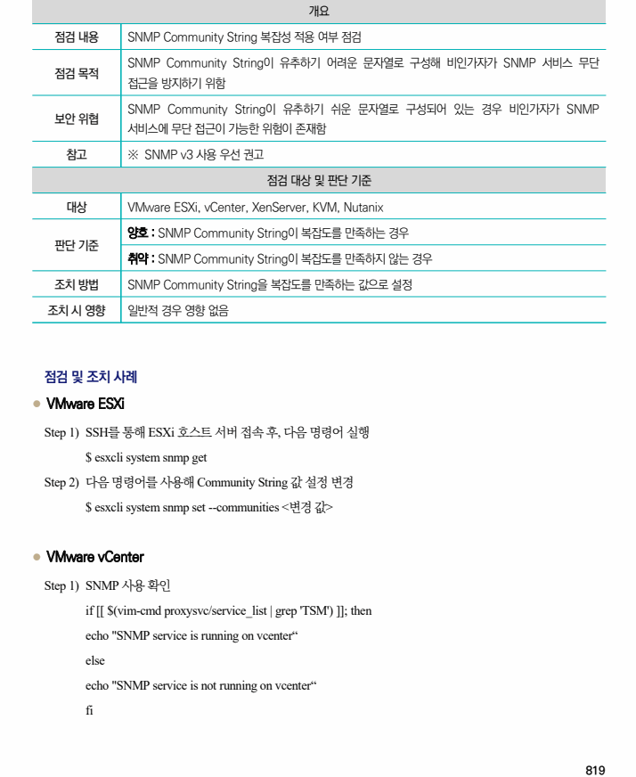
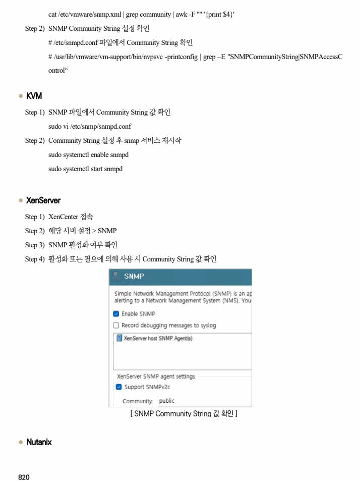
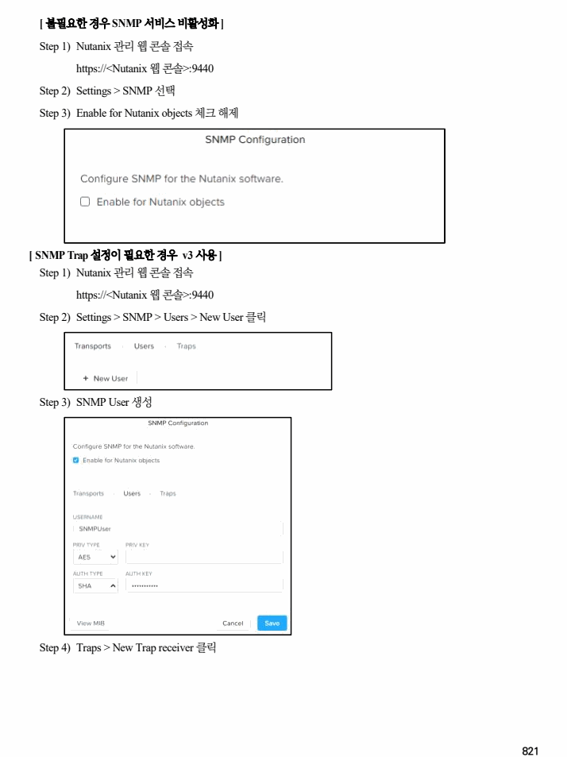
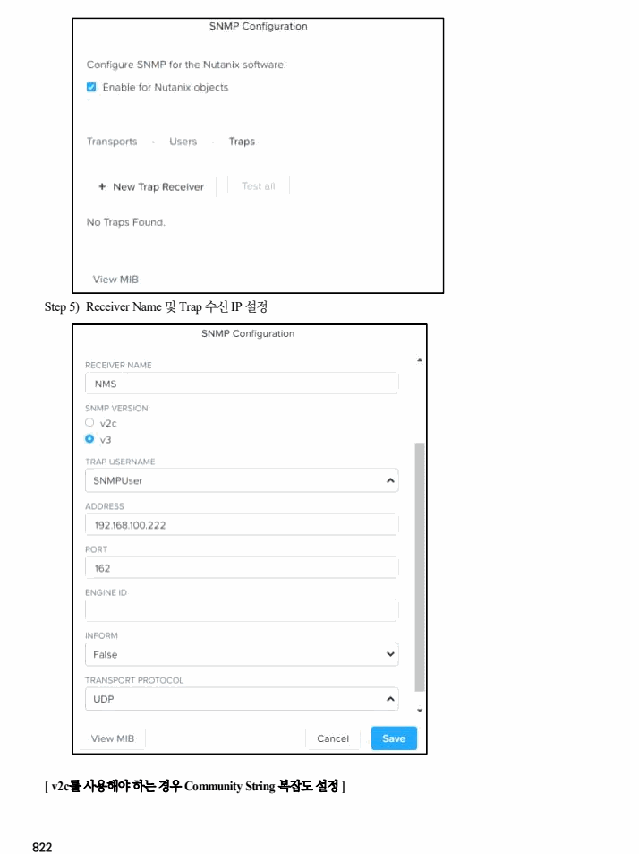

## 원문 전사

### PDF 페이지 819

~~~text transcription
개요
점검 내용 SNMP Community String 복잡성 적용 여부 점검
SNMP Community String이 유추하기 어려운 문자열로 구성해 비인가자가 SNMP 서비스 무단
점검 목적
접근을 방지하기 위함
SNMP Community String이 유추하기 쉬운 문자열로 구성되어 있는 경우 비인가자가 SNMP
보안 위협
서비스에 무단 접근이 가능한 위험이 존재함
참고 ※ SNMP v3 사용 우선 권고
점검 대상 및 판단 기준
대상 VMware ESXi, vCenter, XenServer, KVM, Nutanix
양호 : SNMP Community String이 복잡도를 만족하는 경우
판단 기준
취약 : SNMP Community String이 복잡도를 만족하지 않는 경우
조치 방법 SNMP Community String을 복잡도를 만족하는 값으로 설정
조치 시 영향 일반적 경우 영향 없음
점검 및 조치 사례
l VMware ESXi
Step 1) SSH를 통해 ESXi 호스트 서버 접속 후, 다음 명령어 실행
$ esxcli system snmp get
Step 2) 다음 명령어를 사용해 Community String 값 설정 변경
$ esxcli system snmp set --communities <변경 값>
l VMware vCenter
Step 1) SNMP 사용 확인
if [[ $(vim-cmd proxysvc/service_list | grep 'TSM') ]]; then
echo "SNMP service is running on vcenter“
else
echo "SNMP service is not running on vcenter“
fi
~~~

### PDF 페이지 820

~~~text transcription
cat /etc/vmware/snmp.xml | grep community | awk -F '"' '{print $4}'
Step 2) SNMP Community String 설정 확인
# /etc/snmpd.conf 파일에서 Community String 확인
# /usr/lib/vmware/vm-support/bin/nvpsvc -printconfig | grep –E "SNMPCommunityString|SNMPAccessC
ontrol“
l KVM
Step 1) SNMP 파일에서 Community String 값 확인
sudo vi /etc/snmp/snmpd.conf
Step 2) Community String 설정 후 snmp 서비스 재시작
sudo systemctl enable snmpd
sudo systemctl start snmpd
l XenServer
Step 1) XenCenter 접속
Step 2) 해당 서버 설정 > SNMP
Step 3) SNMP 활성화 여부 확인
Step 4) 활성화 또는 필요에 의해 사용 시 Community String 값 확인
[ SNMP Community String 값 확인 ]
l Nutanix
~~~

### PDF 페이지 821

~~~text transcription
[ 불필요한 경우 SNMP 서비스 비활성화 ]
Step 1) Nutanix 관리 웹 콘솔 접속
https://<Nutanix 웹 콘솔>:9440
Step 2) Settings > SNMP 선택
Step 3) Enable for Nutanix objects 체크 해제
[ SNMP Trap 설정이 필요한 경우 v3 사용 ]
Step 1) Nutanix 관리 웹 콘솔 접속
https://<Nutanix 웹 콘솔>:9440
Step 2) Settings > SNMP > Users > New User 클릭
Step 3) SNMP User 생성
Step 4) Traps > New Trap receiver 클릭
~~~

### PDF 페이지 822

~~~text transcription
Step 5) Receiver Name 및 Trap 수신 IP 설정
[ v2c를 사용해야 하는 경우 Community String 복잡도 설정 ]
~~~

### PDF 페이지 823

~~~text transcription
Step 1) Nutanix 관리 웹 콘솔 접속
https://<Nutanix 웹 콘솔>:9440
Step 2) Settings > SNMP > Traps > 편집 버튼
Step 3) SNMP Community String이 복잡도를 만족하도록 설정
~~~

