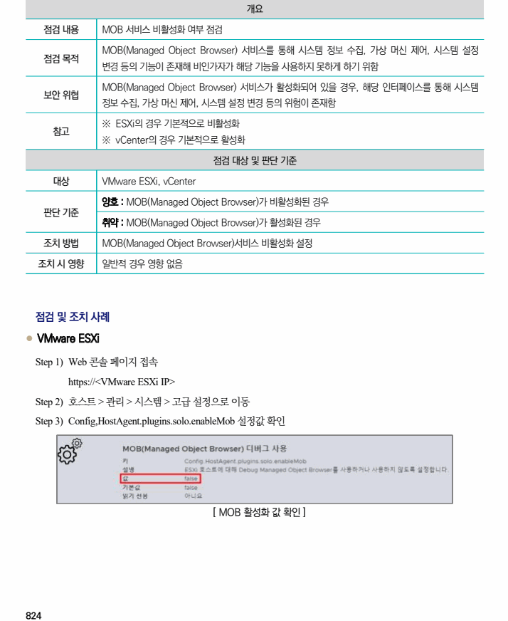
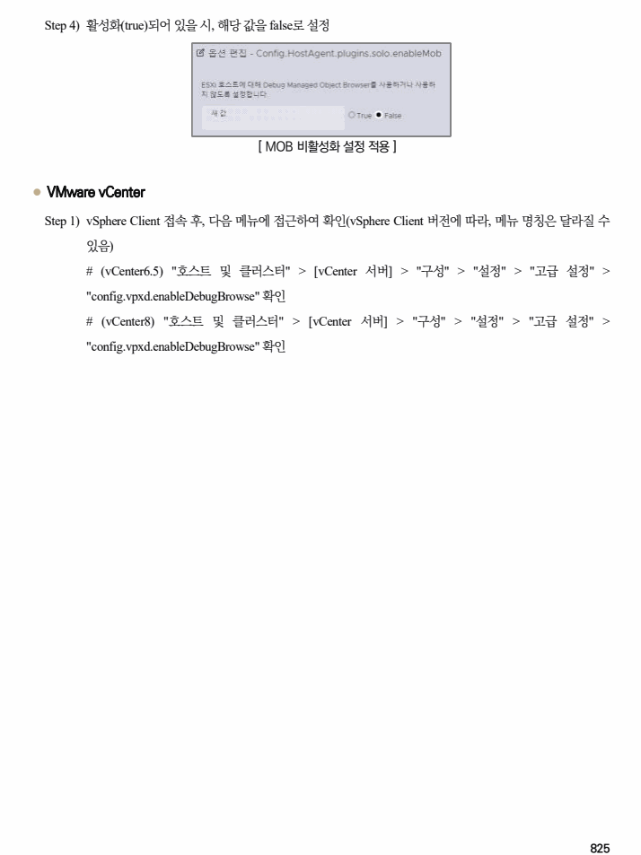

## 원문 전사

### PDF 페이지 824

~~~text transcription
개요
점검 내용 MOB 서비스 비활성화 여부 점검
MOB(Managed Object Browser) 서비스를 통해 시스템 정보 수집, 가상 머신 제어, 시스템 설정
점검 목적
변경 등의 기능이 존재해 비인가자가 해당 기능을 사용하지 못하게 하기 위함
MOB(Managed Object Browser) 서비스가 활성화되어 있을 경우, 해당 인터페이스를 통해 시스템
보안 위협
정보 수집, 가상 머신 제어, 시스템 설정 변경 등의 위험이 존재함
※ ESXi의 경우 기본적으로 비활성화
참고
※ vCenter의 경우 기본적으로 활성화
점검 대상 및 판단 기준
대상 VMware ESXi, vCenter
양호 : MOB(Managed Object Browser)가 비활성화된 경우
판단 기준
취약 : MOB(Managed Object Browser)가 활성화된 경우
조치 방법 MOB(Managed Object Browser)서비스 비활성화 설정
조치 시 영향 일반적 경우 영향 없음
점검 및 조치 사례
l VMware ESXi
Step 1) Web 콘솔 페이지 접속
https://<VMware ESXi IP>
Step 2) 호스트 > 관리 > 시스템 > 고급 설정으로 이동
Step 3) Config,HostAgent.plugins.solo.enableMob 설정값 확인
[ MOB 활성화 값 확인 ]
~~~

### PDF 페이지 825

~~~text transcription
Step 4) 활성화(true)되어 있을 시, 해당 값을 false로 설정
[ MOB 비활성화 설정 적용 ]
l VMware vCenter
Step 1) vSphere Client 접속 후, 다음 메뉴에 접근하여 확인(vSphere Client 버전에 따라, 메뉴 명칭은 달라질 수
있음)
# (vCenter6.5) "호스트 및 클러스터" > [vCenter 서버] > "구성" > "설정" > "고급 설정" >
"config.vpxd.enableDebugBrowse" 확인
# (vCenter8) "호스트 및 클러스터" > [vCenter 서버] > "구성" > "설정" > "고급 설정" >
"config.vpxd.enableDebugBrowse" 확인
~~~

