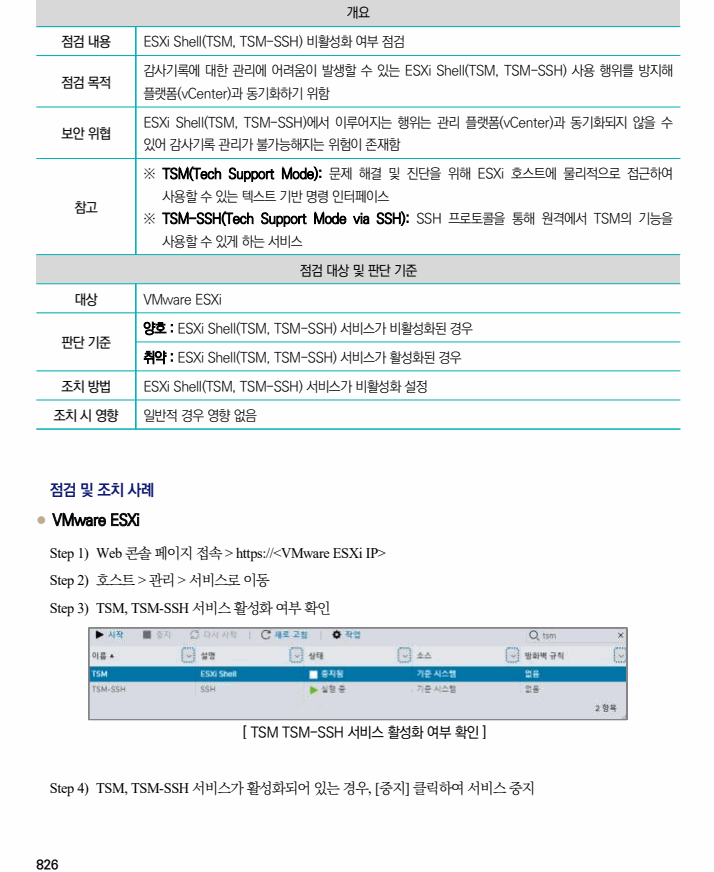

## 원문 전사

### PDF 페이지 826

~~~text transcription
개요
점검 내용 ESXi Shell(TSM, TSM-SSH) 비활성화 여부 점검
감사기록에 대한 관리에 어려움이 발생할 수 있는 ESXi Shell(TSM, TSM-SSH) 사용 행위를 방지해
점검 목적
플랫폼(vCenter)과 동기화하기 위함
ESXi Shell(TSM, TSM-SSH)에서 이루어지는 행위는 관리 플랫폼(vCenter)과 동기화되지 않을 수
보안 위협
있어 감사기록 관리가 불가능해지는 위험이 존재함
※ TSM(Tech Support Mode): 문제 해결 및 진단을 위해 ESXi 호스트에 물리적으로 접근하여
사용할 수 있는 텍스트 기반 명령 인터페이스
참고
※ TSM-SSH(Tech Support Mode via SSH): SSH 프로토콜을 통해 원격에서 TSM의 기능을
사용할 수 있게 하는 서비스
점검 대상 및 판단 기준
대상 VMware ESXi
양호 : ESXi Shell(TSM, TSM-SSH) 서비스가 비활성화된 경우
판단 기준
취약 : ESXi Shell(TSM, TSM-SSH) 서비스가 활성화된 경우
조치 방법 ESXi Shell(TSM, TSM-SSH) 서비스가 비활성화 설정
조치 시 영향 일반적 경우 영향 없음
점검 및 조치 사례
l VMware ESXi
Step 1) Web 콘솔 페이지 접속 > https://<VMware ESXi IP>
Step 2) 호스트 > 관리 > 서비스로 이동
Step 3) TSM, TSM-SSH 서비스 활성화 여부 확인
[ TSM TSM-SSH 서비스 활성화 여부 확인 ]
Step 4) TSM, TSM-SSH 서비스가 활성화되어 있는 경우, [중지] 클릭하여 서비스 중지
~~~

