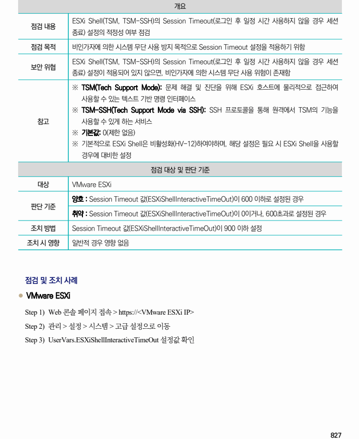
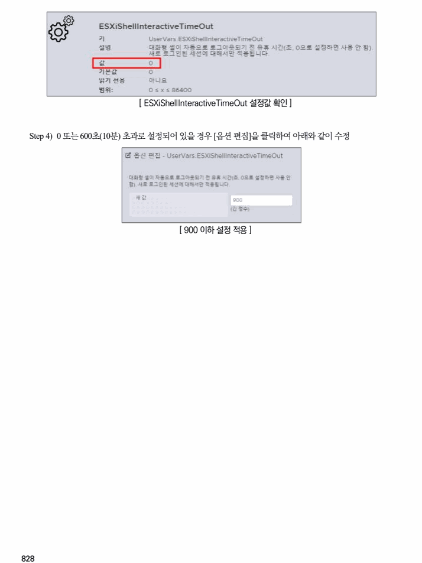

## 원문 전사

### PDF 페이지 827

~~~text transcription
개요
ESXi Shell(TSM, TSM-SSH)의 Session Timeout(로그인 후 일정 시간 사용하지 않을 경우 세션
점검 내용
종료) 설정의 적정성 여부 점검
점검 목적 비인가자에 의한 시스템 무단 사용 방지 목적으로 Session Timeout 설정을 적용하기 위함
ESXi Shell(TSM, TSM-SSH)의 Session Timeout(로그인 후 일정 시간 사용하지 않을 경우 세션
보안 위협
종료) 설정이 적용되어 있지 않으면, 비인가자에 의한 시스템 무단 사용 위험이 존재함
※ TSM(Tech Support Mode): 문제 해결 및 진단을 위해 ESXi 호스트에 물리적으로 접근하여
사용할 수 있는 텍스트 기반 명령 인터페이스
※ TSM-SSH(Tech Support Mode via SSH): SSH 프로토콜을 통해 원격에서 TSM의 기능을
참고 사용할 수 있게 하는 서비스
※ 기본값: 0(제한 없음)
※ 기본적으로 ESXi Shell은 비활성화(HV-12)하여야하며, 해당 설정은 필요 시 ESXi Shell을 사용할
경우에 대비한 설정
점검 대상 및 판단 기준
대상 VMware ESXi
양호 : Session Timeout 값(ESXiShellInteractiveTimeOut)이 600 이하로 설정된 경우
판단 기준
취약 : Session Timeout 값(ESXiShellInteractiveTimeOut)이 0이거나, 600초과로 설정된 경우
조치 방법 Session Timeout 값(ESXiShellInteractiveTimeOut)이 900 이하 설정
조치 시 영향 일반적 경우 영향 없음
점검 및 조치 사례
l VMware ESXi
Step 1) Web 콘솔 페이지 접속 > https://<VMware ESXi IP>
Step 2) 관리 > 설정 > 시스템 > 고급 설정으로 이동
Step 3) UserVars.ESXiShellInteractiveTimeOut 설정값 확인
~~~

### PDF 페이지 828

~~~text transcription
[ ESXiShellInteractiveTimeOut 설정값 확인 ]
Step 4) 0 또는 600초(10분) 초과로 설정되어 있을 경우 [옵션 편집]을 클릭하여 아래와 같이 수정
[ 900 이하 설정 적용 ]
~~~

