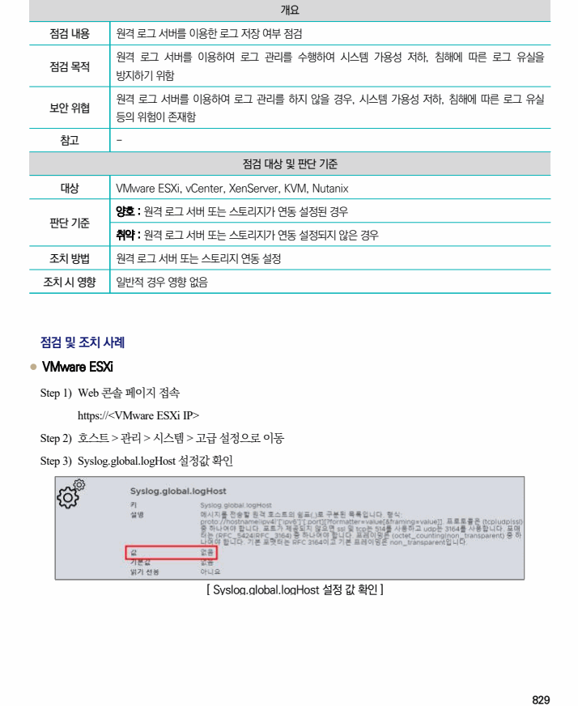
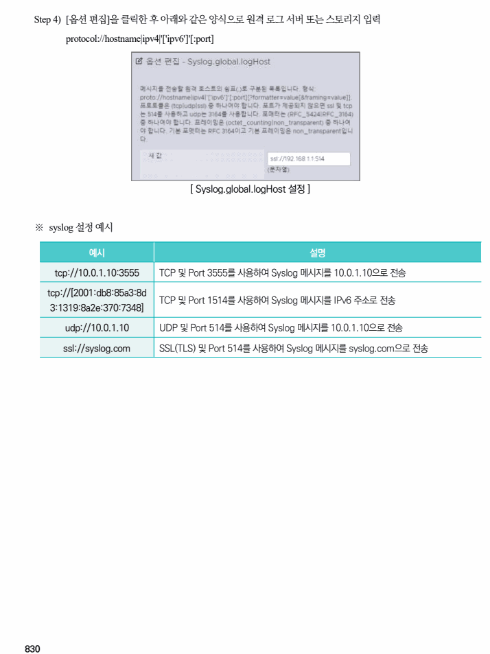
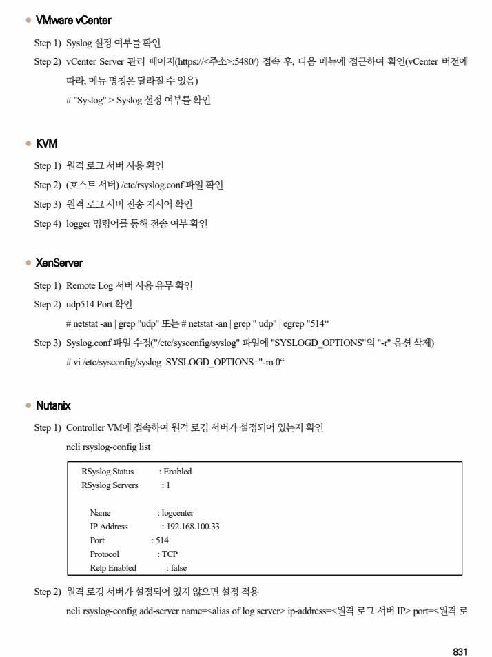
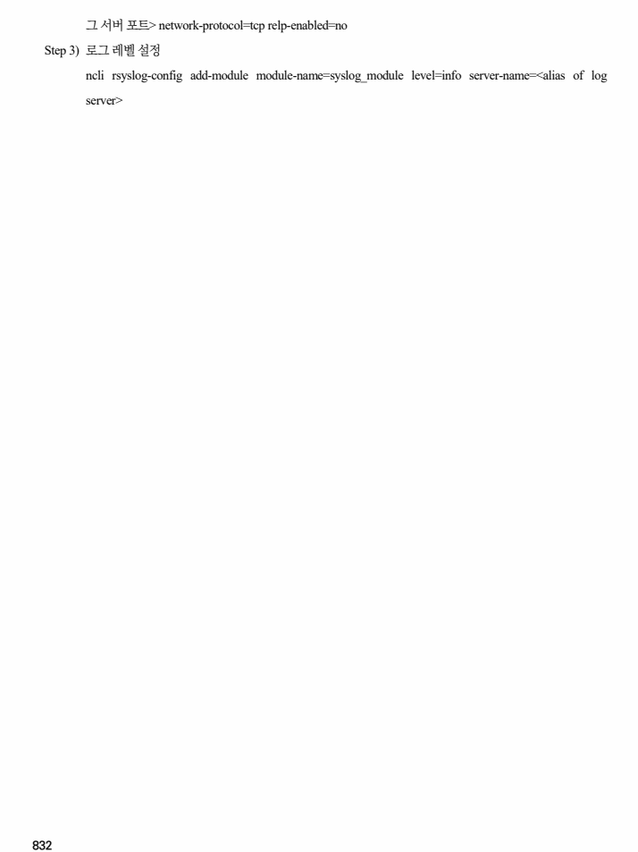

## 원문 전사

### PDF 페이지 829

~~~text transcription
개요
점검 내용 원격 로그 서버를 이용한 로그 저장 여부 점검
원격 로그 서버를 이용하여 로그 관리를 수행하여 시스템 가용성 저하, 침해에 따른 로그 유실을
점검 목적
방지하기 위함
원격 로그 서버를 이용하여 로그 관리를 하지 않을 경우, 시스템 가용성 저하, 침해에 따른 로그 유실
보안 위협
등의 위험이 존재함
참고 -
점검 대상 및 판단 기준
대상 VMware ESXi, vCenter, XenServer, KVM, Nutanix
양호 : 원격 로그 서버 또는 스토리지가 연동 설정된 경우
판단 기준
취약 : 원격 로그 서버 또는 스토리지가 연동 설정되지 않은 경우
조치 방법 원격 로그 서버 또는 스토리지 연동 설정
조치 시 영향 일반적 경우 영향 없음
점검 및 조치 사례
l VMware ESXi
Step 1) Web 콘솔 페이지 접속
https://<VMware ESXi IP>
Step 2) 호스트 > 관리 > 시스템 > 고급 설정으로 이동
Step 3) Syslog.global.logHost 설정값 확인
[ Syslog.global.logHost 설정 값 확인 ]
~~~

### PDF 페이지 830

~~~text transcription
Step 4) [옵션 편집]을 클릭한 후 아래와 같은 양식으로 원격 로그 서버 또는 스토리지 입력
protocol://hostname|ipv4|'['ipv6']'[:port]
[ Syslog.global.logHost 설정 ]
※ syslog 설정 예시
예시 설명
tcp://10.0.1.10:3555 TCP 및 Port 3555를 사용하여 Syslog 메시지를 10.0.1.10으로 전송
tcp://[2001:db8:85a3:8d
TCP 및 Port 1514를 사용하여 Syslog 메시지를 IPv6 주소로 전송
3:1319:8a2e:370:7348]
udp://10.0.1.10 UDP 및 Port 514를 사용하여 Syslog 메시지를 10.0.1.10으로 전송
ssl://syslog.com SSL(TLS) 및 Port 514를 사용하여 Syslog 메시지를 syslog.com으로 전송
~~~

### PDF 페이지 831

~~~text transcription
l VMware vCenter
Step 1) Syslog 설정 여부를 확인
Step 2) vCenter Server 관리 페이지(https://<주소>:5480/) 접속 후, 다음 메뉴에 접근하여 확인(vCenter 버전에
따라, 메뉴 명칭은 달라질 수 있음)
# "Syslog" > Syslog 설정 여부를 확인
l KVM
Step 1) 원격 로그 서버 사용 확인
Step 2) (호스트 서버) /etc/rsyslog.conf 파일 확인
Step 3) 원격 로그 서버 전송 지시어 확인
Step 4) logger 명령어를 통해 전송 여부 확인
l XenServer
Step 1) Remote Log 서버 사용 유무 확인
Step 2) udp514 Port 확인
# netstat -an | grep "udp" 또는 # netstat -an | grep " udp" | egrep "514“
Step 3) Syslog.conf 파일 수정("/etc/sysconfig/syslog" 파일에 "SYSLOGD_OPTIONS"의 "-r" 옵션 삭제)
# vi /etc/sysconfig/syslog SYSLOGD_OPTIONS="-m 0“
l Nutanix
Step 1) Controller VM에 접속하여 원격 로깅 서버가 설정되어 있는지 확인
ncli rsyslog-config list
RSyslog Status : Enabled
RSyslog Servers : 1
Name : logcenter
IP Address : 192.168.100.33
Port : 514
Protocol : TCP
Relp Enabled : false
Step 2) 원격 로깅 서버가 설정되어 있지 않으면 설정 적용
ncli rsyslog-config add-server name=<alias of log server> ip-address=<원격 로그 서버 IP> port=<원격 로
~~~

### PDF 페이지 832

~~~text transcription
그 서버 포트> network-protocol=tcp relp-enabled=no
Step 3) 로그 레벨 설정
ncli rsyslog-config add-module module-name=syslog_module level=info server-name=<alias of log
server>
~~~

