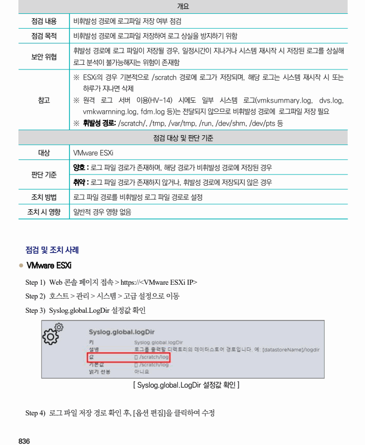

## 원문 전사

### PDF 페이지 836

~~~text transcription
개요
점검 내용 비휘발성 경로에 로그파일 저장 여부 점검
점검 목적 비휘발성 경로에 로그파일 저장하여 로그 상실을 방지하기 위함
휘발성 경로에 로그 파일이 저장될 경우, 일정시간이 지나거나 시스템 재시작 시 저장된 로그를 상실해
보안 위협
로그 분석이 불가능해지는 위험이 존재함
※ ESXi의 경우 기본적으로 /scratch 경로에 로그가 저장되며, 해당 로그는 시스템 재시작 시 또는
하루가 지나면 삭제
참고 ※ 원격 로그 서버 이용(HV-14) 시에도 일부 시스템 로그(vmksummary.log, dvs.log,
vmkwarnning.log, fdm.log 등)는 전달되지 않으므로 비휘발성 경로에 로그파일 저장 필요
※ 휘발성 경로: /scratch/, /tmp, /var/tmp, /run, /dev/shm, /dev/pts 등
점검 대상 및 판단 기준
대상 VMware ESXi
양호 : 로그 파일 경로가 존재하며, 해당 경로가 비휘발성 경로에 저장된 경우
판단 기준
취약 : 로그 파일 경로가 존재하지 않거나, 휘발성 경로에 저장되지 않은 경우
조치 방법 로그 파일 경로를 비휘발성 로그 파일 경로로 설정
조치 시 영향 일반적 경우 영향 없음
점검 및 조치 사례
l VMware ESXi
Step 1) Web 콘솔 페이지 접속 > https://<VMware ESXi IP>
Step 2) 호스트 > 관리 > 시스템 > 고급 설정으로 이동
Step 3) Syslog.global.LogDir 설정값 확인
[ Syslog.global.LogDir 설정값 확인 ]
Step 4) 로그 파일 저장 경로 확인 후, [옵션 편집]을 클릭하여 수정
~~~

