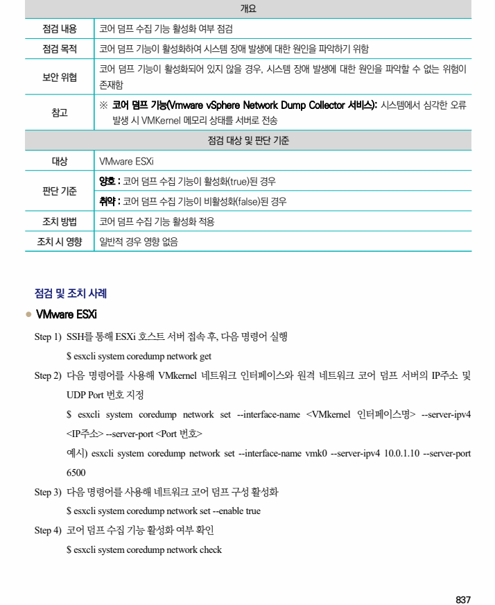

## 원문 전사

### PDF 페이지 837

~~~text transcription
개요
점검 내용 코어 덤프 수집 기능 활성화 여부 점검
점검 목적 코어 덤프 기능이 활성화하여 시스템 장애 발생에 대한 원인을 파악하기 위함
코어 덤프 기능이 활성화되어 있지 않을 경우, 시스템 장애 발생에 대한 원인을 파악할 수 없는 위험이
보안 위협
존재함
※ 코어 덤프 기능(Vmware vSphere Network Dump Collector 서비스): 시스템에서 심각한 오류
참고
발생 시 VMKernel 메모리 상태를 서버로 전송
점검 대상 및 판단 기준
대상 VMware ESXi
양호 : 코어 덤프 수집 기능이 활성화(true)된 경우
판단 기준
취약 : 코어 덤프 수집 기능이 비활성화(false)된 경우
조치 방법 코어 덤프 수집 기능 활성화 적용
조치 시 영향 일반적 경우 영향 없음
점검 및 조치 사례
l VMware ESXi
Step 1) SSH를 통해 ESXi 호스트 서버 접속 후, 다음 명령어 실행
$ esxcli system coredump network get
Step 2) 다음 명령어를 사용해 VMkernel 네트워크 인터페이스와 원격 네트워크 코어 덤프 서버의 IP주소 및
UDP Port 번호 지정
$ esxcli system coredump network set --interface-name <VMkernel 인터페이스명> --server-ipv4
<IP주소> --server-port <Port 번호>
예시) esxcli system coredump network set --interface-name vmk0 --server-ipv4 10.0.1.10 --server-port
6500
Step 3) 다음 명령어를 사용해 네트워크 코어 덤프 구성 활성화
$ esxcli system coredump network set --enable true
Step 4) 코어 덤프 수집 기능 활성화 여부 확인
$ esxcli system coredump network check
~~~

