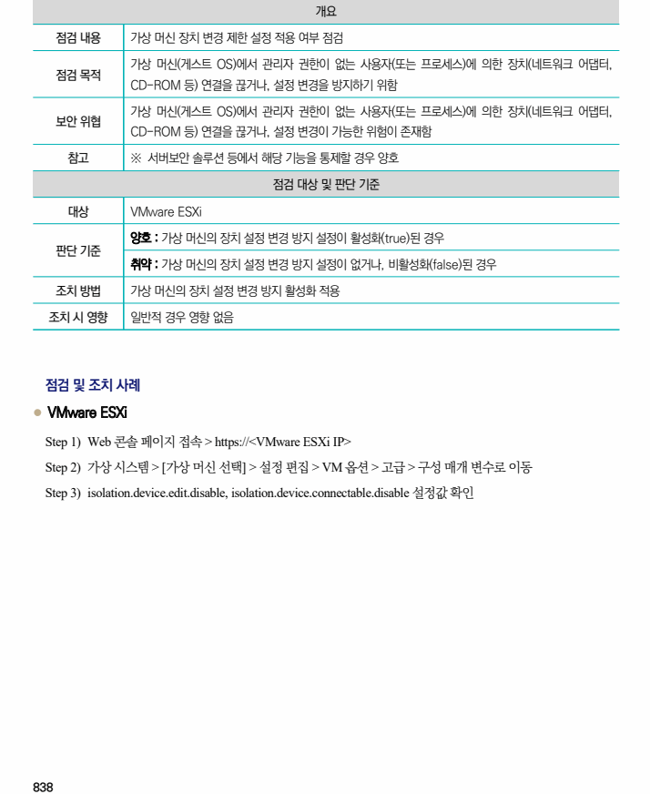
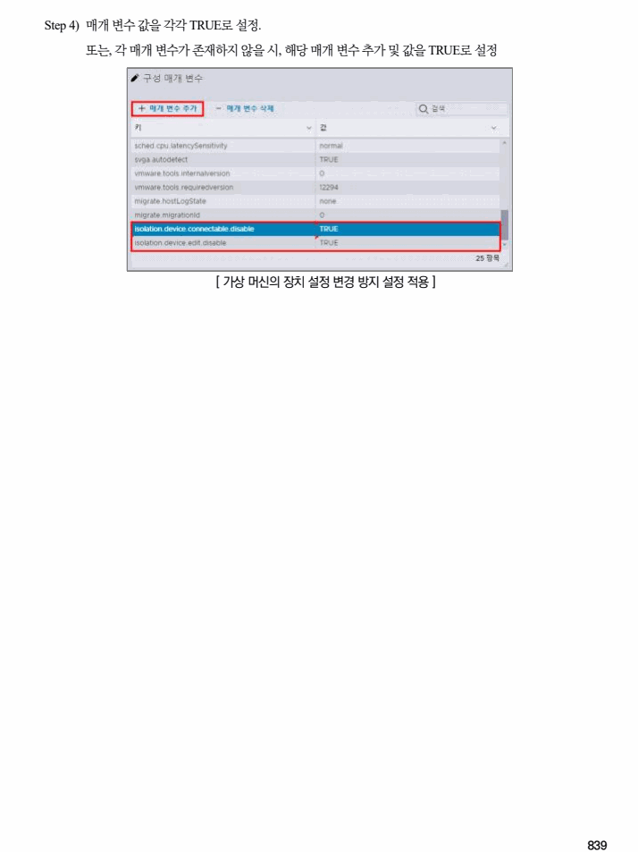

## 원문 전사

### PDF 페이지 838

~~~text transcription
개요
점검 내용 가상 머신 장치 변경 제한 설정 적용 여부 점검
가상 머신(게스트 OS)에서 관리자 권한이 없는 사용자(또는 프로세스)에 의한 장치(네트워크 어댑터,
점검 목적
CD-ROM 등) 연결을 끊거나, 설정 변경을 방지하기 위함
가상 머신(게스트 OS)에서 관리자 권한이 없는 사용자(또는 프로세스)에 의한 장치(네트워크 어댑터,
보안 위협
CD-ROM 등) 연결을 끊거나, 설정 변경이 가능한 위험이 존재함
참고 ※ 서버보안 솔루션 등에서 해당 기능을 통제할 경우 양호
점검 대상 및 판단 기준
대상 VMware ESXi
양호 : 가상 머신의 장치 설정 변경 방지 설정이 활성화(true)된 경우
판단 기준
취약 : 가상 머신의 장치 설정 변경 방지 설정이 없거나, 비활성화(false)된 경우
조치 방법 가상 머신의 장치 설정 변경 방지 활성화 적용
조치 시 영향 일반적 경우 영향 없음
점검 및 조치 사례
l VMware ESXi
Step 1) Web 콘솔 페이지 접속 > https://<VMware ESXi IP>
Step 2) 가상 시스템 > [가상 머신 선택] > 설정 편집 > VM 옵션 > 고급 > 구성 매개 변수로 이동
Step 3) isolation.device.edit.disable, isolation.device.connectable.disable 설정값 확인
~~~

### PDF 페이지 839

~~~text transcription
Step 4) 매개 변수 값을 각각 TRUE로 설정.
또는, 각 매개 변수가 존재하지 않을 시, 해당 매개 변수 추가 및 값을 TRUE로 설정
[ 가상 머신의 장치 설정 변경 방지 설정 적용 ]
~~~

