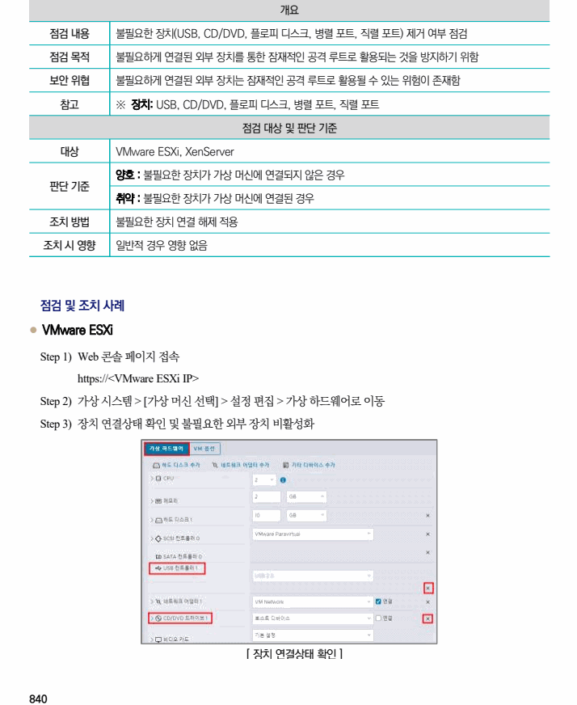
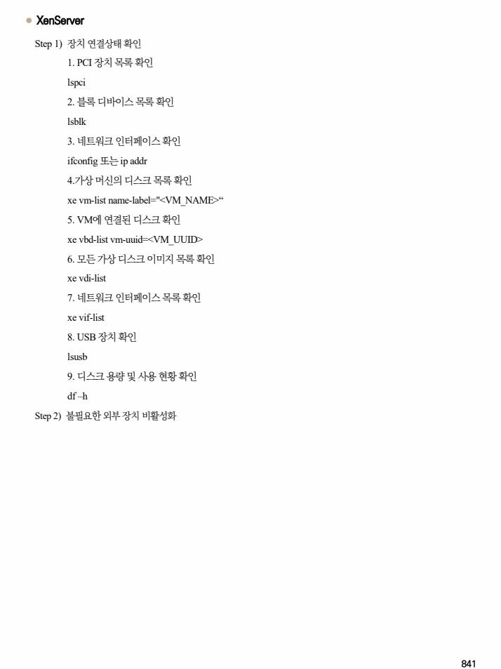

## 원문 전사

### PDF 페이지 840

~~~text transcription
개요
점검 내용 불필요한 장치(USB, CD/DVD, 플로피 디스크, 병렬 포트, 직렬 포트) 제거 여부 점검
점검 목적 불필요하게 연결된 외부 장치를 통한 잠재적인 공격 루트로 활용되는 것을 방지하기 위함
보안 위협 불필요하게 연결된 외부 장치는 잠재적인 공격 루트로 활용될 수 있는 위험이 존재함
참고 ※ 장치: USB, CD/DVD, 플로피 디스크, 병렬 포트, 직렬 포트
점검 대상 및 판단 기준
대상 VMware ESXi, XenServer
양호 : 불필요한 장치가 가상 머신에 연결되지 않은 경우
판단 기준
취약 : 불필요한 장치가 가상 머신에 연결된 경우
조치 방법 불필요한 장치 연결 해제 적용
조치 시 영향 일반적 경우 영향 없음
점검 및 조치 사례
l VMware ESXi
Step 1) Web 콘솔 페이지 접속
https://<VMware ESXi IP>
Step 2) 가상 시스템 > [가상 머신 선택] > 설정 편집 > 가상 하드웨어로 이동
Step 3) 장치 연결상태 확인 및 불필요한 외부 장치 비활성화
[ 장치 연결상태 확인 ]
~~~

### PDF 페이지 841

~~~text transcription
l XenServer
Step 1) 장치 연결상태 확인
1. PCI 장치 목록 확인
lspci
2. 블록 디바이스 목록 확인
lsblk
3. 네트워크 인터페이스 확인
ifconfig 또는 ip addr
4.가상 머신의 디스크 목록 확인
xe vm-list name-label="<VM_NAME>“
5. VM에 연결된 디스크 확인
xe vbd-list vm-uuid=<VM_UUID>
6. 모든 가상 디스크 이미지 목록 확인
xe vdi-list
7. 네트워크 인터페이스 목록 확인
xe vif-list
8. USB 장치 확인
lsusb
9. 디스크 용량 및 사용 현황 확인
df –h
Step 2) 불필요한 외부 장치 비활성화
~~~

