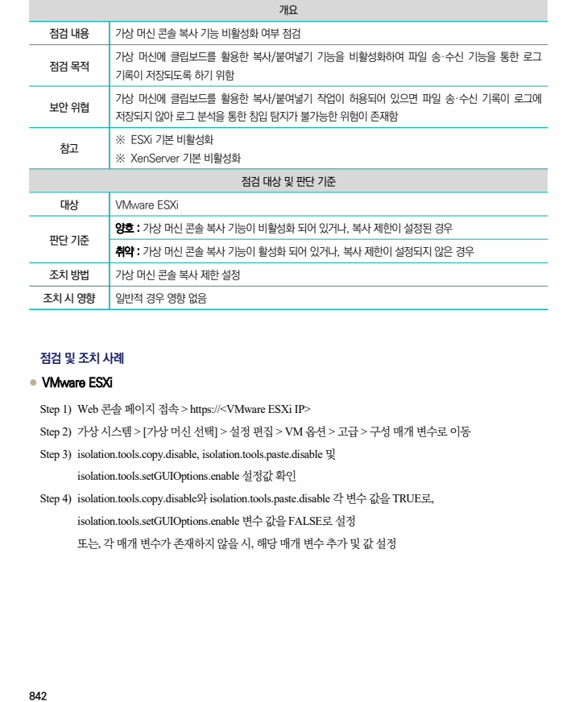
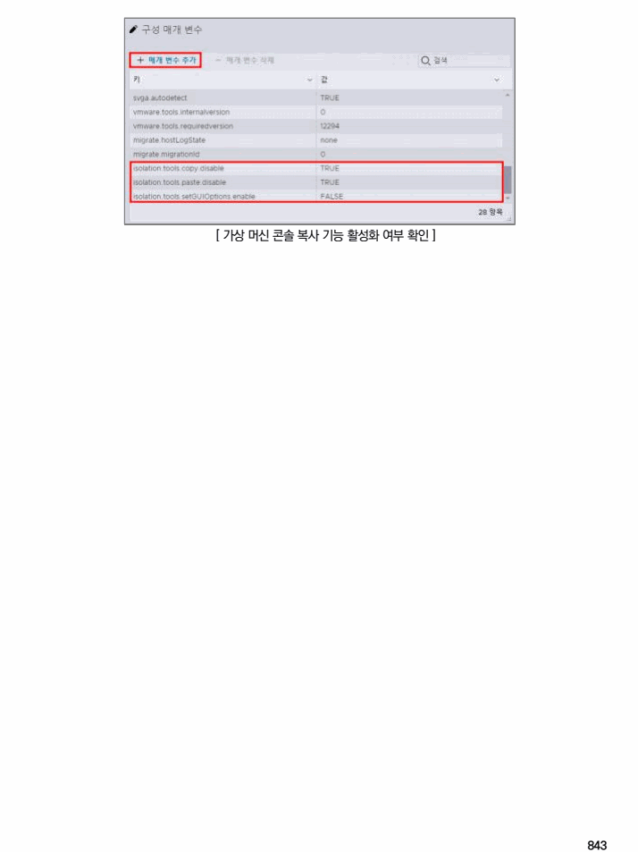

## 원문 전사

### PDF 페이지 842

~~~text transcription
개요
점검 내용 가상 머신 콘솔 복사 기능 비활성화 여부 점검
가상 머신에 클립보드를 활용한 복사/붙여넣기 기능을 비활성화하여 파일 송·수신 기능을 통한 로그
점검 목적
기록이 저장되도록 하기 위함
가상 머신에 클립보드를 활용한 복사/붙여넣기 작업이 허용되어 있으면 파일 송·수신 기록이 로그에
보안 위협
저장되지 않아 로그 분석을 통한 침입 탐지가 불가능한 위험이 존재함
※ ESXi 기본 비활성화
참고
※ XenServer 기본 비활성화
점검 대상 및 판단 기준
대상 VMware ESXi
양호 : 가상 머신 콘솔 복사 기능이 비활성화 되어 있거나, 복사 제한이 설정된 경우
판단 기준
취약 : 가상 머신 콘솔 복사 기능이 활성화 되어 있거나, 복사 제한이 설정되지 않은 경우
조치 방법 가상 머신 콘솔 복사 제한 설정
조치 시 영향 일반적 경우 영향 없음
점검 및 조치 사례
l VMware ESXi
Step 1) Web 콘솔 페이지 접속 > https://<VMware ESXi IP>
Step 2) 가상 시스템 > [가상 머신 선택] > 설정 편집 > VM 옵션 > 고급 > 구성 매개 변수로 이동
Step 3) isolation.tools.copy.disable, isolation.tools.paste.disable 및
isolation.tools.setGUIOptions.enable 설정값 확인
Step 4) isolation.tools.copy.disable와 isolation.tools.paste.disable 각 변수 값을 TRUE로,
isolation.tools.setGUIOptions.enable 변수 값을 FALSE로 설정
또는, 각 매개 변수가 존재하지 않을 시, 해당 매개 변수 추가 및 값 설정
~~~

### PDF 페이지 843

~~~text transcription
[ 가상 머신 콘솔 복사 기능 활성화 여부 확인 ]
~~~

