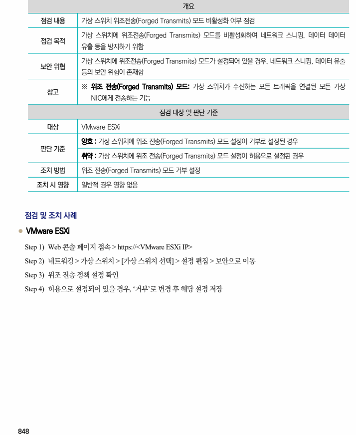
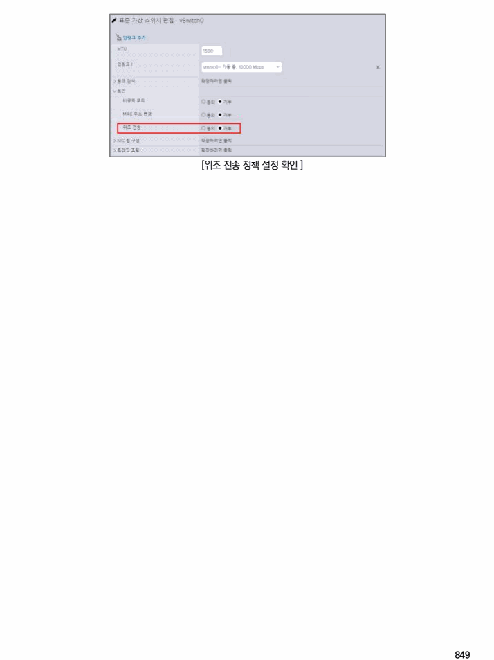

## 원문 전사

### PDF 페이지 848

~~~text transcription
개요
점검 내용 가상 스위치 위조전송(Forged Transmits) 모드 비활성화 여부 점검
가상 스위치에 위조전송(Forged Transmits) 모드를 비활성화하여 네트워크 스니핑, 데이터 데이터
점검 목적
유출 등을 방지하기 위함
가상 스위치에 위조전송(Forged Transmits) 모드가 설정되어 있을 경우, 네트워크 스니핑, 데이터 유출
보안 위협
등의 보안 위험이 존재함
※ 위조 전송(Forged Transmits) 모드: 가상 스위치가 수신하는 모든 트래픽을 연결된 모든 가상
참고
NIC에게 전송하는 기능
점검 대상 및 판단 기준
대상 VMware ESXi
양호 : 가상 스위치에 위조 전송(Forged Transmits) 모드 설정이 거부로 설정된 경우
판단 기준
취약 : 가상 스위치에 위조 전송(Forged Transmits) 모드 설정이 허용으로 설정된 경우
조치 방법 위조 전송(Forged Transmits) 모드 거부 설정
조치 시 영향 일반적 경우 영향 없음
점검 및 조치 사례
l VMware ESXi
Step 1) Web 콘솔 페이지 접속 > https://<VMware ESXi IP>
Step 2) 네트워킹 > 가상 스위치 > [가상 스위치 선택] > 설정 편집 > 보안으로 이동
Step 3) 위조 전송 정책 설정 확인
Step 4) 허용으로 설정되어 있을 경우, ‘거부’로 변경 후 해당 설정 저장
~~~

### PDF 페이지 849

~~~text transcription
[위조 전송 정책 설정 확인 ]
~~~

