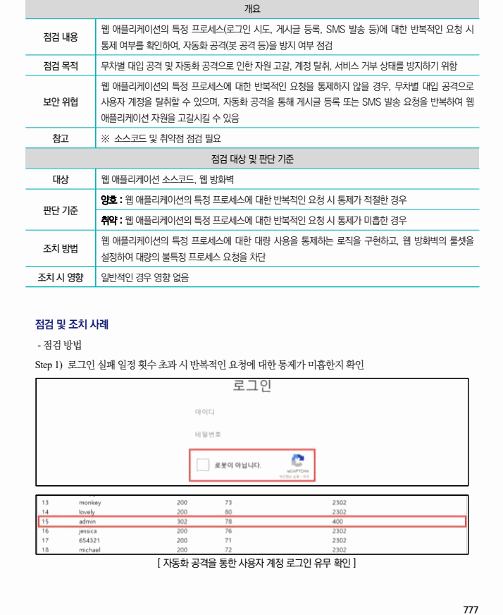
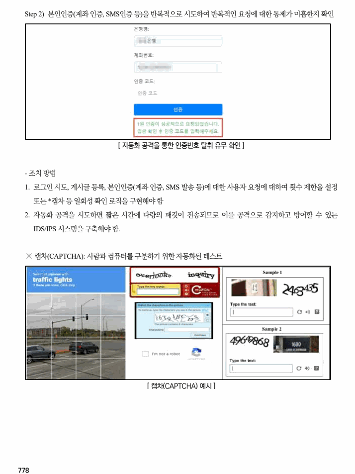

## 원문 전사

### PDF 페이지 777

~~~text transcription
개요
웹 애플리케이션의 특정 프로세스(로그인 시도, 게시글 등록, SMS 발송 등)에 대한 반복적인 요청 시
점검 내용
통제 여부를 확인하여, 자동화 공격(봇 공격 등)을 방지 여부 점검
점검 목적 무차별 대입 공격 및 자동화 공격으로 인한 자원 고갈, 계정 탈취, 서비스 거부 상태를 방지하기 위함
웹 애플리케이션의 특정 프로세스에 대한 반복적인 요청을 통제하지 않을 경우, 무차별 대입 공격으로
보안 위협 사용자 계정을 탈취할 수 있으며, 자동화 공격을 통해 게시글 등록 또는 SMS 발송 요청을 반복하여 웹
애플리케이션 자원을 고갈시킬 수 있음
참고 ※ 소스코드 및 취약점 점검 필요
점검 대상 및 판단 기준
대상 웹 애플리케이션 소스코드, 웹 방화벽
양호 : 웹 애플리케이션의 특정 프로세스에 대한 반복적인 요청 시 통제가 적절한 경우
판단 기준
취약 : 웹 애플리케이션의 특정 프로세스에 대한 반복적인 요청 시 통제가 미흡한 경우
웹 애플리케이션의 특정 프로세스에 대한 대량 사용을 통제하는 로직을 구현하고, 웹 방화벽의 룰셋을
조치 방법
설정하여 대량의 불특정 프로세스 요청을 차단
조치 시 영향 일반적인 경우 영향 없음
점검 및 조치 사례
- 점검 방법
Step 1) 로그인 실패 일정 횟수 초과 시 반복적인 요청에 대한 통제가 미흡한지 확인
[ 자동화 공격을 통한 사용자 계정 로그인 유무 확인 ]
~~~

### PDF 페이지 778

~~~text transcription
Step 2) 본인인증(계좌 인증, SMS인증 등)을 반복적으로 시도하여 반복적인 요청에 대한 통제가 미흡한지 확인
[ 자동화 공격을 통한 인증번호 탈취 유무 확인 ]
- 조치 방법
1. 로그인 시도, 게시글 등록, 본인인증(계좌 인증, SMS 발송 등)에 대한 사용자 요청에 대하여 횟수 제한을 설정
또는 *캡차 등 일회성 확인 로직을 구현해야 함
2. 자동화 공격을 시도하면 짧은 시간에 다량의 패킷이 전송되므로 이를 공격으로 감지하고 방어할 수 있는
IDS/IPS 시스템을 구축해야 함.
※ 캡차(CAPTCHA): 사람과 컴퓨터를 구분하기 위한 자동화된 테스트
[ 캡차(CAPTCHA) 예시 ]
~~~

