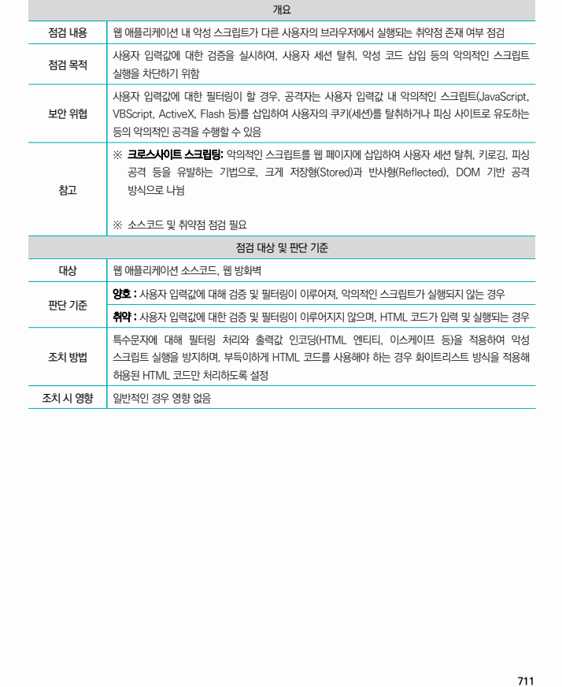
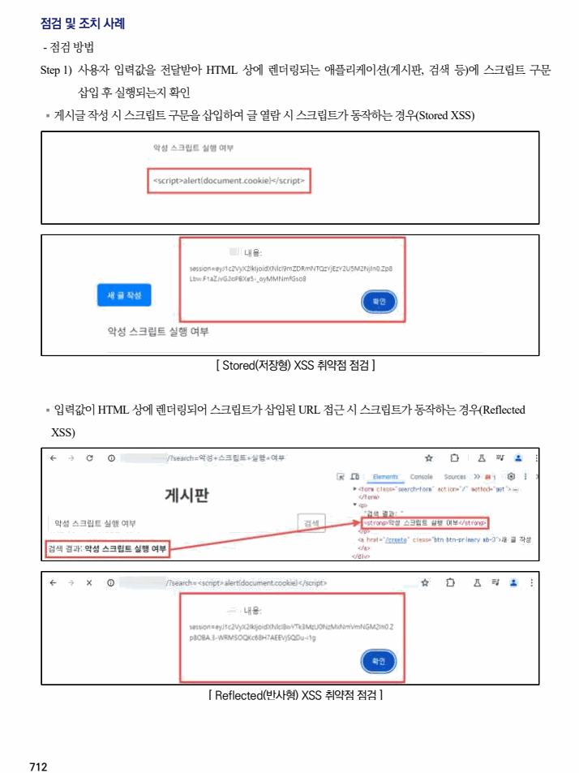
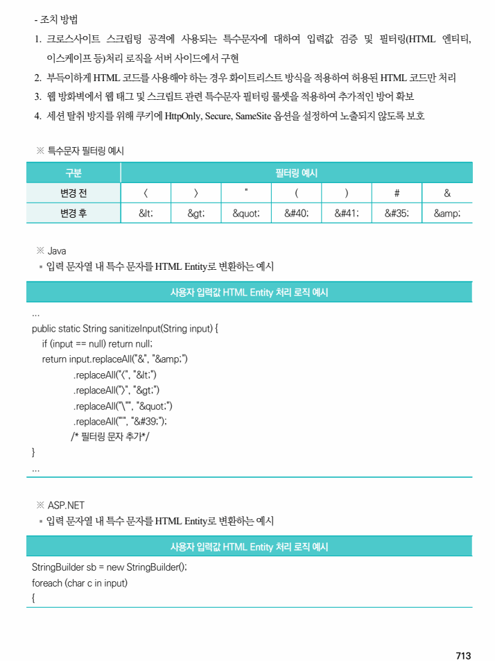
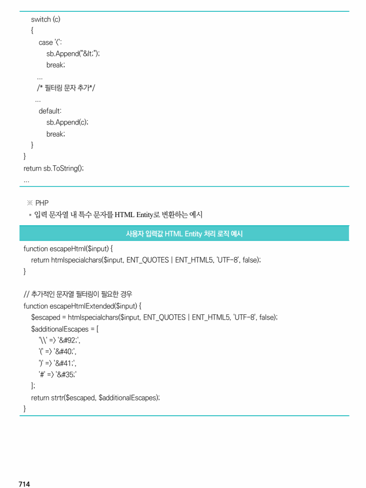

## 원문 전사

### PDF 페이지 711

~~~text transcription
개요
점검 내용 웹 애플리케이션 내 악성 스크립트가 다른 사용자의 브라우저에서 실행되는 취약점 존재 여부 점검
사용자 입력값에 대한 검증을 실시하여, 사용자 세션 탈취, 악성 코드 삽입 등의 악의적인 스크립트
점검 목적
실행을 차단하기 위함
사용자 입력값에 대한 필터링이 할 경우, 공격자는 사용자 입력값 내 악의적인 스크립트(JavaScript,
보안 위협 VBScript, ActiveX, Flash 등)를 삽입하여 사용자의 쿠키(세션)를 탈취하거나 피싱 사이트로 유도하는
등의 악의적인 공격을 수행할 수 있음
※ 크로스사이트 스크립팅: 악의적인 스크립트를 웹 페이지에 삽입하여 사용자 세션 탈취, 키로깅, 피싱
공격 등을 유발하는 기법으로, 크게 저장형(Stored)과 반사형(Reflected), DOM 기반 공격
참고 방식으로 나뉨
※ 소스코드 및 취약점 점검 필요
점검 대상 및 판단 기준
대상 웹 애플리케이션 소스코드, 웹 방화벽
양호 : 사용자 입력값에 대해 검증 및 필터링이 이루어져, 악의적인 스크립트가 실행되지 않는 경우
판단 기준
취약 : 사용자 입력값에 대한 검증 및 필터링이 이루어지지 않으며, HTML 코드가 입력 및 실행되는 경우
특수문자에 대해 필터링 처리와 출력값 인코딩(HTML 엔티티, 이스케이프 등)을 적용하여 악성
조치 방법 스크립트 실행을 방지하며, 부득이하게 HTML 코드를 사용해야 하는 경우 화이트리스트 방식을 적용해
허용된 HTML 코드만 처리하도록 설정
조치 시 영향 일반적인 경우 영향 없음
~~~

### PDF 페이지 712

~~~text transcription
점검 및 조치 사례
- 점검 방법
Step 1) 사용자 입력값을 전달받아 HTML 상에 렌더링되는 애플리케이션(게시판, 검색 등)에 스크립트 구문
삽입 후 실행되는지 확인
§ 게시글 작성 시 스크립트 구문을 삽입하여 글 열람 시 스크립트가 동작하는 경우(Stored XSS)
[ Stored(저장형) XSS 취약점 점검 ]
§ 입력값이 HTML 상에 렌더링되어 스크립트가 삽입된 URL 접근 시 스크립트가 동작하는 경우(Reflected
XSS)
[ Reflected(반사형) XSS 취약점 점검 ]
~~~

### PDF 페이지 713

~~~text transcription
- 조치 방법
1. 크로스사이트 스크립팅 공격에 사용되는 특수문자에 대하여 입력값 검증 및 필터링(HTML 엔티티,
이스케이프 등)처리 로직을 서버 사이드에서 구현
2. 부득이하게 HTML 코드를 사용해야 하는 경우 화이트리스트 방식을 적용하여 허용된 HTML 코드만 처리
3. 웹 방화벽에서 웹 태그 및 스크립트 관련 특수문자 필터링 룰셋을 적용하여 추가적인 방어 확보
4. 세션 탈취 방지를 위해 쿠키에 HttpOnly, Secure, SameSite 옵션을 설정하여 노출되지 않도록 보호
※ 특수문자 필터링 예시
구분 필터링 예시
변경 전 < > " ( ) # &
변경 후 &lt; &gt; &quot; &#40; &#41; &#35; &amp;
※ Java
§ 입력 문자열 내 특수 문자를 HTML Entity로 변환하는 예시
사용자 입력값 HTML Entity 처리 로직 예시
...
public static String sanitizeInput(String input) {
if (input == null) return null;
return input.replaceAll("&", "&amp;")
.replaceAll("<", "&lt;")
.replaceAll(">", "&gt;")
.replaceAll("\"", "&quot;")
.replaceAll("'", "&#39;");
/* 필터링 문자 추가*/
}
...
※ ASP.NET
§ 입력 문자열 내 특수 문자를 HTML Entity로 변환하는 예시
사용자 입력값 HTML Entity 처리 로직 예시
StringBuilder sb = new StringBuilder();
foreach (char c in input)
{
~~~

### PDF 페이지 714

~~~text transcription
switch (c)
{
case '<':
sb.Append("&lt;");
break;
...
/* 필터링 문자 추가*/
...
default:
sb.Append(c);
break;
}
}
return sb.ToString();
...
※ PHP
§ 입력 문자열 내 특수 문자를 HTML Entity로 변환하는 예시
사용자 입력값 HTML Entity 처리 로직 예시
function escapeHtml($input) {
return htmlspecialchars($input, ENT_QUOTES | ENT_HTML5, 'UTF-8', false);
}
// 추가적인 문자열 필터링이 필요한 경우
function escapeHtmlExtended($input) {
$escaped = htmlspecialchars($input, ENT_QUOTES | ENT_HTML5, 'UTF-8', false);
$additionalEscapes = [
'\\' => '&#92;',
'(' => '&#40;',
')' => '&#41;',
'#' => '&#35;'
];
return strtr($escaped, $additionalEscapes);
}
~~~

