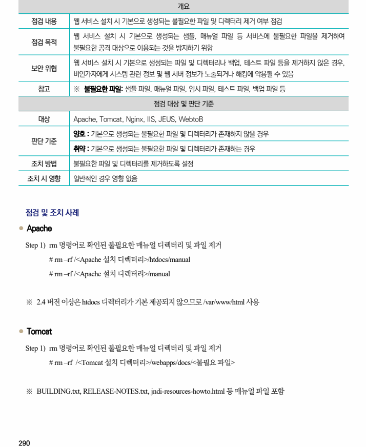
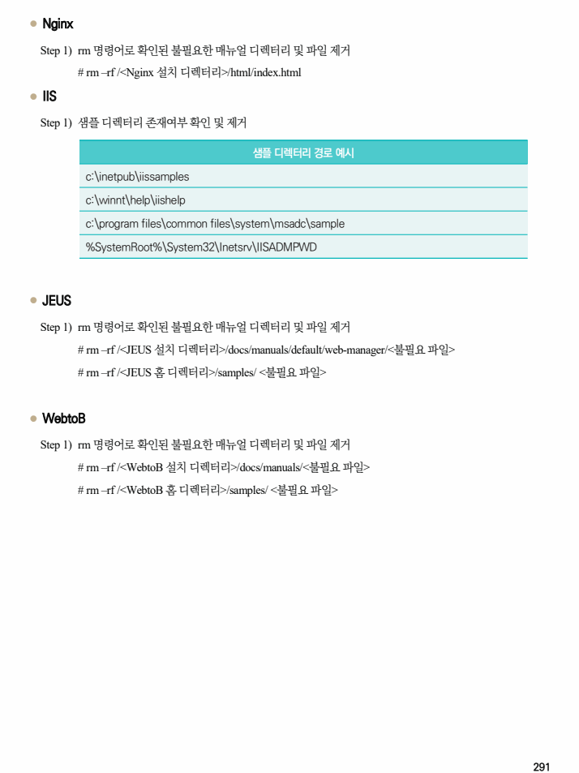

## 원문 전사

### PDF 페이지 290

~~~text transcription
개요
점검 내용 웹 서비스 설치 시 기본으로 생성되는 불필요한 파일 및 디렉터리 제거 여부 점검
웹 서비스 설치 시 기본으로 생성되는 샘플, 매뉴얼 파일 등 서비스에 불필요한 파일을 제거하여
점검 목적
불필요한 공격 대상으로 이용되는 것을 방지하기 위함
웹 서비스 설치 시 기본으로 생성되는 파일 및 디렉터리나 백업, 테스트 파일 등을 제거하지 않은 경우,
보안 위협
비인가자에게 시스템 관련 정보 및 웹 서버 정보가 노출되거나 해킹에 악용될 수 있음
참고 ※ 불필요한 파일: 샘플 파일, 매뉴얼 파일, 임시 파일, 테스트 파일, 백업 파일 등
점검 대상 및 판단 기준
대상 Apache, Tomcat, Nginx, IIS, JEUS, WebtoB
양호 : 기본으로 생성되는 불필요한 파일 및 디렉터리가 존재하지 않을 경우
판단 기준
취약 : 기본으로 생성되는 불필요한 파일 및 디렉터리가 존재하는 경우
조치 방법 불필요한 파일 및 디렉터리를 제거하도록 설정
조치 시 영향 일반적인 경우 영향 없음
점검 및 조치 사례
l Apache
Step 1) rm 명령어로 확인된 불필요한 매뉴얼 디렉터리 및 파일 제거
# rm –rf /<Apache 설치 디렉터리>/htdocs/manual
# rm –rf /<Apache 설치 디렉터리>/manual
※ 2.4 버전 이상은 htdocs 디렉터리가 기본 제공되지 않으므로 /var/www/html 사용
l Tomcat
Step 1) rm 명령어로 확인된 불필요한 매뉴얼 디렉터리 및 파일 제거
# rm –rf /<Tomcat 설치 디렉터리>/webapps/docs/<불필요 파일>
※ BUILDING.txt, RELEASE-NOTES.txt, jndi-resources-howto.html 등 매뉴얼 파일 포함
~~~

### PDF 페이지 291

~~~text transcription
l Nginx
Step 1) rm 명령어로 확인된 불필요한 매뉴얼 디렉터리 및 파일 제거
# rm –rf /<Nginx 설치 디렉터리>/html/index.html
l IIS
Step 1) 샘플 디렉터리 존재여부 확인 및 제거
샘플 디렉터리 경로 예시
c:\inetpub\iissamples
c:\winnt\help\iishelp
c:\program files\common files\system\msadc\sample
%SystemRoot%\System32\Inetsrv\IISADMPWD
l JEUS
Step 1) rm 명령어로 확인된 불필요한 매뉴얼 디렉터리 및 파일 제거
# rm –rf /<JEUS 설치 디렉터리>/docs/manuals/default/web-manager/<불필요 파일>
# rm –rf /<JEUS 홈 디렉터리>/samples/ <불필요 파일>
l WebtoB
Step 1) rm 명령어로 확인된 불필요한 매뉴얼 디렉터리 및 파일 제거
# rm –rf /<WebtoB 설치 디렉터리>/docs/manuals/<불필요 파일>
# rm –rf /<WebtoB 홈 디렉터리>/samples/ <불필요 파일>
~~~

