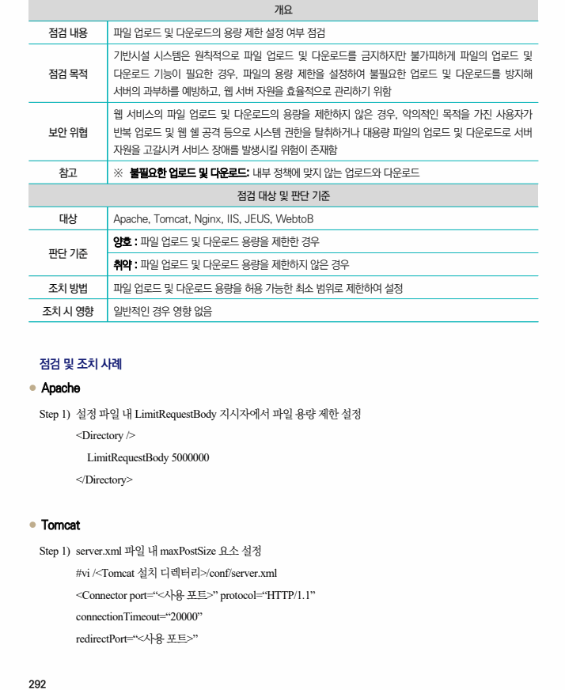
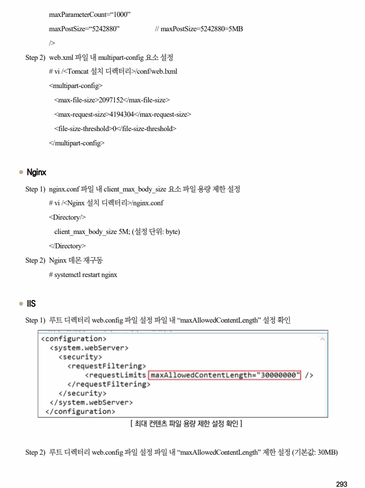
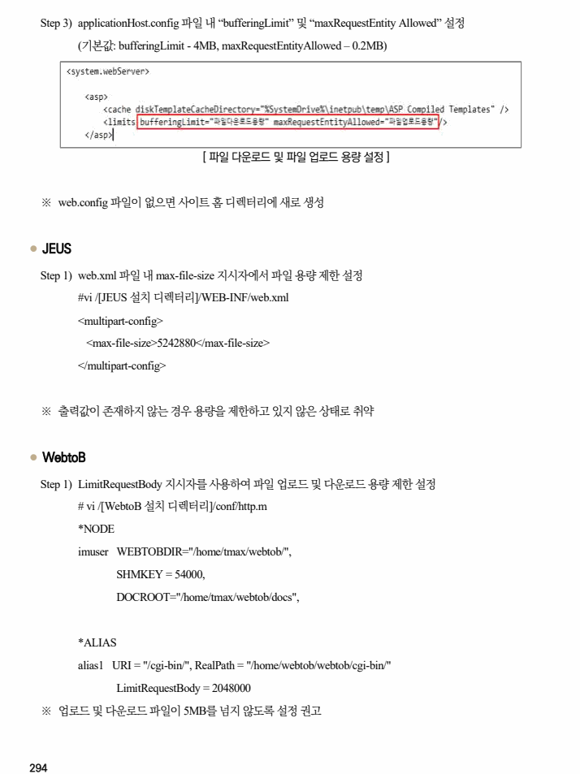

## 원문 전사

### PDF 페이지 292

~~~text transcription
개요
점검 내용 파일 업로드 및 다운로드의 용량 제한 설정 여부 점검
기반시설 시스템은 원칙적으로 파일 업로드 및 다운로드를 금지하지만 불가피하게 파일의 업로드 및
점검 목적 다운로드 기능이 필요한 경우, 파일의 용량 제한을 설정하여 불필요한 업로드 및 다운로드를 방지해
서버의 과부하를 예방하고, 웹 서버 자원을 효율적으로 관리하기 위함
웹 서비스의 파일 업로드 및 다운로드의 용량을 제한하지 않은 경우, 악의적인 목적을 가진 사용자가
보안 위협 반복 업로드 및 웹 쉘 공격 등으로 시스템 권한을 탈취하거나 대용량 파일의 업로드 및 다운로드로 서버
자원을 고갈시켜 서비스 장애를 발생시킬 위험이 존재함
참고 ※ 불필요한 업로드 및 다운로드: 내부 정책에 맞지 않는 업로드와 다운로드
점검 대상 및 판단 기준
대상 Apache, Tomcat, Nginx, IIS, JEUS, WebtoB
양호 : 파일 업로드 및 다운로드 용량을 제한한 경우
판단 기준
취약 : 파일 업로드 및 다운로드 용량을 제한하지 않은 경우
조치 방법 파일 업로드 및 다운로드 용량을 허용 가능한 최소 범위로 제한하여 설정
조치 시 영향 일반적인 경우 영향 없음
점검 및 조치 사례
l Apache
Step 1) 설정 파일 내 LimitRequestBody 지시자에서 파일 용량 제한 설정
<Directory />
LimitRequestBody 5000000
</Directory>
l Tomcat
Step 1) server.xml 파일 내 maxPostSize 요소 설정
#vi /<Tomcat 설치 디렉터리>/conf/server.xml
<Connector port=“<사용 포트>” protocol=“HTTP/1.1”
connectionTimeout=“20000”
redirectPort=“<사용 포트>”
~~~

### PDF 페이지 293

~~~text transcription
maxParameterCount=“1000”
maxPostSize=“5242880” // maxPostSize=5242880=5MB
/>
Step 2) web.xml 파일 내 multipart-config 요소 설정
# vi /<Tomcat 설치 디렉터리>/conf/web.lxml
<multipart-config>
<max-file-size>2097152</max-file-size>
<max-request-size>4194304</max-request-size>
<file-size-threshold>0</file-size-threshold>
</multipart-config>
l Nginx
Step 1) nginx.conf 파일 내 client_max_body_size 요소 파일 용량 제한 설정
# vi /<Nginx 설치 디렉터리>/nginx.conf
<Directory/>
client_max_body_size 5M; (설정 단위: byte)
</Directory>
Step 2) Nginx 데몬 재구동
# systemctl restart nginx
l IIS
Step 1) 루트 디렉터리 web.config 파일 설정 파일 내 “maxAllowedContentLength” 설정 확인
[ 최대 컨텐츠 파일 용량 제한 설정 확인 ]
Step 2) 루트 디렉터리 web.config 파일 설정 파일 내 “maxAllowedContentLength” 제한 설정 (기본값: 30MB)
~~~

### PDF 페이지 294

~~~text transcription
Step 3) applicationHost.config 파일 내 “bufferingLimit” 및 “maxRequestEntity Allowed” 설정
(기본값: bufferingLimit - 4MB, maxRequestEntityAllowed – 0.2MB)
[ 파일 다운로드 및 파일 업로드 용량 설정 ]
※ web.config 파일이 없으면 사이트 홈 디렉터리에 새로 생성
l JEUS
Step 1) web.xml 파일 내 max-file-size 지시자에서 파일 용량 제한 설정
#vi /[JEUS 설치 디렉터리]/WEB-INF/web.xml
<multipart-config>
<max-file-size>5242880</max-file-size>
</multipart-config>
※ 출력값이 존재하지 않는 경우 용량을 제한하고 있지 않은 상태로 취약
l WebtoB
Step 1) LimitRequestBody 지시자를 사용하여 파일 업로드 및 다운로드 용량 제한 설정
# vi /[WebtoB 설치 디렉터리]/conf/http.m
*NODE
imuser WEBTOBDIR="/home/tmax/webtob/",
SHMKEY = 54000,
DOCROOT="/home/tmax/webtob/docs",
*ALIAS
alias1 URI = "/cgi-bin/", RealPath = "/home/webtob/webtob/cgi-bin/"
LimitRequestBody = 2048000
※ 업로드 및 다운로드 파일이 5MB를 넘지 않도록 설정 권고
~~~

