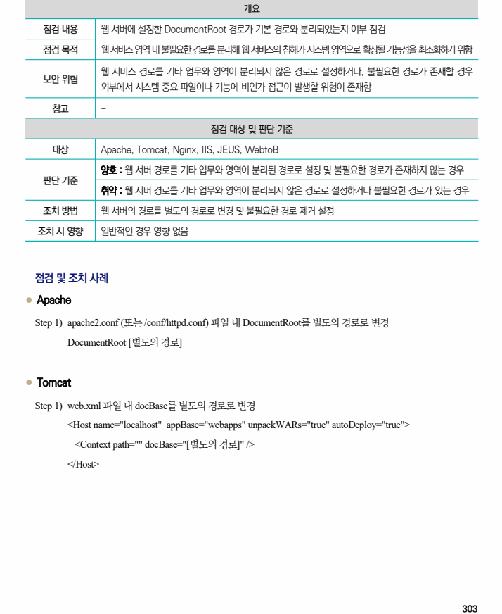
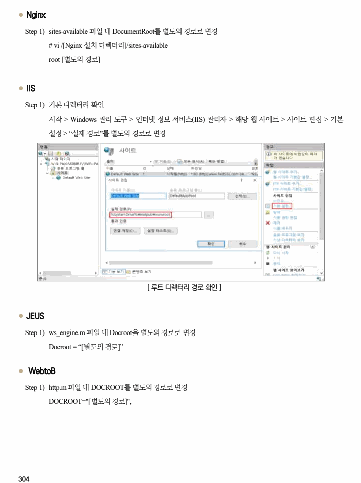

## 원문 전사

### PDF 페이지 303

~~~text transcription
개요
점검 내용 웹 서버에 설정한 DocumentRoot 경로가 기본 경로와 분리되었는지 여부 점검
점검 목적 웹 서비스 영역 내 불필요한 경로를 분리해 웹 서비스의 침해가 시스템 영역으로 확장될 가능성을 최소화하기 위함
웹 서비스 경로를 기타 업무와 영역이 분리되지 않은 경로로 설정하거나, 불필요한 경로가 존재할 경우
보안 위협
외부에서 시스템 중요 파일이나 기능에 비인가 접근이 발생할 위험이 존재함
참고 -
점검 대상 및 판단 기준
대상 Apache, Tomcat, Nginx, IIS, JEUS, WebtoB
양호 : 웹 서버 경로를 기타 업무와 영역이 분리된 경로로 설정 및 불필요한 경로가 존재하지 않는 경우
판단 기준
취약 : 웹 서버 경로를 기타 업무와 영역이 분리되지 않은 경로로 설정하거나 불필요한 경로가 있는 경우
조치 방법 웹 서버의 경로를 별도의 경로로 변경 및 불필요한 경로 제거 설정
조치 시 영향 일반적인 경우 영향 없음
점검 및 조치 사례
l Apache
Step 1) apache2.conf (또는 /conf/httpd.conf) 파일 내 DocumentRoot를 별도의 경로로 변경
DocumentRoot [별도의 경로]
l Tomcat
Step 1) web.xml 파일 내 docBase를 별도의 경로로 변경
<Host name="localhost" appBase="webapps" unpackWARs="true" autoDeploy="true">
<Context path="" docBase="[별도의 경로]" />
</Host>
~~~

### PDF 페이지 304

~~~text transcription
l Nginx
Step 1) sites-available 파일 내 DocumentRoot를 별도의 경로로 변경
# vi /[Nginx 설치 디렉터리]/sites-available
root [별도의 경로]
l IIS
Step 1) 기본 디렉터리 확인
시작 > Windows 관리 도구 > 인터넷 정보 서비스(IIS) 관리자 > 해당 웹 사이트 > 사이트 편집 > 기본
설정 > “실제 경로”를 별도의 경로로 변경
[ 루트 디렉터리 경로 확인 ]
l JEUS
Step 1) ws_engine.m 파일 내 Docroot을 별도의 경로로 변경
Docroot = “[별도의 경로]”
l WebtoB
Step 1) http.m 파일 내 DOCROOT를 별도의 경로로 변경
DOCROOT="[별도의 경로]",
~~~

