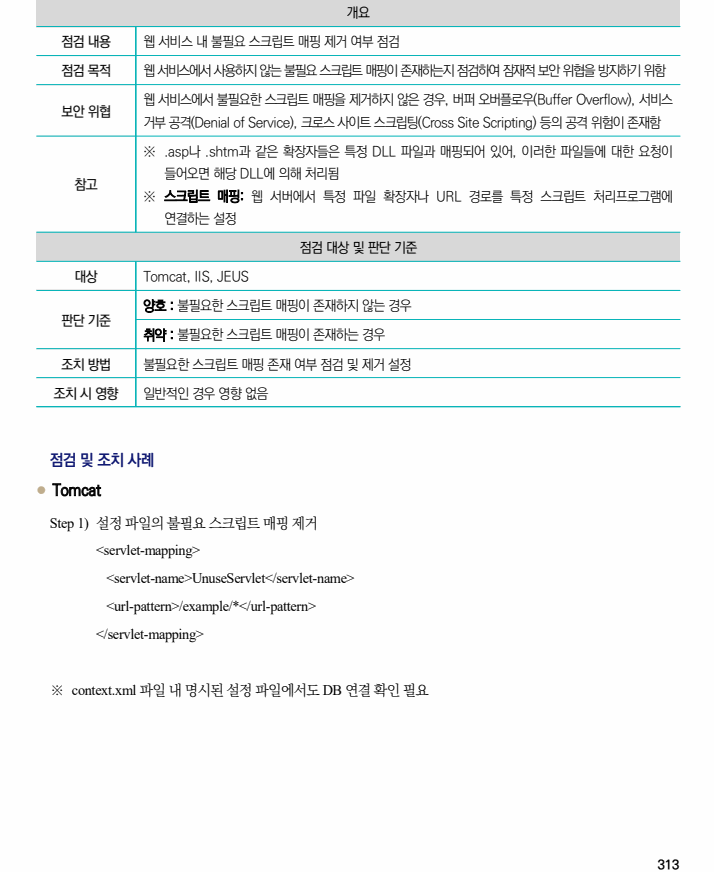
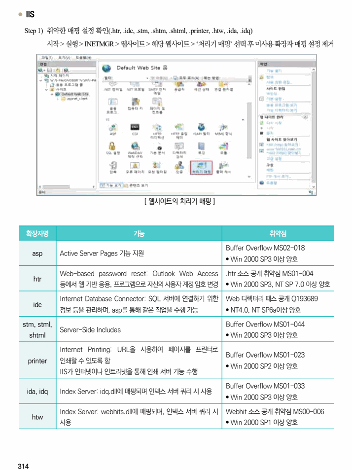
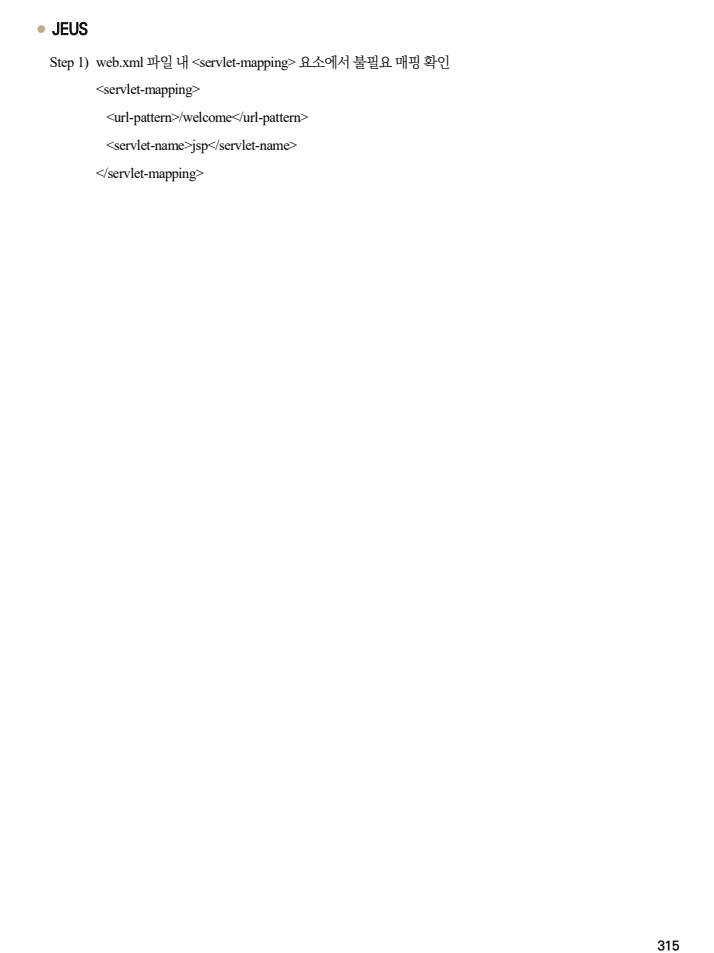

## 원문 전사

### PDF 페이지 313

~~~text transcription
개요
점검 내용 웹 서비스 내 불필요 스크립트 매핑 제거 여부 점검
점검 목적 웹 서비스에서 사용하지 않는 불필요 스크립트 매핑이 존재하는지 점검하여 잠재적 보안 위협을 방지하기 위함
웹 서비스에서 불필요한 스크립트 매핑을 제거하지 않은 경우, 버퍼 오버플로우(Buffer Overflow), 서비스
보안 위협
거부 공격(Denial of Service), 크로스 사이트 스크립팅(Cross Site Scripting) 등의 공격 위험이 존재함
※ .asp나 .shtm과 같은 확장자들은 특정 DLL 파일과 매핑되어 있어, 이러한 파일들에 대한 요청이
들어오면 해당 DLL에 의해 처리됨
참고
※ 스크립트 매핑: 웹 서버에서 특정 파일 확장자나 URL 경로를 특정 스크립트 처리프로그램에
연결하는 설정
점검 대상 및 판단 기준
대상 Tomcat, IIS, JEUS
양호 : 불필요한 스크립트 매핑이 존재하지 않는 경우
판단 기준
취약 : 불필요한 스크립트 매핑이 존재하는 경우
조치 방법 불필요한 스크립트 매핑 존재 여부 점검 및 제거 설정
조치 시 영향 일반적인 경우 영향 없음
점검 및 조치 사례
l Tomcat
Step 1) 설정 파일의 불필요 스크립트 매핑 제거
<servlet-mapping>
<servlet-name>UnuseServlet</servlet-name>
<url-pattern>/example/*</url-pattern>
</servlet-mapping>
※ context.xml 파일 내 명시된 설정 파일에서도 DB 연결 확인 필요
~~~

### PDF 페이지 314

~~~text transcription
l IIS
Step 1) 취약한 매핑 설정 확인(.htr, .idc, .stm, .shtm, .shtml, .printer, .htw, .ida, .idq)
시작 > 실행 > INETMGR > 웹사이트 > 해당 웹사이트 > ‘처리기 매핑’ 선택 후 미사용 확장자 매핑 설정 제거
[ 웹사이트의 처리기 매핑 ]
확장자명 기능 취약점
Buffer Overflow MS02-018
asp Active Server Pages 기능 지원
• Win 2000 SP3 이상 양호
Web-based password reset: Outlook Web Access .htr 소스 공개 취약점 MS01-004
htr
등에서 웹 기반 응용, 프로그램으로 자신의 사용자 계정 암호 변경 • Win 2000 SP3, NT SP 7.0 이상 양호
Internet Database Connector: SQL 서버에 연결하기 위한 Web 디렉터리 패스 공개 Q193689
idc
정보 등을 관리하며, asp를 통해 같은 작업을 수행 가능 • NT4.0, NT SP6a이상 양호
stm, stml, Buffer Overflow MS01-044
Server-Side Includes
shtml • Win 2000 SP3 이상 양호
Internet Printing: URL을 사용하여 페이지를 프린터로
Buffer Overflow MS01-023
printer 인쇄할 수 있도록 함
• Win 2000 SP2 이상 양호
IIS가 인터넷이나 인트라넷을 통해 인쇄 서버 기능 수행
Buffer Overflow MS01-033
ida, idq Index Server: idq.dll에 매핑되며 인덱스 서버 쿼리 시 사용
• Win 2000 SP3 이상 양호
Index Server: webhits.dll에 매핑되며, 인덱스 서버 쿼리 시 Webhit 소스 공개 취약점 MS00-006
htw
사용 • Win 2000 SP1 이상 양호
~~~

### PDF 페이지 315

~~~text transcription
l JEUS
Step 1) web.xml 파일 내 <servlet-mapping> 요소에서 불필요 매핑 확인
<servlet-mapping>
<url-pattern>/welcome</url-pattern>
<servlet-name>jsp</servlet-name>
</servlet-mapping>
~~~

