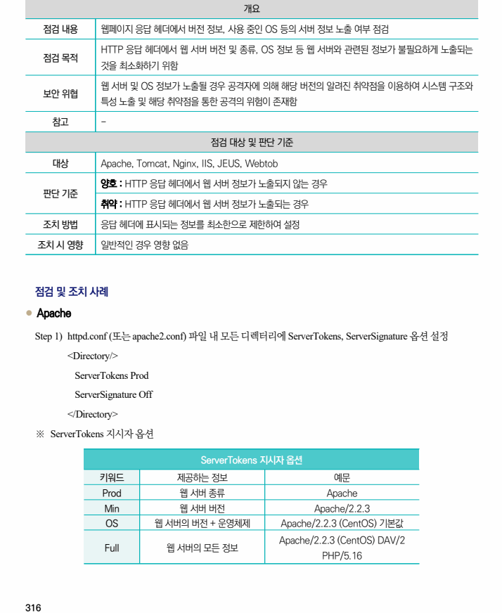
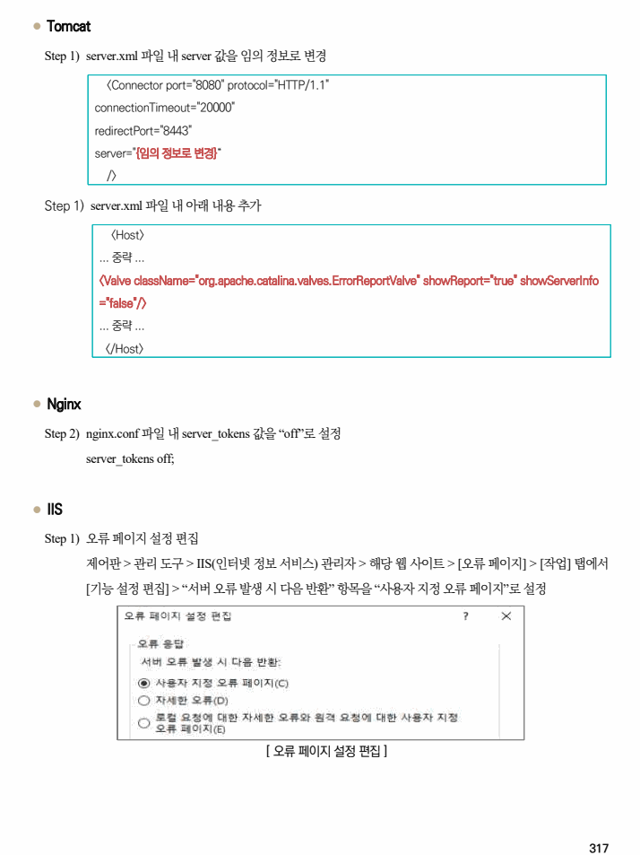
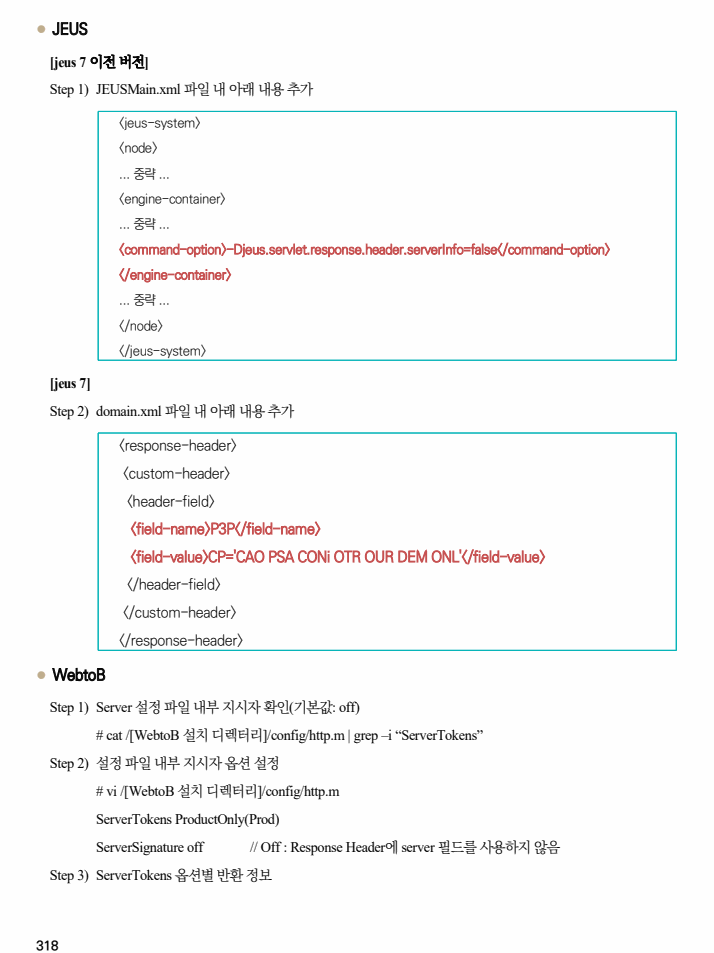
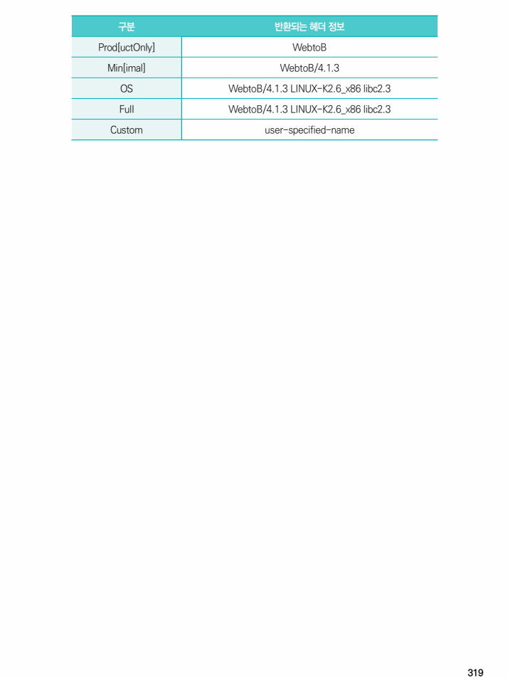

## 원문 전사

### PDF 페이지 316

~~~text transcription
개요
점검 내용 웹페이지 응답 헤더에서 버전 정보, 사용 중인 OS 등의 서버 정보 노출 여부 점검
HTTP 응답 헤더에서 웹 서버 버전 및 종류, OS 정보 등 웹 서버와 관련된 정보가 불필요하게 노출되는
점검 목적
것을 최소화하기 위함
웹 서버 및 OS 정보가 노출될 경우 공격자에 의해 해당 버전의 알려진 취약점을 이용하여 시스템 구조와
보안 위협
특성 노출 및 해당 취약점을 통한 공격의 위험이 존재함
참고 -
점검 대상 및 판단 기준
대상 Apache, Tomcat, Nginx, IIS, JEUS, Webtob
양호 : HTTP 응답 헤더에서 웹 서버 정보가 노출되지 않는 경우
판단 기준
취약 : HTTP 응답 헤더에서 웹 서버 정보가 노출되는 경우
조치 방법 응답 헤더에 표시되는 정보를 최소한으로 제한하여 설정
조치 시 영향 일반적인 경우 영향 없음
점검 및 조치 사례
l Apache
Step 1) httpd.conf (또는 apache2.conf) 파일 내 모든 디렉터리에 ServerTokens, ServerSignature 옵션 설정
<Directory/>
ServerTokens Prod
ServerSignature Off
</Directory>
※ ServerTokens 지시자 옵션
ServerTokens 지시자 옵션
키워드 제공하는 정보 예문
Prod 웹 서버 종류 Apache
Min 웹 서버 버전 Apache/2.2.3
OS 웹 서버의 버전 + 운영체제 Apache/2.2.3 (CentOS) 기본값
Apache/2.2.3 (CentOS) DAV/2
Full 웹 서버의 모든 정보
PHP/5.16
~~~

### PDF 페이지 317

~~~text transcription
l Tomcat
Step 1) server.xml 파일 내 server 값을 임의 정보로 변경
<Connector port="8080" protocol="HTTP/1.1"
connectionTimeout="20000"
redirectPort="8443"
server="{임의 정보로 변경}“
/>
Step 1) server.xml 파일 내 아래 내용 추가
<Host>
... 중략 ...
<Valve className="org.apache.catalina.valves.ErrorReportValve" showReport="true" showServerInfo
="false"/>
... 중략 ...
</Host>
l Nginx
Step 2) nginx.conf 파일 내 server_tokens 값을 “off”로 설정
server_tokens off;
l IIS
Step 1) 오류 페이지 설정 편집
제어판 > 관리 도구 > IIS(인터넷 정보 서비스) 관리자 > 해당 웹 사이트 > [오류 페이지] > [작업] 탭에서
[기능 설정 편집] > “서버 오류 발생 시 다음 반환” 항목을 “사용자 지정 오류 페이지”로 설정
[ 오류 페이지 설정 편집 ]
~~~

### PDF 페이지 318

~~~text transcription
l JEUS
[jeus 7 이전 버전]
Step 1) JEUSMain.xml 파일 내 아래 내용 추가
<jeus-system>
<node>
... 중략 ...
<engine-container>
... 중략 ...
<command-option>-Djeus.servlet.response.header.serverInfo=false</command-option>
</engine-container>
... 중략 ...
</node>
</jeus-system>
[jeus 7]
Step 2) domain.xml 파일 내 아래 내용 추가
<response-header>
<custom-header>
<header-field>
<field-name>P3P</field-name>
<field-value>CP='CAO PSA CONi OTR OUR DEM ONL'</field-value>
</header-field>
</custom-header>
</response-header>
l WebtoB
Step 1) Server 설정 파일 내부 지시자 확인(기본값: off)
# cat /[WebtoB 설치 디렉터리]/config/http.m | grep –i “ServerTokens”
Step 2) 설정 파일 내부 지시자 옵션 설정
# vi /[WebtoB 설치 디렉터리]/config/http.m
ServerTokens ProductOnly(Prod)
ServerSignature off // Off : Response Header에 server 필드를 사용하지 않음
Step 3) ServerTokens 옵션별 반환 정보
~~~

### PDF 페이지 319

~~~text transcription
구분 반환되는 헤더 정보
Prod[uctOnly] WebtoB
Min[imal] WebtoB/4.1.3
OS WebtoB/4.1.3 LINUX-K2.6_x86 libc2.3
Full WebtoB/4.1.3 LINUX-K2.6_x86 libc2.3
Custom user-specified-name
~~~

