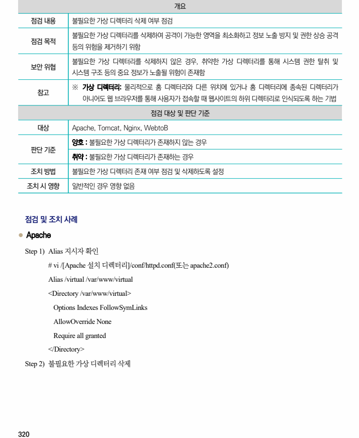
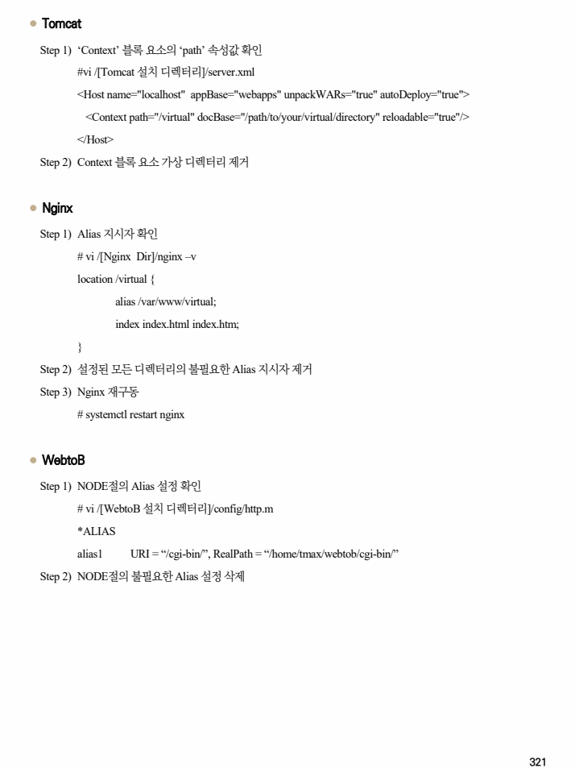

## 원문 전사

### PDF 페이지 320

~~~text transcription
개요
점검 내용 불필요한 가상 디렉터리 삭제 여부 점검
불필요한 가상 디렉터리를 삭제하여 공격이 가능한 영역을 최소화하고 정보 노출 방지 및 권한 상승 공격
점검 목적
등의 위험을 제거하기 위함
불필요한 가상 디렉터리를 삭제하지 않은 경우, 취약한 가상 디렉터리를 통해 시스템 권한 탈취 및
보안 위협
시스템 구조 등의 중요 정보가 노출될 위험이 존재함
※ 가상 디렉터리: 물리적으로 홈 디렉터리와 다른 위치에 있거나 홈 디렉터리에 종속된 디렉터리가
참고
아니어도 웹 브라우저를 통해 사용자가 접속할 때 웹사이트의 하위 디렉터리로 인식되도록 하는 기법
점검 대상 및 판단 기준
대상 Apache, Tomcat, Nginx, WebtoB
양호 : 불필요한 가상 디렉터리가 존재하지 않는 경우
판단 기준
취약 : 불필요한 가상 디렉터리가 존재하는 경우
조치 방법 불필요한 가상 디렉터리 존재 여부 점검 및 삭제하도록 설정
조치 시 영향 일반적인 경우 영향 없음
점검 및 조치 사례
l Apache
Step 1) Alias 지시자 확인
# vi /[Apache 설치 디렉터리]/conf/httpd.conf(또는 apache2.conf)
Alias /virtual /var/www/virtual
<Directory /var/www/virtual>
Options Indexes FollowSymLinks
AllowOverride None
Require all granted
</Directory>
Step 2) 불필요한 가상 디렉터리 삭제
~~~

### PDF 페이지 321

~~~text transcription
l Tomcat
Step 1) ‘Context’ 블록 요소의 ‘path’ 속성값 확인
#vi /[Tomcat 설치 디렉터리]/server.xml
<Host name="localhost" appBase="webapps" unpackWARs="true" autoDeploy="true">
<Context path="/virtual" docBase="/path/to/your/virtual/directory" reloadable="true"/>
</Host>
Step 2) Context 블록 요소 가상 디렉터리 제거
l Nginx
Step 1) Alias 지시자 확인
# vi /[Nginx Dir]/nginx –v
location /virtual {
alias /var/www/virtual;
index index.html index.htm;
}
Step 2) 설정된 모든 디렉터리의 불필요한 Alias 지시자 제거
Step 3) Nginx 재구동
# systemctl restart nginx
l WebtoB
Step 1) NODE절의 Alias 설정 확인
# vi /[WebtoB 설치 디렉터리]/config/http.m
*ALIAS
alias1 URI = “/cgi-bin/”, RealPath = “/home/tmax/webtob/cgi-bin/”
Step 2) NODE절의 불필요한 Alias 설정 삭제
~~~

