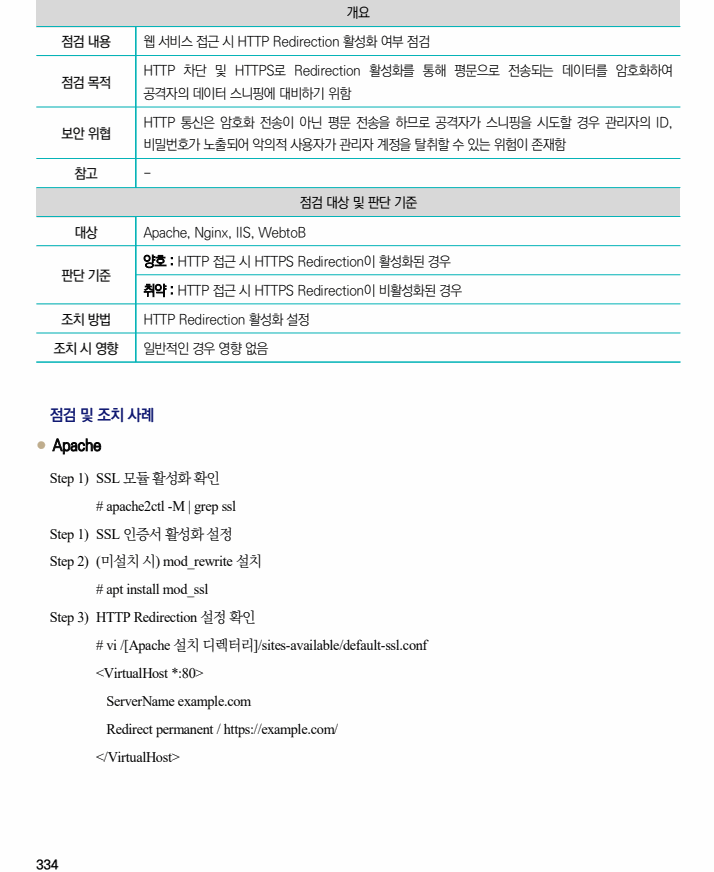
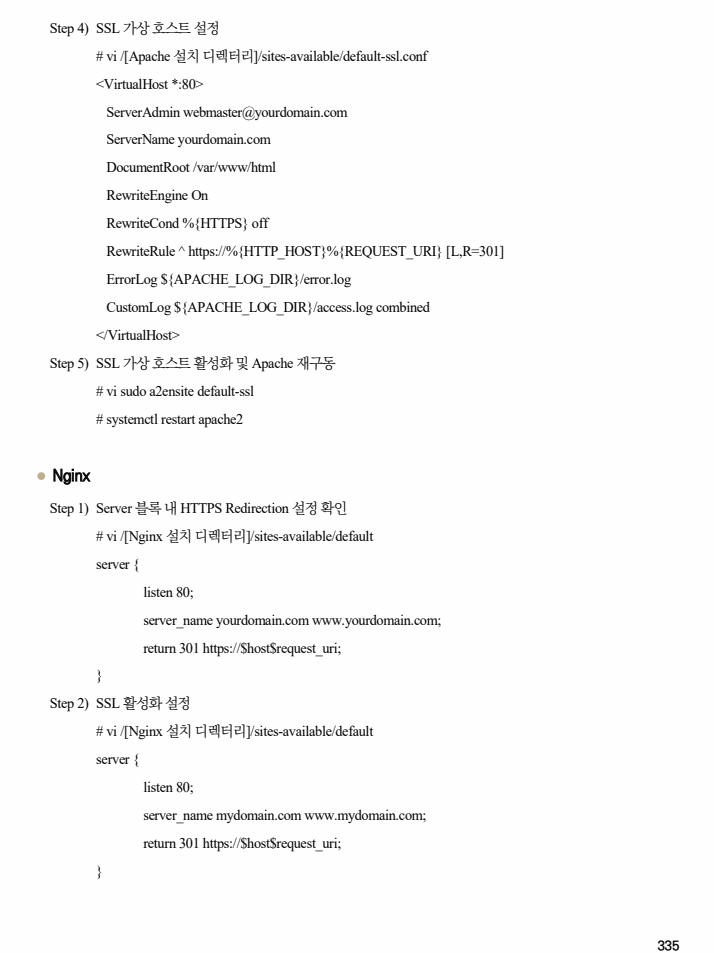
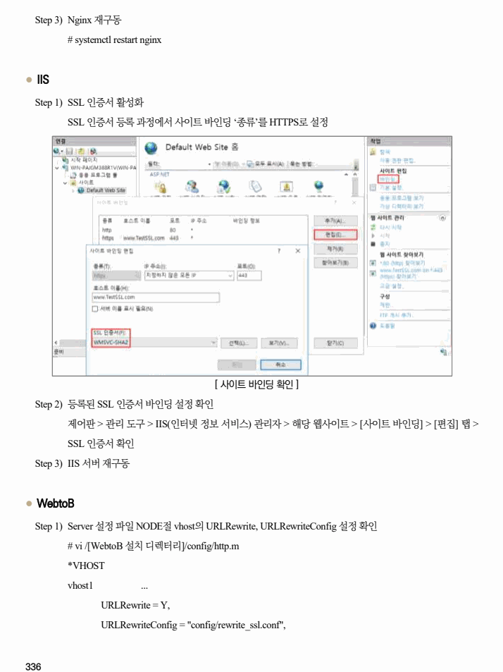
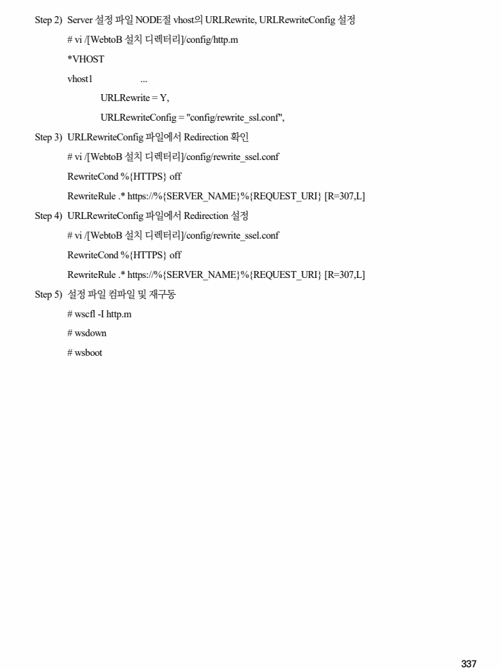

## 원문 전사

### PDF 페이지 334

~~~text transcription
개요
점검 내용 웹 서비스 접근 시 HTTP Redirection 활성화 여부 점검
HTTP 차단 및 HTTPS로 Redirection 활성화를 통해 평문으로 전송되는 데이터를 암호화하여
점검 목적
공격자의 데이터 스니핑에 대비하기 위함
HTTP 통신은 암호화 전송이 아닌 평문 전송을 하므로 공격자가 스니핑을 시도할 경우 관리자의 ID,
보안 위협
비밀번호가 노출되어 악의적 사용자가 관리자 계정을 탈취할 수 있는 위험이 존재함
참고 -
점검 대상 및 판단 기준
대상 Apache, Nginx, IIS, WebtoB
양호 : HTTP 접근 시 HTTPS Redirection이 활성화된 경우
판단 기준
취약 : HTTP 접근 시 HTTPS Redirection이 비활성화된 경우
조치 방법 HTTP Redirection 활성화 설정
조치 시 영향 일반적인 경우 영향 없음
점검 및 조치 사례
l Apache
Step 1) SSL 모듈 활성화 확인
# apache2ctl -M | grep ssl
Step 1) SSL 인증서 활성화 설정
Step 2) (미설치 시) mod_rewrite 설치
# apt install mod_ssl
Step 3) HTTP Redirection 설정 확인
# vi /[Apache 설치 디렉터리]/sites-available/default-ssl.conf
<VirtualHost *:80>
ServerName example.com
Redirect permanent / https://example.com/
</VirtualHost>
~~~

### PDF 페이지 335

~~~text transcription
Step 4) SSL 가상 호스트 설정
# vi /[Apache 설치 디렉터리]/sites-available/default-ssl.conf
<VirtualHost *:80>
ServerAdmin webmaster@yourdomain.com
ServerName yourdomain.com
DocumentRoot /var/www/html
RewriteEngine On
RewriteCond %{HTTPS} off
RewriteRule ^ https://%{HTTP_HOST}%{REQUEST_URI} [L,R=301]
ErrorLog ${APACHE_LOG_DIR}/error.log
CustomLog ${APACHE_LOG_DIR}/access.log combined
</VirtualHost>
Step 5) SSL 가상 호스트 활성화 및 Apache 재구동
# vi sudo a2ensite default-ssl
# systemctl restart apache2
l Nginx
Step 1) Server 블록 내 HTTPS Redirection 설정 확인
# vi /[Nginx 설치 디렉터리]/sites-available/default
server {
listen 80;
server_name yourdomain.com www.yourdomain.com;
return 301 https://$host$request_uri;
}
Step 2) SSL 활성화 설정
# vi /[Nginx 설치 디렉터리]/sites-available/default
server {
listen 80;
server_name mydomain.com www.mydomain.com;
return 301 https://$host$request_uri;
}
~~~

### PDF 페이지 336

~~~text transcription
Step 3) Nginx 재구동
# systemctl restart nginx
l IIS
Step 1) SSL 인증서 활성화
SSL 인증서 등록 과정에서 사이트 바인딩 ‘종류’를 HTTPS로 설정
[ 사이트 바인딩 확인 ]
Step 2) 등록된 SSL 인증서 바인딩 설정 확인
제어판 > 관리 도구 > IIS(인터넷 정보 서비스) 관리자 > 해당 웹사이트 > [사이트 바인딩] > [편집] 탭 >
SSL 인증서 확인
Step 3) IIS 서버 재구동
l WebtoB
Step 1) Server 설정 파일 NODE절 vhost의 URLRewrite, URLRewriteConfig 설정 확인
# vi /[WebtoB 설치 디렉터리]/config/http.m
*VHOST
vhost1 ...
URLRewrite = Y,
URLRewriteConfig = "config/rewrite_ssl.conf",
~~~

### PDF 페이지 337

~~~text transcription
Step 2) Server 설정 파일 NODE절 vhost의 URLRewrite, URLRewriteConfig 설정
# vi /[WebtoB 설치 디렉터리]/config/http.m
*VHOST
vhost1 ...
URLRewrite = Y,
URLRewriteConfig = "config/rewrite_ssl.conf",
Step 3) URLRewriteConfig 파일에서 Redirection 확인
# vi /[WebtoB 설치 디렉터리]/config/rewrite_ssel.conf
RewriteCond %{HTTPS} off
RewriteRule .* https://%{SERVER_NAME}%{REQUEST_URI} [R=307,L]
Step 4) URLRewriteConfig 파일에서 Redirection 설정
# vi /[WebtoB 설치 디렉터리]/config/rewrite_ssel.conf
RewriteCond %{HTTPS} off
RewriteRule .* https://%{SERVER_NAME}%{REQUEST_URI} [R=307,L]
Step 5) 설정 파일 컴파일 및 재구동
# wscfl -I http.m
# wsdown
# wsboot
~~~

