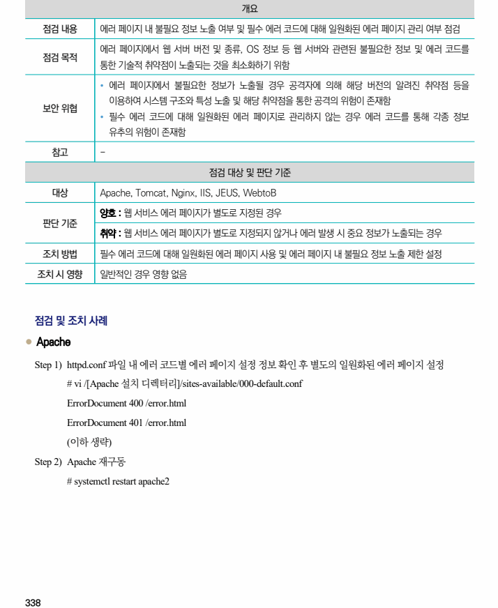
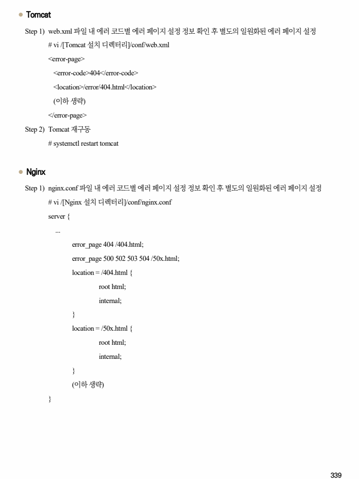
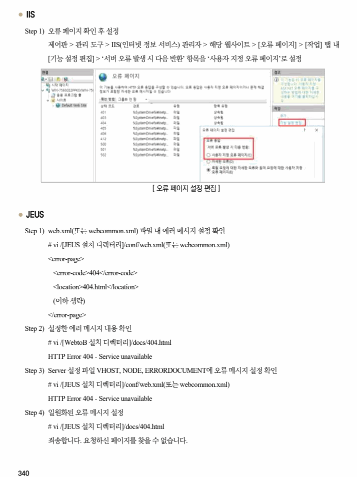
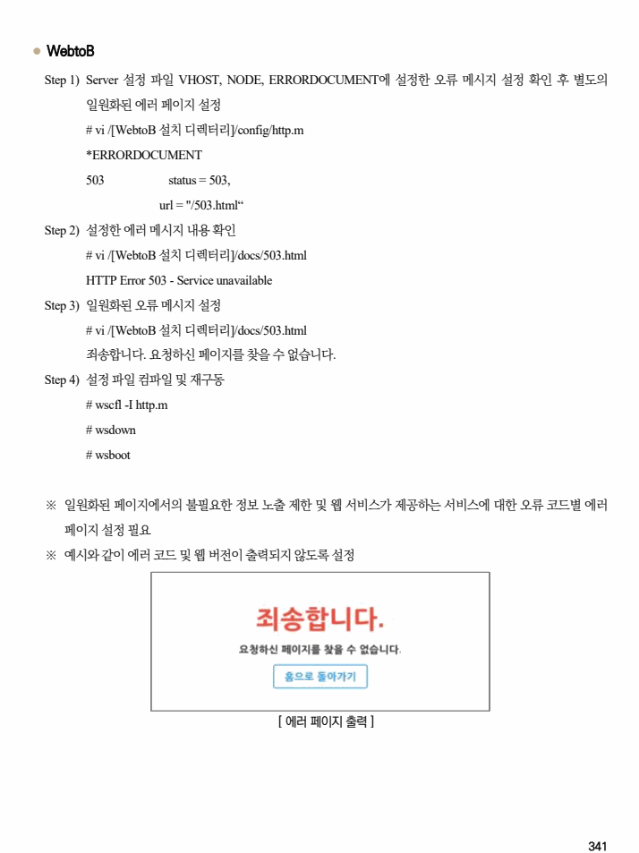

## 원문 전사

### PDF 페이지 338

~~~text transcription
개요
점검 내용 에러 페이지 내 불필요 정보 노출 여부 및 필수 에러 코드에 대해 일원화된 에러 페이지 관리 여부 점검
에러 페이지에서 웹 서버 버전 및 종류, OS 정보 등 웹 서버와 관련된 불필요한 정보 및 에러 코드를
점검 목적
통한 기술적 취약점이 노출되는 것을 최소화하기 위함
Ÿ 에러 페이지에서 불필요한 정보가 노출될 경우 공격자에 의해 해당 버전의 알려진 취약점 등을
이용하여 시스템 구조와 특성 노출 및 해당 취약점을 통한 공격의 위험이 존재함
보안 위협
Ÿ 필수 에러 코드에 대해 일원화된 에러 페이지로 관리하지 않는 경우 에러 코드를 통해 각종 정보
유추의 위험이 존재함
참고 -
점검 대상 및 판단 기준
대상 Apache, Tomcat, Nginx, IIS, JEUS, WebtoB
양호 : 웹 서비스 에러 페이지가 별도로 지정된 경우
판단 기준
취약 : 웹 서비스 에러 페이지가 별도로 지정되지 않거나 에러 발생 시 중요 정보가 노출되는 경우
조치 방법 필수 에러 코드에 대해 일원화된 에러 페이지 사용 및 에러 페이지 내 불필요 정보 노출 제한 설정
조치 시 영향 일반적인 경우 영향 없음
점검 및 조치 사례
l Apache
Step 1) httpd.conf 파일 내 에러 코드별 에러 페이지 설정 정보 확인 후 별도의 일원화된 에러 페이지 설정
# vi /[Apache 설치 디렉터리]/sites-available/000-default.conf
ErrorDocument 400 /error.html
ErrorDocument 401 /error.html
(이하 생략)
Step 2) Apache 재구동
# systemctl restart apache2
~~~

### PDF 페이지 339

~~~text transcription
l Tomcat
Step 1) web.xml 파일 내 에러 코드별 에러 페이지 설정 정보 확인 후 별도의 일원화된 에러 페이지 설정
# vi /[Tomcat 설치 디렉터리]/conf/web.xml
<error-page>
<error-code>404</error-code>
<location>/error/404.html</location>
(이하 생략)
</error-page>
Step 2) Tomcat 재구동
# systemctl restart tomcat
l Nginx
Step 1) nginx.conf 파일 내 에러 코드별 에러 페이지 설정 정보 확인 후 별도의 일원화된 에러 페이지 설정
# vi /[Nginx 설치 디렉터리]/conf/nginx.conf
server {
...
error_page 404 /404.html;
error_page 500 502 503 504 /50x.html;
location = /404.html {
root html;
internal;
}
location = /50x.html {
root html;
internal;
}
(이하 생략)
}
~~~

### PDF 페이지 340

~~~text transcription
l IIS
Step 1) 오류 페이지 확인 후 설정
제어판 > 관리 도구 > IIS(인터넷 정보 서비스) 관리자 > 해당 웹사이트 > [오류 페이지] > [작업] 탭 내
[기능 설정 편집] > ‘서버 오류 발생 시 다음 반환’ 항목을 ‘사용자 지정 오류 페이지’로 설정
[ 오류 페이지 설정 편집 ]
l JEUS
Step 1) web.xml(또는 webcommon.xml) 파일 내 에러 메시지 설정 확인
# vi /[JEUS 설치 디렉터리]/conf/web.xml(또는 webcommon.xml)
<error-page>
<error-code>404</error-code>
<location>404.html</location>
(이하 생략)
</error-page>
Step 2) 설정한 에러 메시지 내용 확인
# vi /[WebtoB 설치 디렉터리]/docs/404.html
HTTP Error 404 - Service unavailable
Step 3) Server 설정 파일 VHOST, NODE, ERRORDOCUMENT에 오류 메시지 설정 확인
# vi /[JEUS 설치 디렉터리]/conf/web.xml(또는 webcommon.xml)
HTTP Error 404 - Service unavailable
Step 4) 일원화된 오류 메시지 설정
# vi /[JEUS 설치 디렉터리]/docs/404.html
죄송합니다. 요청하신 페이지를 찾을 수 없습니다.
~~~

### PDF 페이지 341

~~~text transcription
l WebtoB
Step 1) Server 설정 파일 VHOST, NODE, ERRORDOCUMENT에 설정한 오류 메시지 설정 확인 후 별도의
일원화된 에러 페이지 설정
# vi /[WebtoB 설치 디렉터리]/config/http.m
*ERRORDOCUMENT
503 status = 503,
url = "/503.html“
Step 2) 설정한 에러 메시지 내용 확인
# vi /[WebtoB 설치 디렉터리]/docs/503.html
HTTP Error 503 - Service unavailable
Step 3) 일원화된 오류 메시지 설정
# vi /[WebtoB 설치 디렉터리]/docs/503.html
죄송합니다. 요청하신 페이지를 찾을 수 없습니다.
Step 4) 설정 파일 컴파일 및 재구동
# wscfl -I http.m
# wsdown
# wsboot
※ 일원화된 페이지에서의 불필요한 정보 노출 제한 및 웹 서비스가 제공하는 서비스에 대한 오류 코드별 에러
페이지 설정 필요
※ 예시와 같이 에러 코드 및 웹 버전이 출력되지 않도록 설정
[ 에러 페이지 출력 ]
~~~

