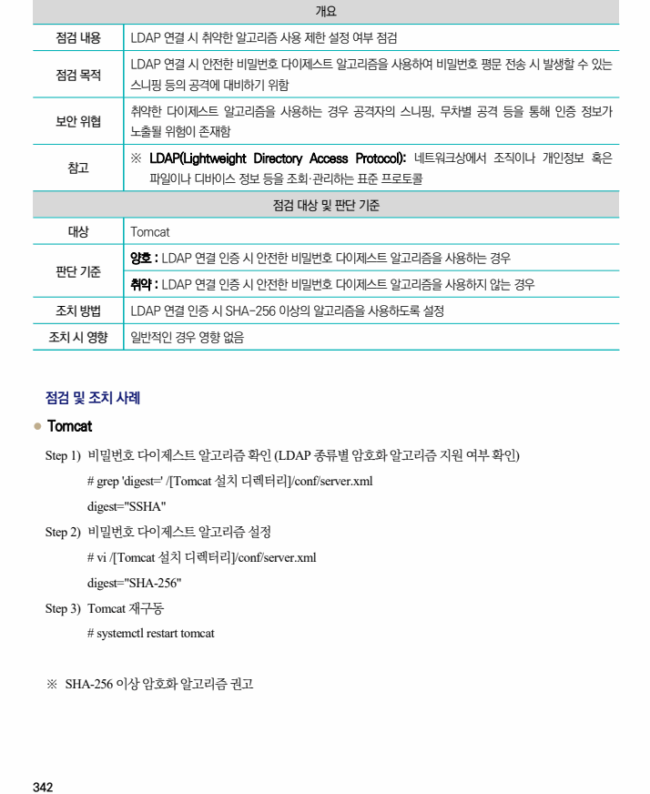

## 원문 전사

### PDF 페이지 342

~~~text transcription
개요
점검 내용 LDAP 연결 시 취약한 알고리즘 사용 제한 설정 여부 점검
LDAP 연결 시 안전한 비밀번호 다이제스트 알고리즘을 사용하여 비밀번호 평문 전송 시 발생할 수 있는
점검 목적
스니핑 등의 공격에 대비하기 위함
취약한 다이제스트 알고리즘을 사용하는 경우 공격자의 스니핑, 무차별 공격 등을 통해 인증 정보가
보안 위협
노출될 위험이 존재함
※ LDAP(Lightweight Directory Access Protocol): 네트워크상에서 조직이나 개인정보 혹은
참고
파일이나 디바이스 정보 등을 조회·관리하는 표준 프로토콜
점검 대상 및 판단 기준
대상 Tomcat
양호 : LDAP 연결 인증 시 안전한 비밀번호 다이제스트 알고리즘을 사용하는 경우
판단 기준
취약 : LDAP 연결 인증 시 안전한 비밀번호 다이제스트 알고리즘을 사용하지 않는 경우
조치 방법 LDAP 연결 인증 시 SHA-256 이상의 알고리즘을 사용하도록 설정
조치 시 영향 일반적인 경우 영향 없음
점검 및 조치 사례
l Tomcat
Step 1) 비밀번호 다이제스트 알고리즘 확인 (LDAP 종류별 암호화 알고리즘 지원 여부 확인)
# grep 'digest=' /[Tomcat 설치 디렉터리]/conf/server.xml
digest="SSHA"
Step 2) 비밀번호 다이제스트 알고리즘 설정
# vi /[Tomcat 설치 디렉터리]/conf/server.xml
digest="SHA-256"
Step 3) Tomcat 재구동
# systemctl restart tomcat
※ SHA-256 이상 암호화 알고리즘 권고
~~~

