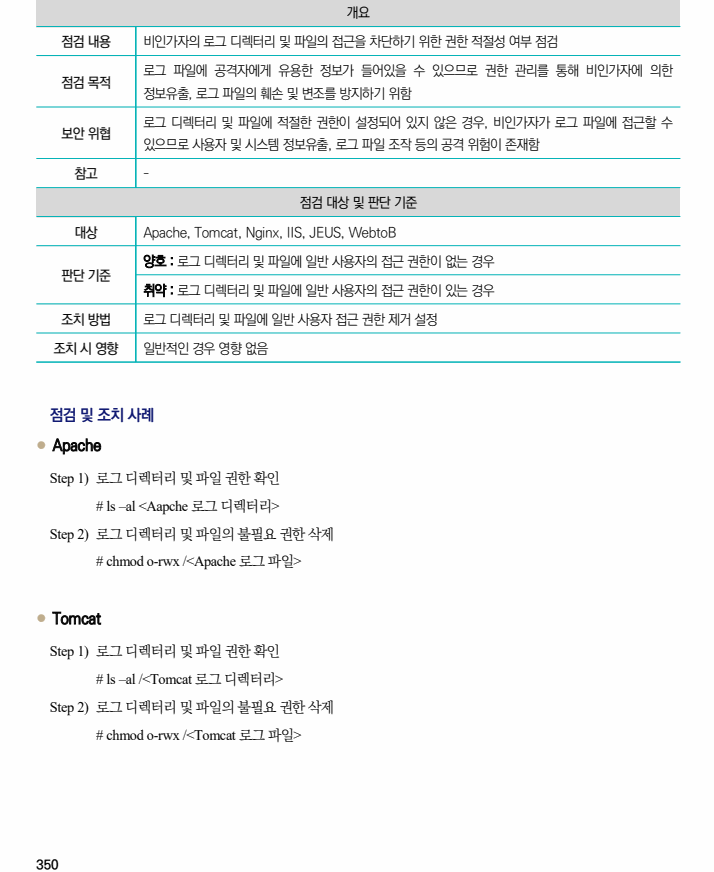
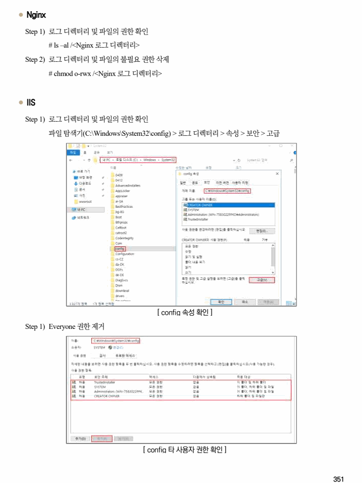
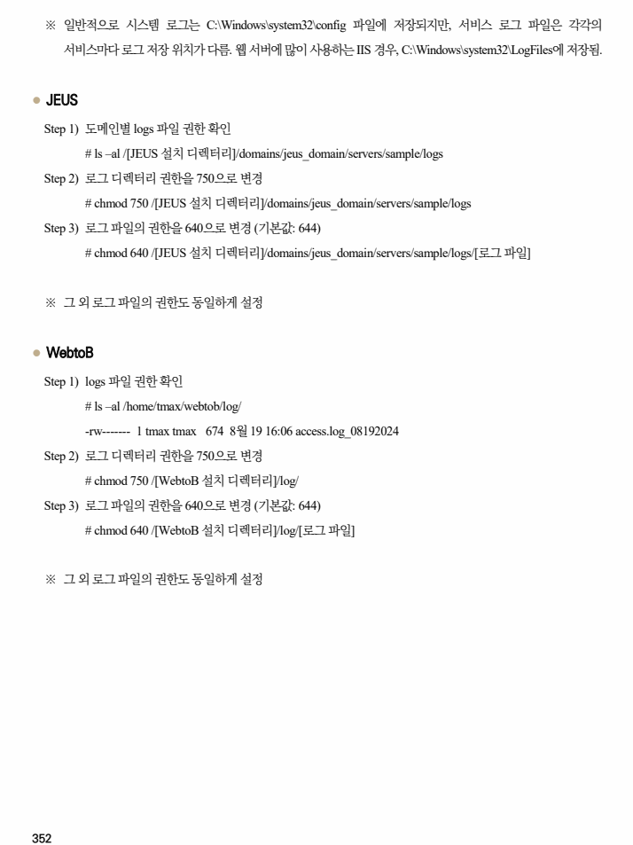

## 원문 전사

### PDF 페이지 350

~~~text transcription
개요
점검 내용 비인가자의 로그 디렉터리 및 파일의 접근을 차단하기 위한 권한 적절성 여부 점검
로그 파일에 공격자에게 유용한 정보가 들어있을 수 있으므로 권한 관리를 통해 비인가자에 의한
점검 목적
정보유출, 로그 파일의 훼손 및 변조를 방지하기 위함
로그 디렉터리 및 파일에 적절한 권한이 설정되어 있지 않은 경우, 비인가자가 로그 파일에 접근할 수
보안 위협
있으므로 사용자 및 시스템 정보유출, 로그 파일 조작 등의 공격 위험이 존재함
참고 -
점검 대상 및 판단 기준
대상 Apache, Tomcat, Nginx, IIS, JEUS, WebtoB
양호 : 로그 디렉터리 및 파일에 일반 사용자의 접근 권한이 없는 경우
판단 기준
취약 : 로그 디렉터리 및 파일에 일반 사용자의 접근 권한이 있는 경우
조치 방법 로그 디렉터리 및 파일에 일반 사용자 접근 권한 제거 설정
조치 시 영향 일반적인 경우 영향 없음
점검 및 조치 사례
l Apache
Step 1) 로그 디렉터리 및 파일 권한 확인
# ls –al <Aapche 로그 디렉터리>
Step 2) 로그 디렉터리 및 파일의 불필요 권한 삭제
# chmod o-rwx /<Apache 로그 파일>
l Tomcat
Step 1) 로그 디렉터리 및 파일 권한 확인
# ls –al /<Tomcat 로그 디렉터리>
Step 2) 로그 디렉터리 및 파일의 불필요 권한 삭제
# chmod o-rwx /<Tomcat 로그 파일>
~~~

### PDF 페이지 351

~~~text transcription
l Nginx
Step 1) 로그 디렉터리 및 파일의 권한 확인
# ls –al /<Nginx 로그 디렉터리>
Step 2) 로그 디렉터리 및 파일의 불필요 권한 삭제
# chmod o-rwx /<Nginx 로그 디렉터리>
l IIS
Step 1) 로그 디렉터리 및 파일의 권한 확인
파일 탐색기(C:\Windows\System32\config) > 로그 디렉터리 > 속성 > 보안 > 고급
[ config 속성 확인 ]
Step 1) Everyone 권한 제거
[ config 타 사용자 권한 확인 ]
~~~

### PDF 페이지 352

~~~text transcription
※ 일반적으로 시스템 로그는 C:\Windows\system32\config 파일에 저장되지만, 서비스 로그 파일은 각각의
서비스마다 로그 저장 위치가 다름. 웹 서버에 많이 사용하는 IIS 경우, C:\Windows\system32\LogFiles에 저장됨.
l JEUS
Step 1) 도메인별 logs 파일 권한 확인
# ls –al /[JEUS 설치 디렉터리]/domains/jeus_domain/servers/sample/logs
Step 2) 로그 디렉터리 권한을 750으로 변경
# chmod 750 /[JEUS 설치 디렉터리]/domains/jeus_domain/servers/sample/logs
Step 3) 로그 파일의 권한을 640으로 변경 (기본값: 644)
# chmod 640 /[JEUS 설치 디렉터리]/domains/jeus_domain/servers/sample/logs/[로그 파일]
※ 그 외 로그 파일의 권한도 동일하게 설정
l WebtoB
Step 1) logs 파일 권한 확인
# ls –al /home/tmax/webtob/log/
-rw------- 1 tmax tmax 674 8월 19 16:06 access.log_08192024
Step 2) 로그 디렉터리 권한을 750으로 변경
# chmod 750 /[WebtoB 설치 디렉터리]/log/
Step 3) 로그 파일의 권한을 640으로 변경 (기본값: 644)
# chmod 640 /[WebtoB 설치 디렉터리]/log/[로그 파일]
※ 그 외 로그 파일의 권한도 동일하게 설정
~~~

