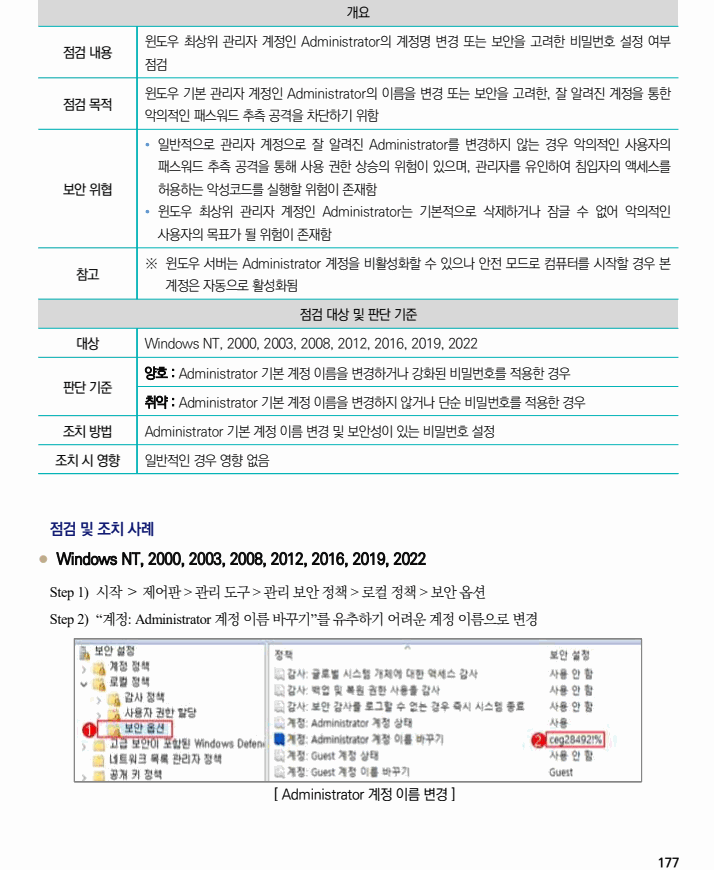

## 원문 전사

### PDF 페이지 177

~~~text transcription
개요
윈도우 최상위 관리자 계정인 Administrator의 계정명 변경 또는 보안을 고려한 비밀번호 설정 여부
점검 내용
점검
윈도우 기본 관리자 계정인 Administrator의 이름을 변경 또는 보안을 고려한, 잘 알려진 계정을 통한
점검 목적
악의적인 패스워드 추측 공격을 차단하기 위함
Ÿ 일반적으로 관리자 계정으로 잘 알려진 Administrator를 변경하지 않는 경우 악의적인 사용자의
패스워드 추측 공격을 통해 사용 권한 상승의 위험이 있으며, 관리자를 유인하여 침입자의 액세스를
보안 위협 허용하는 악성코드를 실행할 위험이 존재함
Ÿ 윈도우 최상위 관리자 계정인 Administrator는 기본적으로 삭제하거나 잠글 수 없어 악의적인
사용자의 목표가 될 위험이 존재함
※ 윈도우 서버는 Administrator 계정을 비활성화할 수 있으나 안전 모드로 컴퓨터를 시작할 경우 본
참고
계정은 자동으로 활성화됨
점검 대상 및 판단 기준
대상 Windows NT, 2000, 2003, 2008, 2012, 2016, 2019, 2022
양호 : Administrator 기본 계정 이름을 변경하거나 강화된 비밀번호를 적용한 경우
판단 기준
취약 : Administrator 기본 계정 이름을 변경하지 않거나 단순 비밀번호를 적용한 경우
조치 방법 Administrator 기본 계정 이름 변경 및 보안성이 있는 비밀번호 설정
조치 시 영향 일반적인 경우 영향 없음
점검 및 조치 사례
l Windows NT, 2000, 2003, 2008, 2012, 2016, 2019, 2022
Step 1) 시작 ＞ 제어판 > 관리 도구 > 관리 보안 정책 > 로컬 정책 > 보안 옵션
Step 2) “계정: Administrator 계정 이름 바꾸기”를 유추하기 어려운 계정 이름으로 변경
[ Administrator 계정 이름 변경 ]
~~~

