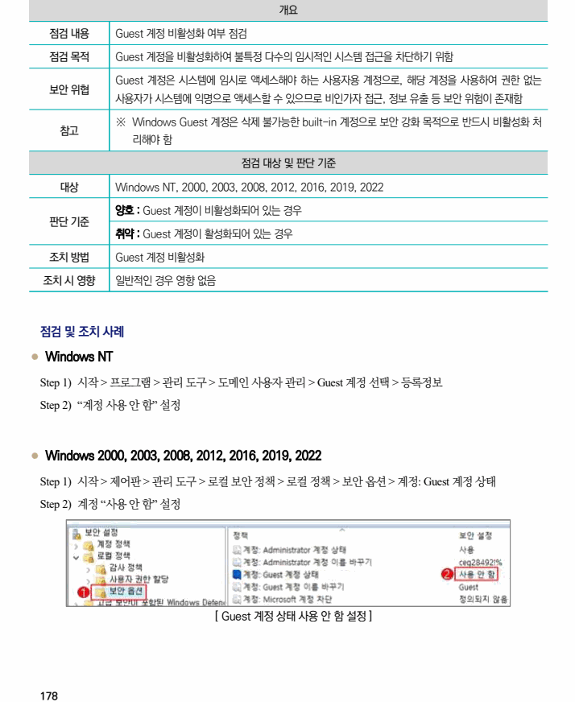

## 원문 전사

### PDF 페이지 178

~~~text transcription
개요
점검 내용 Guest 계정 비활성화 여부 점검
점검 목적 Guest 계정을 비활성화하여 불특정 다수의 임시적인 시스템 접근을 차단하기 위함
Guest 계정은 시스템에 임시로 액세스해야 하는 사용자용 계정으로, 해당 계정을 사용하여 권한 없는
보안 위협
사용자가 시스템에 익명으로 액세스할 수 있으므로 비인가자 접근, 정보 유출 등 보안 위험이 존재함
※ Windows Guest 계정은 삭제 불가능한 built-in 계정으로 보안 강화 목적으로 반드시 비활성화 처
참고
리해야 함
점검 대상 및 판단 기준
대상 Windows NT, 2000, 2003, 2008, 2012, 2016, 2019, 2022
양호 : Guest 계정이 비활성화되어 있는 경우
판단 기준
취약 : Guest 계정이 활성화되어 있는 경우
조치 방법 Guest 계정 비활성화
조치 시 영향 일반적인 경우 영향 없음
점검 및 조치 사례
l Windows NT
Step 1) 시작 > 프로그램 > 관리 도구 > 도메인 사용자 관리 > Guest 계정 선택 > 등록정보
Step 2) “계정 사용 안 함” 설정
l Windows 2000, 2003, 2008, 2012, 2016, 2019, 2022
Step 1) 시작 > 제어판 > 관리 도구 > 로컬 보안 정책 > 로컬 정책 > 보안 옵션 > 계정: Guest 계정 상태
Step 2) 계정 “사용 안 함” 설정
[ Guest 계정 상태 사용 안 함 설정 ]
~~~

