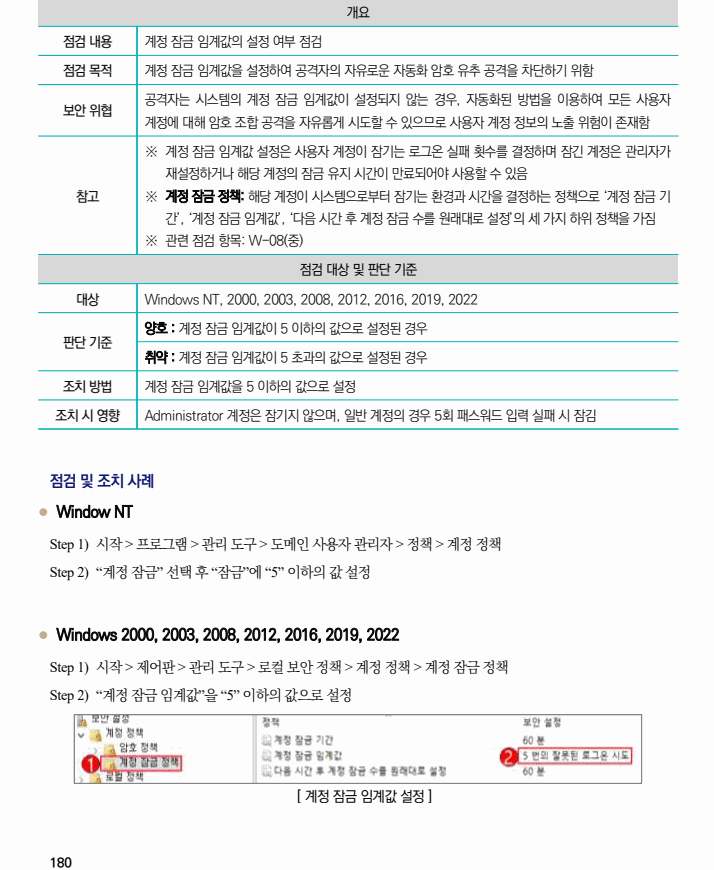

## 원문 전사

### PDF 페이지 180

~~~text transcription
개요
점검 내용 계정 잠금 임계값의 설정 여부 점검
점검 목적 계정 잠금 임계값을 설정하여 공격자의 자유로운 자동화 암호 유추 공격을 차단하기 위함
공격자는 시스템의 계정 잠금 임계값이 설정되지 않는 경우, 자동화된 방법을 이용하여 모든 사용자
보안 위협
계정에 대해 암호 조합 공격을 자유롭게 시도할 수 있으므로 사용자 계정 정보의 노출 위험이 존재함
※ 계정 잠금 임계값 설정은 사용자 계정이 잠기는 로그온 실패 횟수를 결정하며 잠긴 계정은 관리자가
재설정하거나 해당 계정의 잠금 유지 시간이 만료되어야 사용할 수 있음
참고 ※ 계정 잠금 정책: 해당 계정이 시스템으로부터 잠기는 환경과 시간을 결정하는 정책으로 ‘계정 잠금 기
간’, ‘계정 잠금 임계값’, ‘다음 시간 후 계정 잠금 수를 원래대로 설정’의 세 가지 하위 정책을 가짐
※ 관련 점검 항목: W-08(중)
점검 대상 및 판단 기준
대상 Windows NT, 2000, 2003, 2008, 2012, 2016, 2019, 2022
양호 : 계정 잠금 임계값이 5 이하의 값으로 설정된 경우
판단 기준
취약 : 계정 잠금 임계값이 5 초과의 값으로 설정된 경우
조치 방법 계정 잠금 임계값을 5 이하의 값으로 설정
조치 시 영향 Administrator 계정은 잠기지 않으며, 일반 계정의 경우 5회 패스워드 입력 실패 시 잠김
점검 및 조치 사례
l Window NT
Step 1) 시작 > 프로그램 > 관리 도구 > 도메인 사용자 관리자 > 정책 > 계정 정책
Step 2) “계정 잠금” 선택 후 “잠금”에 “5” 이하의 값 설정
l Windows 2000, 2003, 2008, 2012, 2016, 2019, 2022
Step 1) 시작 > 제어판 > 관리 도구 > 로컬 보안 정책 > 계정 정책 > 계정 잠금 정책
Step 2) “계정 잠금 임계값”을 “5” 이하의 값으로 설정
[ 계정 잠금 임계값 설정 ]
~~~

