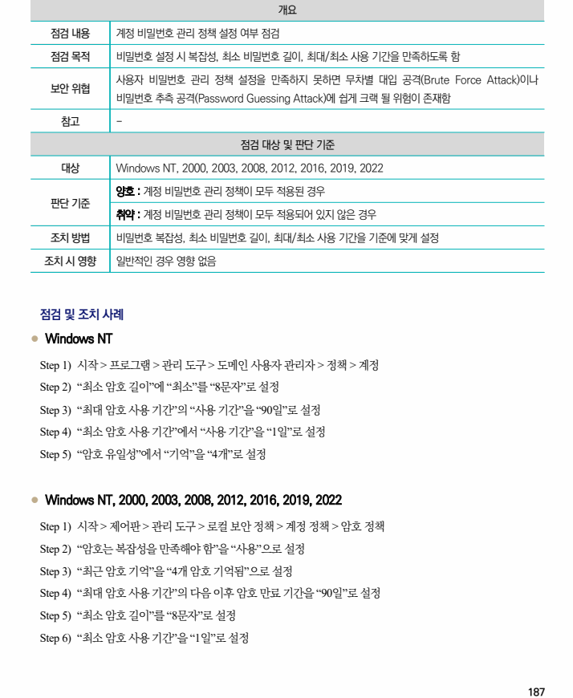
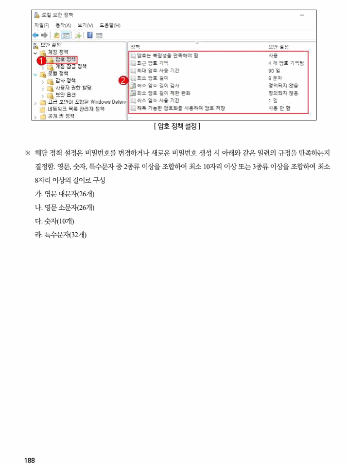

## 원문 전사

### PDF 페이지 187

~~~text transcription
개요
점검 내용 계정 비밀번호 관리 정책 설정 여부 점검
점검 목적 비밀번호 설정 시 복잡성, 최소 비밀번호 길이, 최대/최소 사용 기간을 만족하도록 함
사용자 비밀번호 관리 정책 설정을 만족하지 못하면 무차별 대입 공격(Brute Force Attack)이나
보안 위협
비밀번호 추측 공격(Password Guessing Attack)에 쉽게 크랙 될 위험이 존재함
참고 -
점검 대상 및 판단 기준
대상 Windows NT, 2000, 2003, 2008, 2012, 2016, 2019, 2022
양호 : 계정 비밀번호 관리 정책이 모두 적용된 경우
판단 기준
취약 : 계정 비밀번호 관리 정책이 모두 적용되어 있지 않은 경우
조치 방법 비밀번호 복잡성, 최소 비밀번호 길이, 최대/최소 사용 기간을 기준에 맞게 설정
조치 시 영향 일반적인 경우 영향 없음
점검 및 조치 사례
l Windows NT
Step 1) 시작 > 프로그램 > 관리 도구 > 도메인 사용자 관리자 > 정책 > 계정
Step 2) “최소 암호 길이”에 “최소”를 “8문자”로 설정
Step 3) “최대 암호 사용 기간”의 “사용 기간”을 “90일”로 설정
Step 4) “최소 암호 사용 기간”에서 “사용 기간”을 “1일”로 설정
Step 5) “암호 유일성”에서 “기억”을 “4개”로 설정
l Windows NT, 2000, 2003, 2008, 2012, 2016, 2019, 2022
Step 1) 시작 > 제어판 > 관리 도구 > 로컬 보안 정책 > 계정 정책 > 암호 정책
Step 2) “암호는 복잡성을 만족해야 함”을 “사용”으로 설정
Step 3) “최근 암호 기억”을 “4개 암호 기억됨”으로 설정
Step 4) “최대 암호 사용 기간”의 다음 이후 암호 만료 기간을 “90일”로 설정
Step 5) “최소 암호 길이”를 “8문자”로 설정
Step 6) “최소 암호 사용 기간”을 “1일”로 설정
~~~

### PDF 페이지 188

~~~text transcription
[ 암호 정책 설정 ]
※ 해당 정책 설정은 비밀번호를 변경하거나 새로운 비밀번호 생성 시 아래와 같은 일련의 규정을 만족하는지
결정함. 영문, 숫자, 특수문자 중 2종류 이상을 조합하여 최소 10자리 이상 또는 3종류 이상을 조합하여 최소
8자리 이상의 길이로 구성
가. 영문 대문자(26개)
나. 영문 소문자(26개)
다. 숫자(10개)
라. 특수문자(32개)
~~~

