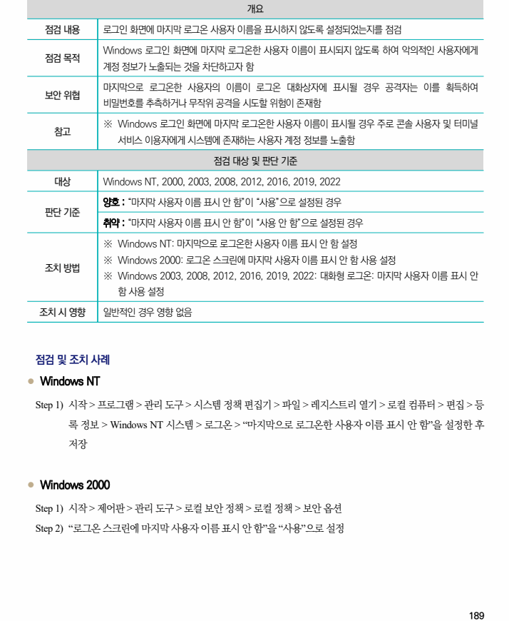
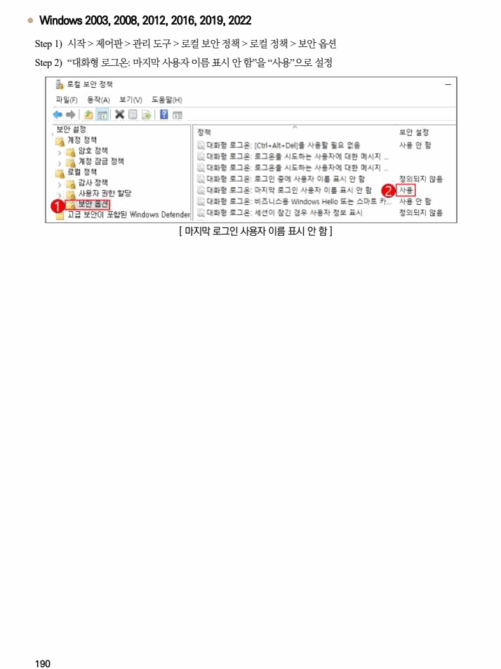

## 원문 전사

### PDF 페이지 189

~~~text transcription
개요
점검 내용 로그인 화면에 마지막 로그온 사용자 이름을 표시하지 않도록 설정되었는지를 점검
Windows 로그인 화면에 마지막 로그온한 사용자 이름이 표시되지 않도록 하여 악의적인 사용자에게
점검 목적
계정 정보가 노출되는 것을 차단하고자 함
마지막으로 로그온한 사용자의 이름이 로그온 대화상자에 표시될 경우 공격자는 이를 획득하여
보안 위협
비밀번호를 추측하거나 무작위 공격을 시도할 위험이 존재함
※ Windows 로그인 화면에 마지막 로그온한 사용자 이름이 표시될 경우 주로 콘솔 사용자 및 터미널
참고
서비스 이용자에게 시스템에 존재하는 사용자 계정 정보를 노출함
점검 대상 및 판단 기준
대상 Windows NT, 2000, 2003, 2008, 2012, 2016, 2019, 2022
양호 : “마지막 사용자 이름 표시 안 함”이 “사용”으로 설정된 경우
판단 기준
취약 : “마지막 사용자 이름 표시 안 함”이 “사용 안 함”으로 설정된 경우
※ Windows NT: 마지막으로 로그온한 사용자 이름 표시 안 함 설정
※ Windows 2000: 로그온 스크린에 마지막 사용자 이름 표시 안 함 사용 설정
조치 방법
※ Windows 2003, 2008, 2012, 2016, 2019, 2022: 대화형 로그온: 마지막 사용자 이름 표시 안
함 사용 설정
조치 시 영향 일반적인 경우 영향 없음
점검 및 조치 사례
l Windows NT
Step 1) 시작 > 프로그램 > 관리 도구 > 시스템 정책 편집기 > 파일 > 레지스트리 열기 > 로컬 컴퓨터 > 편집 > 등
록 정보 > Windows NT 시스템 > 로그온 > “마지막으로 로그온한 사용자 이름 표시 안 함”을 설정한 후
저장
l Windows 2000
Step 1) 시작 > 제어판 > 관리 도구 > 로컬 보안 정책 > 로컬 정책 > 보안 옵션
Step 2) “로그온 스크린에 마지막 사용자 이름 표시 안 함”을 “사용”으로 설정
~~~

### PDF 페이지 190

~~~text transcription
l Windows 2003, 2008, 2012, 2016, 2019, 2022
Step 1) 시작 > 제어판 > 관리 도구 > 로컬 보안 정책 > 로컬 정책 > 보안 옵션
Step 2) “대화형 로그온: 마지막 사용자 이름 표시 안 함”을 “사용”으로 설정
[ 마지막 로그인 사용자 이름 표시 안 함 ]
~~~

