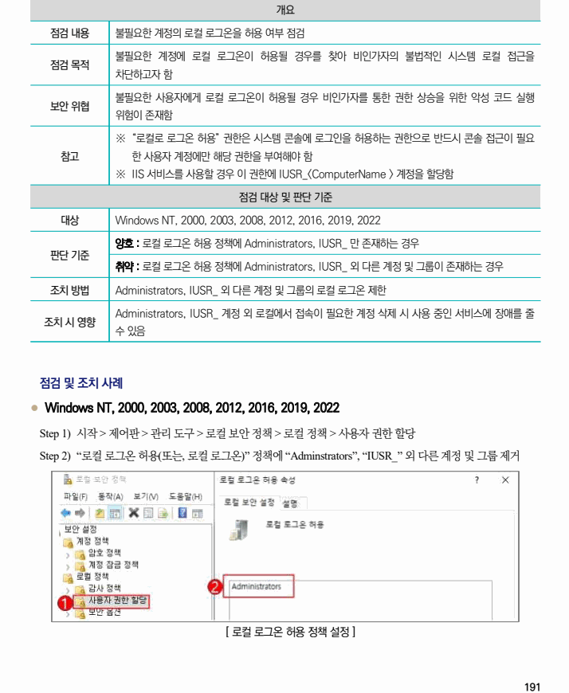

## 원문 전사

### PDF 페이지 191

~~~text transcription
개요
점검 내용 불필요한 계정의 로컬 로그온을 허용 여부 점검
불필요한 계정에 로컬 로그온이 허용될 경우를 찾아 비인가자의 불법적인 시스템 로컬 접근을
점검 목적
차단하고자 함
불필요한 사용자에게 로컬 로그온이 허용될 경우 비인가자를 통한 권한 상승을 위한 악성 코드 실행
보안 위협
위험이 존재함
※ “로컬로 로그온 허용” 권한은 시스템 콘솔에 로그인을 허용하는 권한으로 반드시 콘솔 접근이 필요
참고 한 사용자 계정에만 해당 권한을 부여해야 함
※ IIS 서비스를 사용할 경우 이 권한에 IUSR_<ComputerName > 계정을 할당함
점검 대상 및 판단 기준
대상 Windows NT, 2000, 2003, 2008, 2012, 2016, 2019, 2022
양호 : 로컬 로그온 허용 정책에 Administrators, IUSR_ 만 존재하는 경우
판단 기준
취약 : 로컬 로그온 허용 정책에 Administrators, IUSR_ 외 다른 계정 및 그룹이 존재하는 경우
조치 방법 Administrators, IUSR_ 외 다른 계정 및 그룹의 로컬 로그온 제한
Administrators, IUSR_ 계정 외 로컬에서 접속이 필요한 계정 삭제 시 사용 중인 서비스에 장애를 줄
조치 시 영향
수 있음
점검 및 조치 사례
l Windows NT, 2000, 2003, 2008, 2012, 2016, 2019, 2022
Step 1) 시작 > 제어판 > 관리 도구 > 로컬 보안 정책 > 로컬 정책 > 사용자 권한 할당
Step 2) “로컬 로그온 허용(또는, 로컬 로그온)” 정책에 “Adminstrators”, “IUSR_” 외 다른 계정 및 그룹 제거
[ 로컬 로그온 허용 정책 설정 ]
~~~

