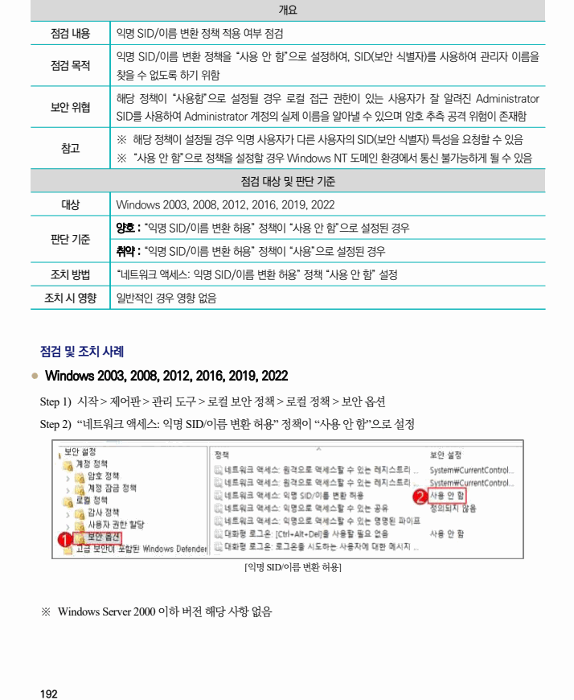

## 원문 전사

### PDF 페이지 192

~~~text transcription
개요
점검 내용 익명 SID/이름 변환 정책 적용 여부 점검
익명 SID/이름 변환 정책을 “사용 안 함”으로 설정하여, SID(보안 식별자)를 사용하여 관리자 이름을
점검 목적
찾을 수 없도록 하기 위함
해당 정책이 “사용함”으로 설정될 경우 로컬 접근 권한이 있는 사용자가 잘 알려진 Administrator
보안 위협
SID를 사용하여 Administrator 계정의 실제 이름을 알아낼 수 있으며 암호 추측 공격 위험이 존재함
※ 해당 정책이 설정될 경우 익명 사용자가 다른 사용자의 SID(보안 식별자) 특성을 요청할 수 있음
참고
※ “사용 안 함”으로 정책을 설정할 경우 Windows NT 도메인 환경에서 통신 불가능하게 될 수 있음
점검 대상 및 판단 기준
대상 Windows 2003, 2008, 2012, 2016, 2019, 2022
양호 : “익명 SID/이름 변환 허용” 정책이 “사용 안 함”으로 설정된 경우
판단 기준
취약 : “익명 SID/이름 변환 허용” 정책이 “사용”으로 설정된 경우
조치 방법 “네트워크 액세스: 익명 SID/이름 변환 허용” 정책 “사용 안 함” 설정
조치 시 영향 일반적인 경우 영향 없음
점검 및 조치 사례
l Windows 2003, 2008, 2012, 2016, 2019, 2022
Step 1) 시작 > 제어판 > 관리 도구 > 로컬 보안 정책 > 로컬 정책 > 보안 옵션
Step 2) “네트워크 액세스: 익명 SID/이름 변환 허용” 정책이 “사용 안 함”으로 설정
[익명 SID/이름 변환 허용]
※ Windows Server 2000 이하 버전 해당 사항 없음
~~~

