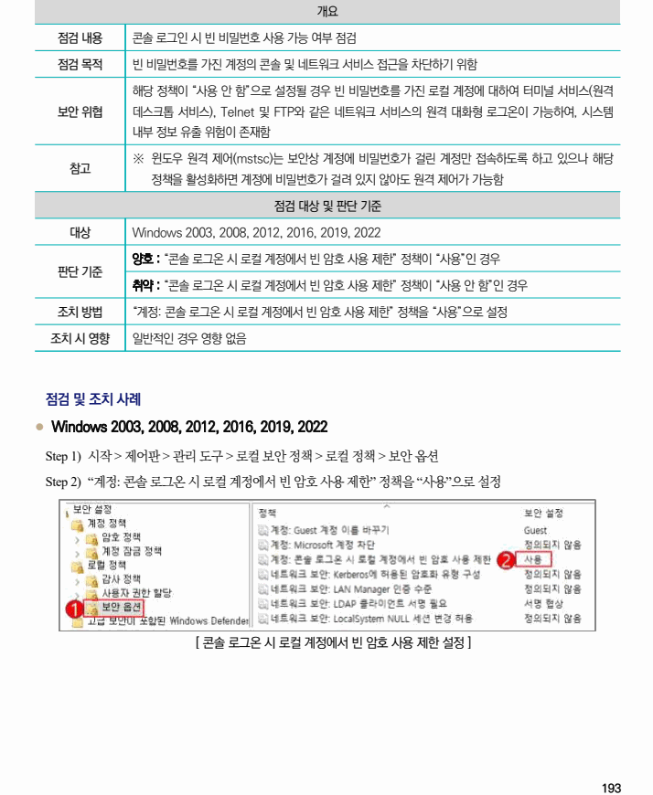

## 원문 전사

### PDF 페이지 193

~~~text transcription
개요
점검 내용 콘솔 로그인 시 빈 비밀번호 사용 가능 여부 점검
점검 목적 빈 비밀번호를 가진 계정의 콘솔 및 네트워크 서비스 접근을 차단하기 위함
해당 정책이 “사용 안 함”으로 설정될 경우 빈 비밀번호를 가진 로컬 계정에 대하여 터미널 서비스(원격
보안 위협 데스크톱 서비스), Telnet 및 FTP와 같은 네트워크 서비스의 원격 대화형 로그온이 가능하여, 시스템
내부 정보 유출 위험이 존재함
※ 윈도우 원격 제어(mstsc)는 보안상 계정에 비밀번호가 걸린 계정만 접속하도록 하고 있으나 해당
참고
정책을 활성화하면 계정에 비밀번호가 걸려 있지 않아도 원격 제어가 가능함
점검 대상 및 판단 기준
대상 Windows 2003, 2008, 2012, 2016, 2019, 2022
양호 : “콘솔 로그온 시 로컬 계정에서 빈 암호 사용 제한” 정책이 “사용”인 경우
판단 기준
취약 : “콘솔 로그온 시 로컬 계정에서 빈 암호 사용 제한” 정책이 “사용 안 함”인 경우
조치 방법 “계정: 콘솔 로그온 시 로컬 계정에서 빈 암호 사용 제한” 정책을 “사용”으로 설정
조치 시 영향 일반적인 경우 영향 없음
점검 및 조치 사례
l Windows 2003, 2008, 2012, 2016, 2019, 2022
Step 1) 시작 > 제어판 > 관리 도구 > 로컬 보안 정책 > 로컬 정책 > 보안 옵션
Step 2) “계정: 콘솔 로그온 시 로컬 계정에서 빈 암호 사용 제한” 정책을 “사용”으로 설정
[ 콘솔 로그온 시 로컬 계정에서 빈 암호 사용 제한 설정 ]
~~~

