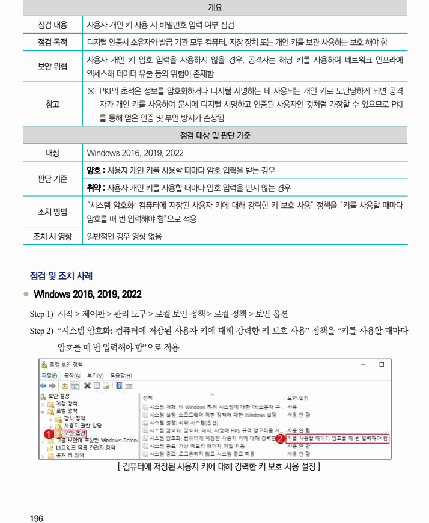

## 원문 전사

### PDF 페이지 196

~~~text transcription
개요
점검 내용 사용자 개인 키 사용 시 비밀번호 입력 여부 점검
점검 목적 디지털 인증서 소유자와 발급 기관 모두 컴퓨터, 저장 장치 또는 개인 키를 보관 사용하는 보호 해야 함
사용자 개인 키 암호 입력을 사용하지 않을 경우, 공격자는 해당 키를 사용하여 네트워크 인프라에
보안 위협
액세스해 데이터 유출 등의 위험이 존재함
※ PKI의 초석은 정보를 암호화하거나 디지털 서명하는 데 사용되는 개인 키로 도난당하게 되면 공격
참고 자가 개인 키를 사용하여 문서에 디지털 서명하고 인증된 사용자인 것처럼 가장할 수 있으므로 PKI
를 통해 얻은 인증 및 부인 방지가 손상됨
점검 대상 및 판단 기준
대상 Windows 2016, 2019, 2022
양호 : 사용자 개인 키를 사용할 때마다 암호 입력을 받는 경우
판단 기준
취약 : 사용자 개인 키를 사용할 때마다 암호 입력을 받지 않는 경우
“시스템 암호화: 컴퓨터에 저장된 사용자 키에 대해 강력한 키 보호 사용” 정책을 “키를 사용할 때마다
조치 방법
암호를 매 번 입력해야 함”으로 적용
조치 시 영향 일반적인 경우 영향 없음
점검 및 조치 사례
l Windows 2016, 2019, 2022
Step 1) 시작 > 제어판 > 관리 도구 > 로컬 보안 정책 > 로컬 정책 > 보안 옵션
Step 2) “시스템 암호화: 컴퓨터에 저장된 사용자 키에 대해 강력한 키 보호 사용” 정책을 “키를 사용할 때마다
암호를 매 번 입력해야 함”으로 적용
[ 컴퓨터에 저장된 사용자 키에 대해 강력한 키 보호 사용 설정 ]
~~~

