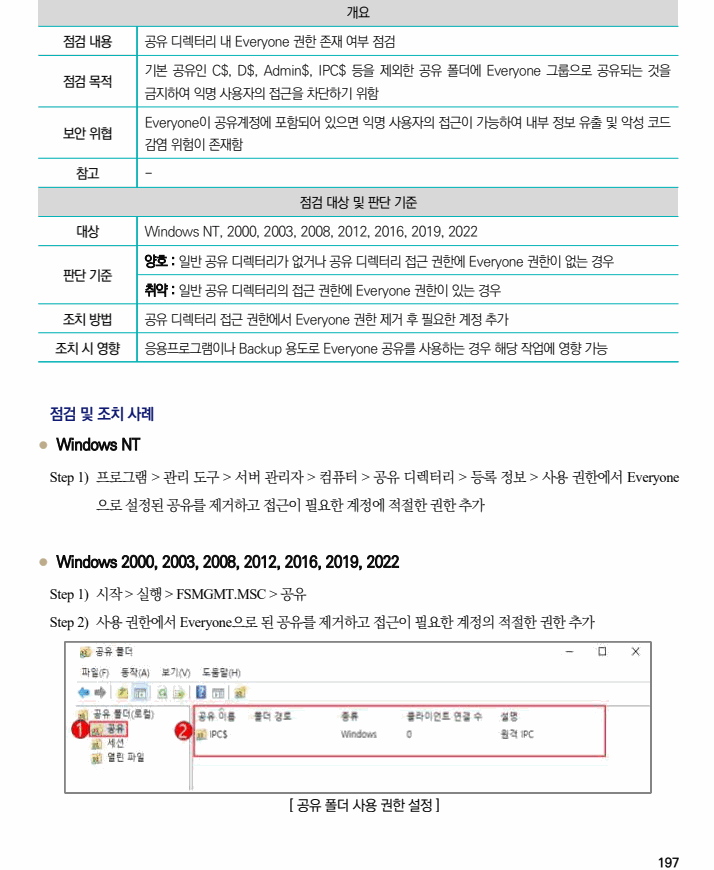

## 원문 전사

### PDF 페이지 197

~~~text transcription
개요
점검 내용 공유 디렉터리 내 Everyone 권한 존재 여부 점검
기본 공유인 C$, D$, Admin$, IPC$ 등을 제외한 공유 폴더에 Everyone 그룹으로 공유되는 것을
점검 목적
금지하여 익명 사용자의 접근을 차단하기 위함
Everyone이 공유계정에 포함되어 있으면 익명 사용자의 접근이 가능하여 내부 정보 유출 및 악성 코드
보안 위협
감염 위험이 존재함
참고 -
점검 대상 및 판단 기준
대상 Windows NT, 2000, 2003, 2008, 2012, 2016, 2019, 2022
양호 : 일반 공유 디렉터리가 없거나 공유 디렉터리 접근 권한에 Everyone 권한이 없는 경우
판단 기준
취약 : 일반 공유 디렉터리의 접근 권한에 Everyone 권한이 있는 경우
조치 방법 공유 디렉터리 접근 권한에서 Everyone 권한 제거 후 필요한 계정 추가
조치 시 영향 응용프로그램이나 Backup 용도로 Everyone 공유를 사용하는 경우 해당 작업에 영향 가능
점검 및 조치 사례
l Windows NT
Step 1) 프로그램 > 관리 도구 > 서버 관리자 > 컴퓨터 > 공유 디렉터리 > 등록 정보 > 사용 권한에서 Everyone
으로 설정된 공유를 제거하고 접근이 필요한 계정에 적절한 권한 추가
l Windows 2000, 2003, 2008, 2012, 2016, 2019, 2022
Step 1) 시작 > 실행 > FSMGMT.MSC > 공유
Step 2) 사용 권한에서 Everyone으로 된 공유를 제거하고 접근이 필요한 계정의 적절한 권한 추가
[ 공유 폴더 사용 권한 설정 ]
~~~

