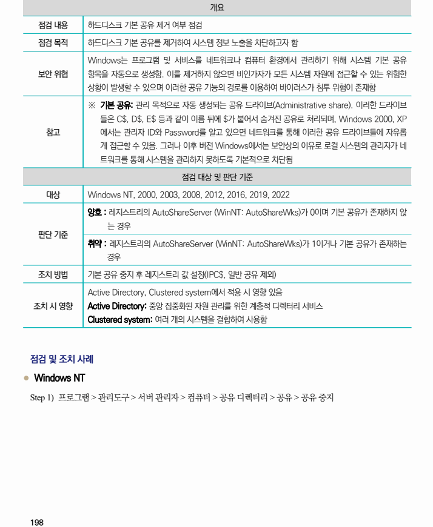
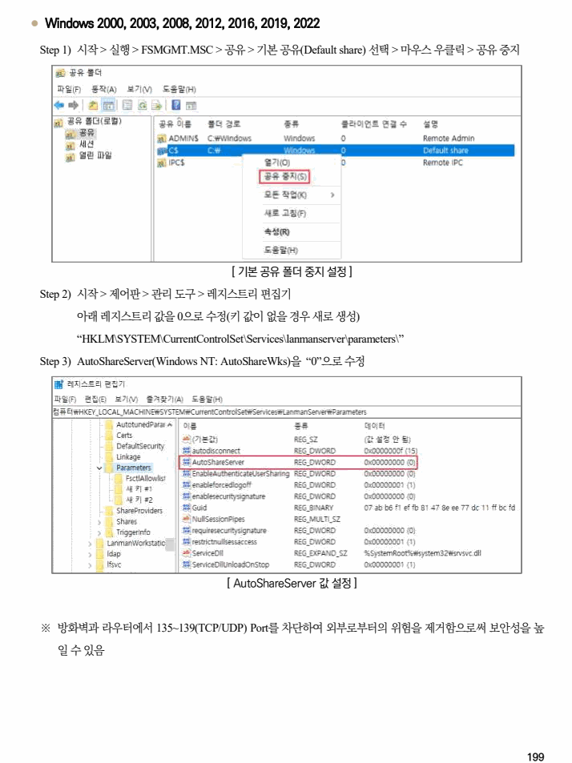

## 원문 전사

### PDF 페이지 198

~~~text transcription
개요
점검 내용 하드디스크 기본 공유 제거 여부 점검
점검 목적 하드디스크 기본 공유를 제거하여 시스템 정보 노출을 차단하고자 함
Windows는 프로그램 및 서비스를 네트워크나 컴퓨터 환경에서 관리하기 위해 시스템 기본 공유
보안 위협 항목을 자동으로 생성함. 이를 제거하지 않으면 비인가자가 모든 시스템 자원에 접근할 수 있는 위험한
상황이 발생할 수 있으며 이러한 공유 기능의 경로를 이용하여 바이러스가 침투 위험이 존재함
※ 기본 공유: 관리 목적으로 자동 생성되는 공유 드라이브(Administrative share). 이러한 드라이브
들은 C$, D$, E$ 등과 같이 이름 뒤에 $가 붙어서 숨겨진 공유로 처리되며, Windows 2000, XP
참고 에서는 관리자 ID와 Password를 알고 있으면 네트워크를 통해 이러한 공유 드라이브들에 자유롭
게 접근할 수 있음. 그러나 이후 버전 Windows에서는 보안상의 이유로 로컬 시스템의 관리자가 네
트워크를 통해 시스템을 관리하지 못하도록 기본적으로 차단됨
점검 대상 및 판단 기준
대상 Windows NT, 2000, 2003, 2008, 2012, 2016, 2019, 2022
양호 : 레지스트리의 AutoShareServer (WinNT: AutoShareWks)가 0이며 기본 공유가 존재하지 않
는 경우
판단 기준
취약 : 레지스트리의 AutoShareServer (WinNT: AutoShareWks)가 1이거나 기본 공유가 존재하는
경우
조치 방법 기본 공유 중지 후 레지스트리 값 설정(IPC$, 일반 공유 제외)
Active Directory, Clustered system에서 적용 시 영향 있음
조치 시 영향 Active Directory: 중앙 집중화된 자원 관리를 위한 계층적 디렉터리 서비스
Clustered system: 여러 개의 시스템을 결합하여 사용함
점검 및 조치 사례
l Windows NT
Step 1) 프로그램 > 관리도구 > 서버 관리자 > 컴퓨터 > 공유 디렉터리 > 공유 > 공유 중지
~~~

### PDF 페이지 199

~~~text transcription
l Windows 2000, 2003, 2008, 2012, 2016, 2019, 2022
Step 1) 시작 > 실행 > FSMGMT.MSC > 공유 > 기본 공유(Default share) 선택 > 마우스 우클릭 > 공유 중지
[ 기본 공유 폴더 중지 설정 ]
Step 2) 시작 > 제어판 > 관리 도구 > 레지스트리 편집기
아래 레지스트리 값을 0으로 수정(키 값이 없을 경우 새로 생성)
“HKLM\SYSTEM\CurrentControlSet\Services\lanmanserver\parameters\”
Step 3) AutoShareServer(Windows NT: AutoShareWks)을 “0”으로 수정
[ AutoShareServer 값 설정 ]
※ 방화벽과 라우터에서 135~139(TCP/UDP) Port를 차단하여 외부로부터의 위험을 제거함으로써 보안성을 높
일 수 있음
~~~

