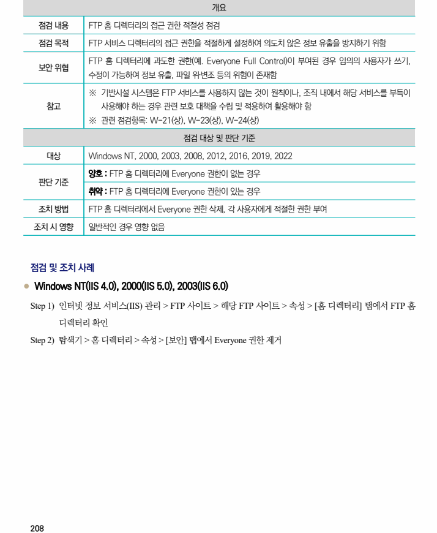
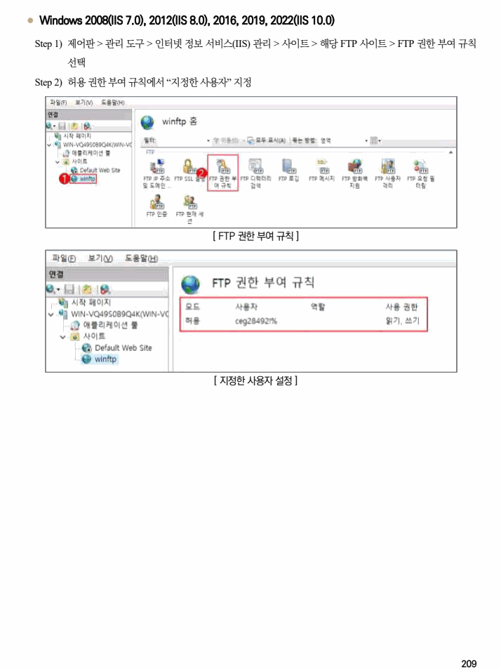

## 원문 전사

### PDF 페이지 208

~~~text transcription
개요
점검 내용 FTP 홈 디렉터리의 접근 권한 적절성 점검
점검 목적 FTP 서비스 디렉터리의 접근 권한을 적절하게 설정하여 의도치 않은 정보 유출을 방지하기 위함
FTP 홈 디렉터리에 과도한 권한(예. Everyone Full Control)이 부여된 경우 임의의 사용자가 쓰기,
보안 위협
수정이 가능하여 정보 유출, 파일 위‧변조 등의 위험이 존재함
※ 기반시설 시스템은 FTP 서비스를 사용하지 않는 것이 원칙이나, 조직 내에서 해당 서비스를 부득이
참고 사용해야 하는 경우 관련 보호 대책을 수립 및 적용하여 활용해야 함
※ 관련 점검항목: W-21(상), W-23(상), W-24(상)
점검 대상 및 판단 기준
대상 Windows NT, 2000, 2003, 2008, 2012, 2016, 2019, 2022
양호 : FTP 홈 디렉터리에 Everyone 권한이 없는 경우
판단 기준
취약 : FTP 홈 디렉터리에 Everyone 권한이 있는 경우
조치 방법 FTP 홈 디렉터리에서 Everyone 권한 삭제, 각 사용자에게 적절한 권한 부여
조치 시 영향 일반적인 경우 영향 없음
점검 및 조치 사례
l Windows NT(IIS 4.0), 2000(IIS 5.0), 2003(IIS 6.0)
Step 1) 인터넷 정보 서비스(IIS) 관리 > FTP 사이트 > 해당 FTP 사이트 > 속성 > [홈 디렉터리] 탭에서 FTP 홈
디렉터리 확인
Step 2) 탐색기 > 홈 디렉터리 > 속성 > [보안] 탭에서 Everyone 권한 제거
~~~

### PDF 페이지 209

~~~text transcription
l Windows 2008(IIS 7.0), 2012(IIS 8.0), 2016, 2019, 2022(IIS 10.0)
Step 1) 제어판 > 관리 도구 > 인터넷 정보 서비스(IIS) 관리 > 사이트 > 해당 FTP 사이트 > FTP 권한 부여 규칙
선택
Step 2) 허용 권한 부여 규칙에서 “지정한 사용자” 지정
[ FTP 권한 부여 규칙 ]
[ 지정한 사용자 설정 ]
~~~

