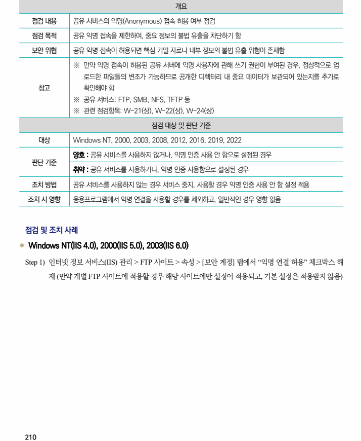
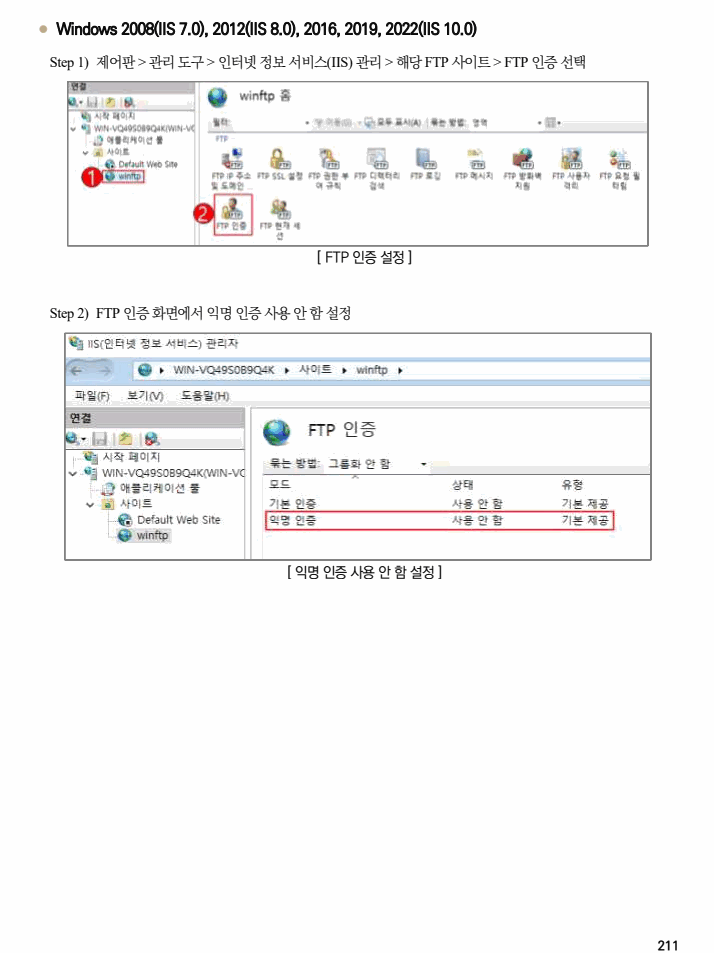

## 원문 전사

### PDF 페이지 210

~~~text transcription
개요
점검 내용 공유 서비스의 익명(Anonymous) 접속 허용 여부 점검
점검 목적 공유 익명 접속을 제한하여, 중요 정보의 불법 유출을 차단하기 함
보안 위협 공유 익명 접속이 허용되면 핵심 기밀 자료나 내부 정보의 불법 유출 위험이 존재함
※ 만약 익명 접속이 허용된 공유 서버에 익명 사용자에 관해 쓰기 권한이 부여된 경우, 정상적으로 업
로드한 파일들의 변조가 가능하므로 공개한 디렉터리 내 중요 데이터가 보관되어 있는지를 추가로
참고 확인해야 함
※ 공유 서비스: FTP, SMB, NFS, TFTP 등
※ 관련 점검항목: W-21(상), W-22(상), W-24(상)
점검 대상 및 판단 기준
대상 Windows NT, 2000, 2003, 2008, 2012, 2016, 2019, 2022
양호 : 공유 서비스를 사용하지 않거나, 익명 인증 사용 안 함으로 설정된 경우
판단 기준
취약 : 공유 서비스를 사용하거나, 익명 인증 사용함으로 설정된 경우
조치 방법 공유 서비스를 사용하지 않는 경우 서비스 중지, 사용할 경우 익명 인증 사용 안 함 설정 적용
조치 시 영향 응용프로그램에서 익명 연결을 사용할 경우를 제외하고, 일반적인 경우 영향 없음
점검 및 조치 사례
l Windows NT(IIS 4.0), 2000(IIS 5.0), 2003(IIS 6.0)
Step 1) 인터넷 정보 서비스(IIS) 관리 > FTP 사이트 > 속성 > [보안 계정] 탭에서 “익명 연결 허용” 체크박스 해
제 (만약 개별 FTP 사이트에 적용할 경우 해당 사이트에만 설정이 적용되고, 기본 설정은 적용받지 않음)
~~~

### PDF 페이지 211

~~~text transcription
l Windows 2008(IIS 7.0), 2012(IIS 8.0), 2016, 2019, 2022(IIS 10.0)
Step 1) 제어판 > 관리 도구 > 인터넷 정보 서비스(IIS) 관리 > 해당 FTP 사이트 > FTP 인증 선택
[ FTP 인증 설정 ]
Step 2) FTP 인증 화면에서 익명 인증 사용 안 함 설정
[ 익명 인증 사용 안 함 설정 ]
~~~

